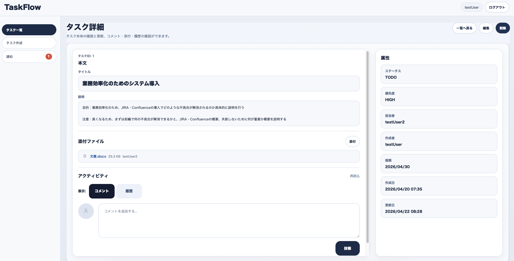
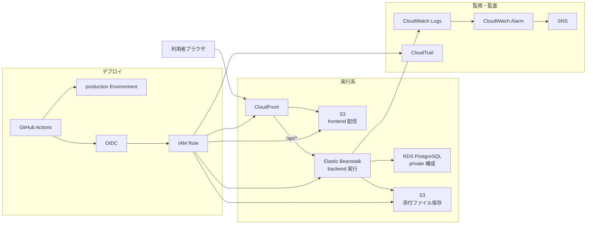

# TaskFlow

## 30秒でわかるこのアプリ

Spring Boot / React / PostgreSQL で開発した、認証・認可付きのタスク管理 Web アプリです。  
単なる CRUD 実装で終わらせず、**JWT 認証、ユーザー間の認可制御、例外設計、AWS 上での公開、GitHub Actions + OIDC による本番デプロイ自動化、CloudWatch Logs を用いたログ追跡**まで一通り実装しています。

このポートフォリオで特に見てほしい点は、**画面を作れること**ではなく、**バックエンド API 設計・認証認可・デプロイ・運用導線までを自分で組み立てたこと**です。

## この作品で示したい実務スキル

このアプリでは、次のような実務寄りのスキルを示すことを目的にしています。

- Spring Boot + Spring Security を用いた認証・認可設計
- React + TypeScript によるフロントエンド実装と状態制御
- PostgreSQL / JPA / Flyway を用いたデータ設計とマイグレーション管理
- コメント、添付、通知、アクティビティログを含む副作用付き処理の設計
- AWS（S3 / CloudFront / Elastic Beanstalk / RDS）を用いた公開構成
- S3 を用いた静的配信と添付ファイル保存の設計・実装
- GitHub Actions + OIDC による安全なデプロイ自動化
- CloudWatch Logs を用いた障害調査の導線整備
- Playwright / API 統合テストによる主要導線の自動テスト整備

そのため、README でも機能一覧だけでなく、設計意図、技術選定、テスト方針、既知課題を明示しています。

## デモ

- 公開 URL: `https://d3jotedl3xn7u4.cloudfront.net`
- 現在公開中
- 公開環境で主要導線を確認済み
  - 新規登録
  - ログイン
  - タスク一覧 / 詳細 / 作成 / 更新 / 削除
  - コメント / 添付 / 通知
  - 通知ポーリング
  - アクティビティログ表示
  - ログアウト
  - セッション切れ導線
  - 認可境界
  - CloudWatch Logs でのログ追跡
- 一部、監視設定や権限整理などの運用改善項目は残っています

## この題材を選んだ理由

タスク管理アプリ自体は一般的な題材ですが、その分、**認証認可、CRUD、入力バリデーション、データ設計、公開構成、デプロイ自動化、運用導線**といった、Web アプリ開発で基礎かつ重要な要素を過不足なく示しやすいと考えました。

UI の独自性よりも、**実務で必要になる設計・実装・運用の一連の流れを見せること**を重視して、この題材を選んでいます。

## 主な機能

### 実装済み

- ユーザー新規登録
- ログイン
- ログアウト
- セッション切れ時の再ログイン導線
- タスク一覧表示
- タスク詳細表示
- タスク作成
- タスク更新
- タスク削除
- 担当者候補一覧
- コメント投稿 / 更新 / 削除
- 添付ファイルアップロード / ダウンロード / 削除
- 通知一覧表示
- 通知の個別既読 / 一括既読
- 通知ポーリング
- アクティビティログ表示
- 認可エラー表示
- 画面表示制御 / 二重送信防止

### 現時点で対象外

- チーム / 組織管理
- ADMIN 権限制御
- パスワードリセット
- ヘルプ
- 管理者画面
- 独自ドメイン
- Multi-AZ / DR 構成

## 画面イメージ

### ログイン画面


### タスク一覧画面


### タスク詳細画面



## 技術スタック

### Frontend

- React 19
- TypeScript
- Vite 8
- Axios
- Playwright

### Backend

- Java 17
- Spring Boot 3.5
- Spring Security
- Spring Data JPA
- Flyway
- JWT

### Database

- PostgreSQL
- Amazon RDS for PostgreSQL

### Infrastructure / Operations

- Amazon S3
- Amazon CloudFront
- AWS Elastic Beanstalk
- Amazon CloudWatch Logs / Alarm
- AWS CloudTrail
- Amazon SNS
- GitHub Actions
- OIDC

## 設計上のポイント

### 1. 認証と認可を分けて考えている

- 認証は JWT ベースで実装
- 認可は「ログインしているか」だけでなく、**そのタスクの所有者かどうか**まで含めて判定
- 未認証、不正トークン、他人タスク参照・更新・削除拒否を公開環境で確認済み

現状の認可ルールは、**タスクの作成者 / 担当者ベース**です。`Team` / `Role` / 所属ベースの認可モデルはまだ導入しておらず、今後の拡張対象として切り分けています。

### 2. 責務ごとに構成を分離している

- frontend は S3 + CloudFront で静的配信
- backend は Elastic Beanstalk 上で Spring Boot を実行
- database は private 構成の RDS PostgreSQL
- 添付ファイルは S3 に保存

公開しやすさだけでなく、**フロント配信 / API 実行 / DB 保持 / 添付保存の責務を分けた構成**を意識しています。

### 3. 本番デプロイをローカル手作業に依存させていない

- GitHub Actions を正規デプロイ経路に固定
- OIDC + IAM Role を使い、長期 access key を使わない構成
- `production` Environment の承認前提で本番反映

### 4. 公開後の障害調査を意識している

- `requestId` と `eventId` を対応づけたログ追跡
- CloudWatch Logs / Logs Insights を使った確認導線
- 初動メモと DB 復旧メモを別資料として整理

### 5. 副作用を伴う処理も含めて整合性を意識している

- タスク更新、コメント投稿、添付追加などの操作では、データ更新だけでなくアクティビティログ記録や通知生成まで含めて整合性を意識している
- 機能追加後も責務が散らばりすぎないよう、主処理と副作用処理を分けて扱う構成を意識している
- 単なる CRUD 実装にとどまらず、変更履歴や利用者への通知まで含めた運用導線を持たせている

### 6. API だけでなく画面側の認可と状態制御も意識している

- 認可は backend の API 制御だけで完結させず、frontend でも権限に応じたボタン表示制御を行っている
- コメント編集・添付削除・通知既読化などでは、利用者に不自然な操作をさせないよう、状態に応じた UI 制御を入れている
- 未読通知バッジや通知ポーリング、二重送信防止も含めて、正しい API 応答だけでなく利用体験として自然に動くことを意識している

## 技術選定の比較とトレードオフ

### Spring Boot

認証・認可、例外ハンドリング、DB アクセスまでを一貫して実装しやすく、業務システム開発で使われやすい構成を意識したため採用しました。

### React + TypeScript

画面状態と API レスポンスの型を明確に扱いたく、フォームや認証状態の制御を整理しやすいため採用しました。サーバーサイドレンダリング構成も候補でしたが、今回は **フロントエンドとバックエンドを分離した API 中心の構成**を経験することを優先しています。

### PostgreSQL + Flyway

ローカルと本番でスキーマ差分を管理しやすく、テーブル変更履歴を追える構成にしたかったため採用しました。

### AWS（S3 / CloudFront / Elastic Beanstalk / RDS）

MVP 段階では、まず **公開できること、責務分離できること、デプロイとログ確認まで一通り回せること** を優先しました。ECS などのより複雑な構成も選択肢でしたが、個人開発では運用負荷が上がりやすいため、今回は Elastic Beanstalk を採用し、フロント配信・API 実行・DB・添付保存を責務ごとに分けた現実的な構成にしています。

### GitHub Actions + OIDC

長期アクセスキーを GitHub に保持せずに本番 deploy できる構成にし、個人開発でも **本番運用を意識したセキュアな導線**を作るため採用しました。

### JWT を採用した理由

今回はフロントエンドとバックエンドを分離した構成のため、セッション共有よりも API ベースで扱いやすい JWT を採用しました。将来的なクライアント追加や API 利用も見据え、**認証情報を HTTP API の文脈で扱いやすい構成**を優先しています。

なお、現状のフロントエンドではポートフォリオ向けの簡易実装として JWT を `localStorage` に保存しています。本番運用を強く意識する場合は、HttpOnly Cookie、refresh token、CSP などを組み合わせた方式も検討対象です。

## テスト方針

### バックエンド

- Spring Boot のテストで API の正常系・異常系を確認
- 認証、認可、バリデーション、タスク CRUD の代表ケースを対象に自動確認

### フロントエンド

- build 成功を GitHub Actions の CI で確認
- 主要な表示崩れや API 連携不整合は公開環境で確認

### Playwright の位置づけ

Playwright は、**公開環境に対する主要導線確認の自動化**に利用しています。現時点では、ログイン、一覧表示、主要 CRUD、認可エラー表示の確認に活用しており、未自動の観点は手動確認で補完しています。今後はセッション切れや代表的な異常系も、自動化対象を広げる予定です。

### 公開環境での確認

- 新規登録
- ログイン
- タスク一覧 / 詳細 / 作成 / 更新 / 削除
- コメント / 添付 / 通知
- 通知ポーリング
- アクティビティログ表示
- ログアウト
- セッション切れ導線
- 未認証 / 不正トークン / 他人タスク操作拒否
- CloudWatch Logs での `requestId` / `eventId` 追跡

## 工夫した点 / 苦労した点

### 1. 公開環境で frontend が `localhost` を向く問題を解消

公開環境で `VITE_API_BASE_URL` が未設定のとき、frontend が `http://localhost:8080` を API 接続先として解決し、`signup` 送信時に `Network Error` になる問題がありました。  
`apiClient.ts` を修正し、設定未指定でも公開環境では `window.location.origin` を基準に解決するように変更しました。

### 2. Elastic Beanstalk のポート不整合による `502` を解消

backend deploy 後、Spring Boot は `8080`、nginx upstream は `5000` を向いており、公開 API が `502 Bad Gateway` になる問題がありました。  
`Procfile` とアプリ設定を見直し、`SERVER_PORT` 前提で待受ポートを統一しました。

### 3. CloudFront の SPA ルーティング問題を解消

CloudFront の `403 / 404 -> /index.html` 設定によって、API の認可エラーまで画面用 HTML に書き換わり、他人タスクの詳細・更新・削除で誤った画面表示になる問題がありました。  
CloudFront Function で **画面ルートだけを rewrite し、`/api/*` は rewrite しない** 方式へ変更して解消しました。

これらの対応を通じて、単に機能を実装するだけでなく、**公開後に起こる不整合を切り分けて直す力**も示せるようにしました。

## アーキテクチャ



> GitHub 上の表示環境によっては mermaid が見えにくい場合があるため、必要に応じて静止画像版も追加予定です。

## セットアップ

### 前提

- Java 17
- Node.js 22.12 以上
- npm
- Docker
- Docker Compose

### 1. DB を起動する

```bash
cd backend
docker-compose up -d
```

PostgreSQL は Docker 上で起動し、backend はこの DB を参照する前提です。

### 2. backend を起動する

```bash
cd backend
export JWT_SECRET="$(openssl rand -base64 32)"
./gradlew test
./gradlew bootRun
```

`JWT_SECRET` は必須です。未設定の場合、backend は起動時に失敗します。サンプル値は [backend/.env.example](backend/.env.example) にも置いてあります。

### 3. frontend を起動する

```bash
cd frontend
npm ci
npm run dev
```

### DB 停止

```bash
cd backend
docker-compose down
```

### DB を初期化したい場合

```bash
cd backend
docker-compose down -v
```

## 関連資料
- [設計資料](docs/01_設計)
- [障害初動メモ](docs/03_成果物/notes/initial_response_memo.md)
- [DB 復旧メモ](docs/03_成果物/notes/rds_restore_memo.md)

## 既知課題と今後優先して改善する項目

### 現在の既知課題

- **Elastic Beanstalk の health アラーム見直し**  
  実状態が正常でも、CloudWatch Alarm が `ALARM` になるケースがあり、参照メトリクスやしきい値の再確認が必要です。

- **DB 向け Security Group に暫定設定が残っている**  
  DB 向けの inbound 設定に、用途確認が必要な暫定設定が残っています。

- **Secret ローテーション未実施**  
  `DB_PASSWORD` / `JWT_SECRET` は今後ローテーション要否を判断し、必要に応じて実施予定です。

- **CLI 運用ユーザーの最小権限化未完**  
  日常運用に使うユーザー権限が広いため、必要操作を整理して最小権限化したいと考えています。

- **eventId 単位の監視未整備**  
  現状は Logs Insights で追跡可能ですが、重要なエラーについては Metric Filter / Alarm 化を今後進める予定です。

### 今後の拡張

- チーム / 組織管理
- ADMIN 権限制御
- パスワードリセット
- 管理者向け運用画面
- 独自ドメイン導入
- 監視 / アラート運用の改善
- Multi-AZ / DR 構成

