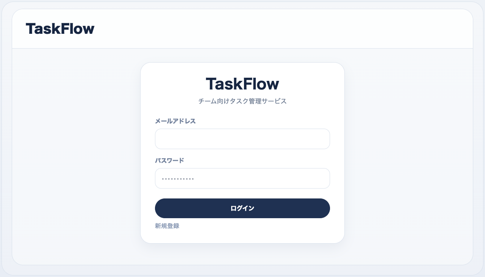
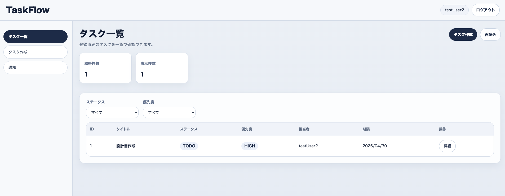
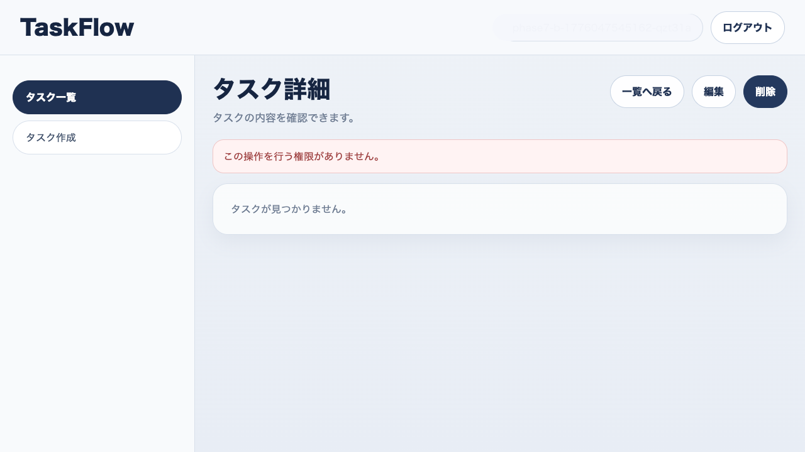
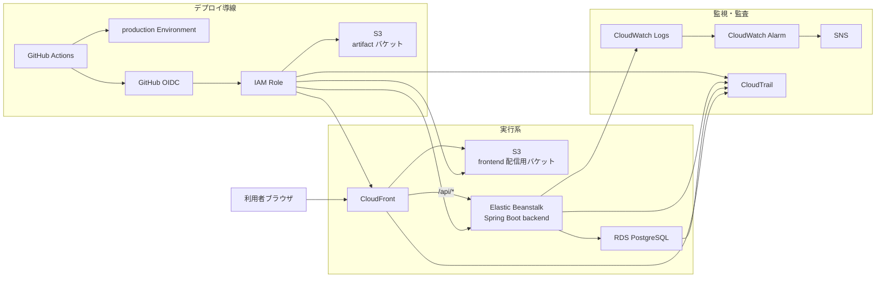

# TaskFlow

Spring Boot / React / PostgreSQL で開発した、認証・認可付きのタスク管理 Web アプリです。  
単なる CRUD 実装で終わらせず、**JWT 認証、ユーザー間の認可制御、AWS 上での公開、GitHub Actions + OIDC による本番デプロイ自動化、CloudWatch Logs を使ったログ追跡**までを一通り実装しています。

## 30秒でわかるこのアプリ

このアプリで特に見てほしいのは、画面を作ったことよりも、**バックエンド API 設計・認証認可・デプロイ・運用導線まで含めて整えたこと**です。

- JWT による認証と、他ユーザーのタスク参照・更新・削除を防ぐ認可を実装
- タスクの一覧・詳細・作成・更新・削除までを MVP として公開済み
- AWS 上に frontend / backend / DB を分離して配置
- GitHub Actions + OIDC + GitHub Environment 承認で本番 deploy を自動化
- CloudWatch Logs で `requestId` と `eventId` を対応づけて追跡可能

## この作品で示したい実務スキル

このアプリでは、次の実務寄りスキルを示すことを目的にしています。

- Spring Boot + Spring Security を使った認証・認可設計
- React + TypeScript による画面実装と API 連携
- PostgreSQL / JPA / Flyway を用いたデータ設計とマイグレーション管理
- AWS 上での公開構成の設計と運用導線の整備
- GitHub Actions + OIDC による安全なデプロイ自動化
- CloudWatch Logs を使った障害調査とログ追跡

## デモ

- 公開 URL: `https://d3jotedl3xn7u4.cloudfront.net`
- 判定: **条件付き公開継続可**

### 画面イメージ

#### ログイン画面



#### タスク一覧画面



#### 権限エラー表示



## 主な機能

### 実装済み（MVP）

- ユーザー新規登録
- ログイン
- ログアウト
- セッション切れ時の再ログイン導線
- タスク一覧表示
- タスク詳細表示
- タスク作成
- タスク更新
- タスク削除
- フィルタ表示
- 入力バリデーション
- 認可境界の制御

### 現時点で対象外

- コメント
- 添付ファイル
- チーム管理
- 通知
- パスワードリセット
- ヘルプ
- 管理者画面

## 技術スタック

### Frontend

- React 19
- TypeScript
- Vite 8
- Axios
- Playwright

### Backend

- Java 17
- Spring Boot 3.5
- Spring Security
- Spring Data JPA
- Flyway
- JWT

### Database

- PostgreSQL
- Amazon RDS for PostgreSQL

### Infrastructure / Operations

- Amazon S3
- Amazon CloudFront
- AWS Elastic Beanstalk
- Amazon CloudWatch Logs / Alarm
- AWS CloudTrail
- Amazon SNS
- GitHub Actions
- GitHub Environment
- OIDC

## 設計上のポイント

### 1. 認証と認可を分けて考える構成にした

- 認証は JWT ベースで実装
- 認可は「ログインしているか」だけでなく、**そのタスクにアクセスしてよいユーザーか**まで制御
- 未認証、不正トークン、他人タスク参照・更新・削除拒否を確認済み

### 2. frontend / backend / DB を責務ごとに分離した

- frontend は `S3 + CloudFront` で静的配信
- backend は `Elastic Beanstalk` 上の Spring Boot アプリとして実行
- DB は private 構成の `RDS PostgreSQL` として分離

これにより、配信、アプリ実行、データ永続化の責務を明確にしています。

### 3. 本番 deploy をローカル手動作業に依存させない

- 正規手順は `GitHub Actions -> production Environment 承認 -> AWS deploy`
- 長期 access key ではなく OIDC で AWS ロールを引き受ける構成
- `backend -> frontend` の順で本番反映する運用に統一

### 4. 公開後の障害調査を意識したログ設計にした

- API 応答に含まれる `requestId` と、アプリログの `eventId` を対応づけて追跡可能
- `CloudWatch Logs` と `Logs Insights` を使い、公開 URL からの試験結果をログ側でも確認可能
- 初動メモ、RDS 復旧メモを別資料として整備

## 技術選定理由

### Spring Boot

認証・認可、例外ハンドリング、DB アクセスまでを一貫して実装しやすく、業務システム開発で使われやすい構成を意識したためです。

### React + TypeScript

画面状態と API レスポンスの型を明確に扱いたく、フォームや認証状態の制御を整理しやすいため採用しました。

### PostgreSQL + Flyway

ローカル環境と本番環境のスキーマ差分を管理しやすく、テーブル変更履歴を追える構成にしたかったためです。

### AWS（S3 / CloudFront / Elastic Beanstalk / RDS）

フロント配信、アプリ実行、DB を責務ごとに分離しつつ、個人開発でも本番公開まで持っていける現実的な構成として選定しました。

### GitHub Actions + OIDC

長期アクセスキーを持たずに deploy できる構成にし、個人開発でも本番運用を意識した安全な導線を作るためです。

## テスト方針

このアプリでは、**自動テストと公開環境での確認を役割分担**して進めています。

### 自動で確認していること

- backend の Gradle test
- backend の bootJar 生成
- frontend の build
- GitHub Actions による CI 実行

### 公開環境で確認していること

- 公開 URL を入口にした新規登録、ログイン、タスク CRUD、ログアウト、セッション切れ
- 未認証、不正トークン、認可境界、代表バリデーション
- CloudWatch Logs での `requestId` / `eventId` 追跡
- CloudWatch Alarm、初動メモ、RDS 復旧導線の spot check

### Playwright の位置づけ

Playwright は公開 URL を使ったブラウザ確認で利用しています。  
MVP の正常系・異常系・認可境界の確認に活用し、画面上の挙動と API 応答の突合に使っています。

## 工夫した点 / 苦労した点

### 1. 公開 frontend が `localhost` を向いてしまう問題を解消

公開環境で API 接続先が `http://localhost:8080` に解決され、`Network Error` になる問題がありました。  
`frontend/src/lib/apiClient.ts` を見直し、設定値未指定でも公開環境では `window.location.origin` を使うように修正しました。

### 2. Elastic Beanstalk 側のポート不整合を解消

backend deploy 後に `502 Bad Gateway` となり、切り分けた結果 `Procfile` のポート指定と `SERVER_PORT` が不整合でした。  
workflow と Spring Boot 設定を見直し、公開環境での待受ポート解決を統一しました。

### 3. CloudFront の SPA ルーティングで API の 403 が HTML に化ける問題を解消

初回は `403 / 404 -> /index.html` を distribution 全体へ設定していたため、`/api/*` の認可エラーまで画面用 HTML に変換されていました。  
これにより、他人タスク更新・削除が画面上だけ成功に見える問題が発生しました。

対策として、distribution 全体の custom error response をやめ、**画面ルートだけを rewrite する CloudFront Function** へ切り替えました。

### 4. 問題を「実装ミス」ではなく「公開後の不整合」として切り分けた

公開 URL、CloudFront、Elastic Beanstalk、CloudWatch Logs を順に確認し、

- frontend の API 接続先不整合
- backend のポート不整合
- CloudFront の SPA ルーティング不整合

を個別に切り分けて修正しました。  
単に機能を実装するだけでなく、**公開後に起こる問題を追跡して直す力**を示せるように意識しています。

## 既知課題と今後の改善

### 既知課題

- `taskflow-prd-eb-environment-health` アラームが実状態と不整合
- `db SG` に追加 source security group が残っている
- `DB_PASSWORD / JWT_SECRET` のローテーション未実施
- `taskflow-cli-operator` の最小権限化未実施
- `eventId` 単位の `Metric Filter / Alarm` は未作成

### 今後の改善候補

- コメント機能
- 添付ファイル機能
- チーム管理
- 通知
- パスワードリセット
- 管理者向け運用画面
- `eventId` 単位の監視追加
- secret ローテーションの運用整備
- 権限の最小化

## アーキテクチャ



## セットアップ

### Frontend

```bash
cd frontend
npm ci
npm run dev
```

### Backend

```bash
cd backend
./gradlew test
./gradlew bootRun
```

### 補足

- frontend / backend は別プロセスで起動します
- 本番 deploy はローカルから直接行わず、GitHub Actions の手順を使います

## 関連資料

README では採用担当者向けに要点を整理し、運用詳細は別資料へ分けています。

- [障害初動メモ](docs/03_成果物/notes/initial_response_memo.md)
- [DB 復旧メモ](docs/03_成果物/notes/rds_restore_memo.md)
- [設計資料](docs/01_設計)
- [AWS デプロイ関連資料](docs/02_製造/AWSデプロイ)

## 補足

GitHub のリポジトリトップでは、README 以外にも次を整備すると入口がわかりやすくなります。

- Description
- Website
- Topics

推奨 Topics の例:

- `spring-boot`
- `react`
- `aws`
- `jwt`
- `portfolio`
- `postgresql`
- `github-actions`
