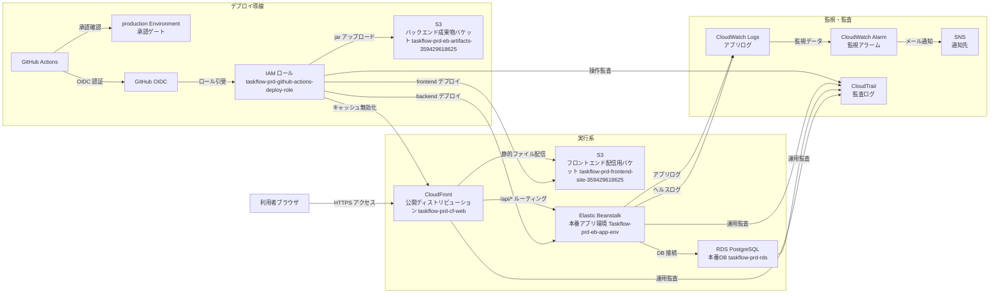
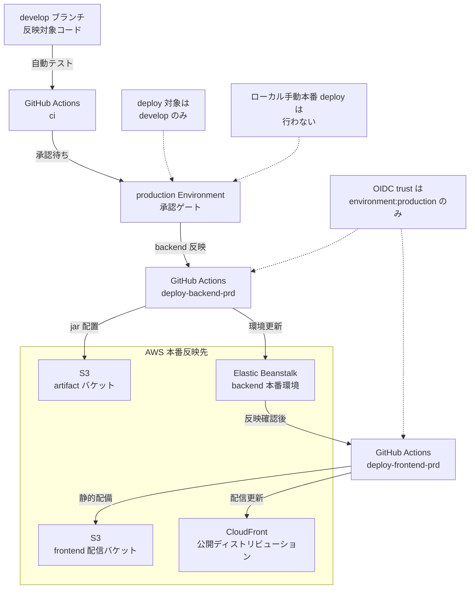

# TaskFlow

## 目次

読みたい章へ移動できます。

- [概要](#overview)
- [ポートフォリオ向け要約](#portfolio-summary)
- [主な機能](#features)
- [画面イメージ](#screenshots)
- [MVP 対象 / 対象外](#mvp-scope)
- [技術スタック](#tech-stack)
- [システム構成](#architecture)
- [Deploy フロー](#deploy-flow)
- [ローカル起動手順](#local-setup)
- [監視 / 復旧](#operations)
- [運用上の前提](#operational-rules)
- [検証結果](#verification)
- [既知課題](#known-issues)
- [今後の拡張](#roadmap)
- [関連資料](#references)

<a id="overview"></a>
## 概要

本アプリは、`Spring Boot` / `React` / `PostgreSQL` を用いた個人開発のタスク管理 Web アプリです。

`AWS` では `S3 + CloudFront` による frontend 配信、`Elastic Beanstalk` による backend 実行、`RDS (PostgreSQL)` による DB 運用を構成しています。

本番 deploy は `GitHub Actions + OIDC + production Environment` を正規手順とし、監視・監査・復旧の導線も整えています。

公開環境では、MVP の正常系・異常系・認可境界・ログ到達まで確認済みで、判定は `条件付き公開継続可` です。

<a id="portfolio-summary"></a>
## ポートフォリオ向け要約

### 短文版

Spring Boot / React / PostgreSQL を基盤に、AWS 上で公開したタスク管理アプリです。  
GitHub Actions + OIDC で本番 deploy を自動化し、CloudWatch による監視と運用導線まで整えています。

### 詳細版

Spring Boot / React / PostgreSQL を用いたタスク管理 Web アプリで、  
ユーザー登録、ログイン、タスク一覧・詳細、作成・更新・削除、ログアウト、セッション切れ対応までを MVP として実装しました。

AWS では `S3 + CloudFront` で frontend、`Elastic Beanstalk` で backend、`RDS for PostgreSQL` で DB を構成し、  
`GitHub Actions + OIDC + production Environment` 承認で本番 deploy を自動化しています。

`CloudWatch Logs / Alarm`、`SNS`、`CloudTrail` を使った監視・運用導線も整え、  
公開 URL を使った総合テストで正常系・異常系・認可境界・ログ到達まで確認しました。

公開確認の中で API 接続先、backend port、CloudFront の SPA ルーティング不整合も修正し、  
現在は公開中 MVP を第三者へ説明できる状態まで整理しています。

<a id="features"></a>
## 主な機能

- ユーザー新規登録
- ログイン
- タスク一覧表示
- タスク詳細表示
- タスク作成
- タスク更新
- タスク削除
- ログアウト
- セッション切れ時の再ログイン導線

<a id="screenshots"></a>
## 画面イメージ

### ログイン画面


### タスク一覧画面


### 権限エラー表示


<a id="mvp-scope"></a>
## MVP 対象 / 対象外

### MVP 対象

- `register`
- `login`
- `task list`
- `task detail`
- `task create`
- `task update`
- `task delete`
- `logout`
- `session expired`

### MVP 対象外

- `コメント`
- `添付ファイル`
- `チーム管理`
- `通知`
- `パスワードリセット`
- `ヘルプ`
- `管理者画面`

<a id="tech-stack"></a>
## 技術スタック

### Frontend

- `React 19`
- `TypeScript`
- `Vite 8`
- `Axios`
- `Playwright`

### Backend

- `Java 17`
- `Spring Boot 3.5`
- `Spring Security`
- `Spring Data JPA`
- `Flyway`
- `JWT`

### Database

- `PostgreSQL`
- `Amazon RDS for PostgreSQL`

### Infrastructure / Operations

- `Amazon S3`
- `Amazon CloudFront`
- `AWS Elastic Beanstalk`
- `Amazon CloudWatch Logs / Alarm`
- `AWS CloudTrail`
- `Amazon SNS`
- `GitHub Actions`
- `OIDC`

<a id="architecture"></a>
## システム構成



- frontend は `S3 + CloudFront` で配信し、利用者は `CloudFront` の公開 URL からアクセスする
- backend は `Elastic Beanstalk` 上の `Spring Boot` アプリで動作し、`/api/*` は `CloudFront` から backend origin へルーティングされる
- DB は private 構成の `RDS PostgreSQL` で、アプリケーションからのみ接続する前提で運用している
- deploy は `GitHub Actions + OIDC + production Environment + IAM Role` を正規手順とし、ローカルからの手動本番 deploy は行わない
- 監視は `CloudWatch Logs / Alarm / SNS`、監査は `CloudTrail` を利用する

<a id="deploy-flow"></a>
## Deploy フロー



- 正規フローは `ci -> approval -> deploy-backend-prd -> deploy-frontend-prd`
- `deploy-backend-prd` と `deploy-frontend-prd` はどちらも `production Environment` を参照し、`Required reviewer` 前提で実行する
- `OIDC trust policy` は `repo:kitune-udon/task-manager-app:environment:production` のみを信頼し、長期 access key を使わない
- deploy 対象 branch は `develop` のみとし、本番再反映はローカル手動 deploy ではなく `GitHub Actions` の手動実行機能 (`workflow_dispatch`) を使う
- 順序は `backend -> frontend` を維持し、frontend deploy では `CloudFront Function` による SPA rewrite 設定も合わせて維持する

### 本番で固定して使う主な値

- frontend 公開 URL: `https://d3jotedl3xn7u4.cloudfront.net`
- CloudFront Distribution: `taskflow-prd-cf-web / E688SH91TX10P`
- Elastic Beanstalk Application: `taskflow-prd-eb-app`
- Elastic Beanstalk Environment: `Taskflow-prd-eb-app-env / e-gvcyudrrcs`
- backend artifact バケット: `taskflow-prd-eb-artifacts-359429618625`
- frontend 配信バケット: `taskflow-prd-frontend-site-359429618625`
- GitHub Environment: `production`
- deploy role: `taskflow-prd-github-actions-deploy-role`

## この構成にした理由

- frontend: `S3 + CloudFront`。静的配信とキャッシュ制御を分けやすく、公開 URL を一本化しやすいため
- backend: `Elastic Beanstalk`。`Spring Boot` アプリを EC2 / nginx / deploy 単位で扱いやすく、MVP 運用に必要な構成を早く整えやすいため
- database: `RDS for PostgreSQL`。永続データを private 構成で分離し、バックアップや復旧導線を AWS 標準機能で整理しやすいため
- deploy: `GitHub Actions + OIDC + production Environment`。長期 access key を持たずに本番 deploy を自動化し、承認付き運用へ寄せるため

<a id="local-setup"></a>
## ローカル起動手順

### Frontend

```bash
cd frontend
npm ci
npm run dev
```

### Backend

```bash
cd backend
./gradlew test
./gradlew bootRun
```

### 補足

- frontend / backend を別プロセスで起動する
- 本番 deploy は上記 `Deploy フロー` に従い、ローカルから直接本番反映しない

<a id="operations"></a>
## 監視 / 復旧

- `CloudWatch Logs` で、API 応答の `requestId` とアプリログの `eventId` を対応づけて追跡できる
- `CloudWatch Alarm + SNS` の基本監視を整備済み
- 初動は [initial_response_memo.md](docs/02_製造/AWSデプロイ/作業記録フォルダ_phase6/notes/initial_response_memo.md) の順に確認する
- DB 復旧は [rds_restore_memo.md](docs/02_製造/AWSデプロイ/作業記録フォルダ_phase6/notes/rds_restore_memo.md) を参照し、`PITR / snapshot restore` を使い分ける

<a id="operational-rules"></a>
## 運用上の前提

- 本番 deploy は `GitHub Actions` を正規手順とする
- `production Environment` の承認前提で運用する
- `develop` のみを本番 deploy 対象 branch とする
- 公開判定は `条件付き公開継続可` で統一する
- 残課題は隠さず `既知課題` に分けて記載する

<a id="verification"></a>
## 検証結果

### 基本情報

- 確認日: `2026年4月13日`
- 公開 URL: `https://d3jotedl3xn7u4.cloudfront.net`
- 判定: `条件付き公開継続可`

### 正常系

| 観点 | 結果 | 補足 |
| --- | --- | --- |
| `register` | `成功` | 公開 URL から新規登録完了まで確認 |
| `login` | `成功` | 認証後にタスク一覧へ遷移 |
| `task list / detail / filter` | `成功` | 一覧、詳細、フィルタ表示を確認 |
| `task create` | `成功` | 新規タスク作成後に一覧へ反映 |
| `task update` | `成功` | 編集内容の保存と再表示を確認 |
| `task delete` | `成功` | 削除後に対象タスクが一覧から消えることを確認 |
| `logout` | `成功` | セッション破棄後にログイン画面へ戻る |
| `session expired` | `成功` | セッション切れ時に再ログイン導線が動作 |

### 異常系 / 認可境界

| 観点 | 結果 | 補足 |
| --- | --- | --- |
| 未認証 `GET /api/tasks` | `401 ERR-AUTH-001` | 未ログインで API へ直接アクセスした場合 |
| 不正 token `GET /api/tasks` | `401 ERR-AUTH-003` | 改ざん token での API 呼び出し |
| 他人タスク detail | `403 ERR-AUTH-005` | 他ユーザー作成タスクの参照を拒否 |
| 他人タスク update | `403 ERR-TASK-005` | 他ユーザー作成タスクの更新を拒否 |
| 他人タスク delete | `403 ERR-TASK-006` | 他ユーザー作成タスクの削除を拒否 |
| 入力バリデーション | `確認済み` | 未入力で `タイトルを入力してください。`、`101` 文字で `タイトルは100文字以内で入力してください。` |

### CloudWatch Logs 到達確認

API 応答に含まれる `requestId` と、アプリログの種別を表す `eventId` を対応づけて追跡できることを確認済みです。代表例は以下のとおりです。

| requestId | API 結果 | CloudWatch Logs 上の eventId |
| --- | --- | --- |
| `phase7-5-8-login-1776048485` | `POST /api/auth/login -> 200` | `LOG-AUTH-001`、`LOG-REQ-001` |
| `phase7-5-8-invalid-1776048485` | `GET /api/tasks -> 401 ERR-AUTH-003` | `LOG-AUTH-003`、`LOG-REQ-001` |
| `phase7-5-8-unauth-1776048485` | `GET /api/tasks -> 401 ERR-AUTH-001` | `LOG-AUTH-006`、`LOG-REQ-001` |
| `phase7-5-8-tasks-1776048485` | `GET /api/tasks -> 200` | `LOG-REQ-001` |

- 確認対象 log group:
  - `/aws/elasticbeanstalk/Taskflow-prd-eb-app-env/var/log/web.stdout.log`
  - `/aws/elasticbeanstalk/Taskflow-prd-eb-app-env/environment-health.log`
- `Elastic Beanstalk` の簡易ログ取得 (`tail`) / 一括ログ取得 (`bundle`) も可能

<a id="known-issues"></a>
## 既知課題

### 解消済みの初回検出事項

#### 1. frontend の API 接続先が `localhost` へ向く問題

- 問題:
  - 公開環境で `VITE_API_BASE_URL` が未設定のとき、frontend が `http://localhost:8080` を API 接続先として解決し、`signup` 送信時に `Network Error` になっていた
- 対応:
  - `frontend/src/lib/apiClient.ts` を修正し、設定値が未指定でも公開環境では `window.location.origin` を API 接続先として使うようにした
- 今後の deploy で維持すべきファイル:
  - `frontend/src/lib/apiClient.ts`

#### 2. backend の `Procfile` と `SERVER_PORT` が不整合な問題

- 問題:
  - backend deploy 用 `Procfile` が `SERVER_PORT` と不整合で、アプリが `8080`、nginx upstream が `5000` を向く状態になり、公開 API が `502` になっていた
- 対応:
  - `.github/workflows/deploy-backend-prd.yml` の `Procfile` 生成を `-Dserver.port=$SERVER_PORT` に修正し、`application-{dev,local,prod}.yml` も `${PORT:${SERVER_PORT:8080}}` で受けるよう補強した
- 今後の deploy で維持すべきファイル:
  - `.github/workflows/deploy-backend-prd.yml`
  - `backend/src/main/resources/application-dev.yml`
  - `backend/src/main/resources/application-local.yml`
  - `backend/src/main/resources/application-prod.yml`

#### 3. API の認可エラーが HTML に書き換わる問題

- 問題:
  - `CloudFront` の distribution 全体で `403 / 404 -> /index.html -> 200` を行っていたため、`/api/*` の認可エラーまで画面配信用 HTML に書き換わり、他人タスクの `detail / update / delete` が誤った画面表示になっていた
- 対応:
  - distribution 全体の custom error response に依存する方式をやめ、`CloudFront Function` で画面ルートだけを `index.html` へ rewrite する構成へ切り替えた
- 今後の deploy で維持すべきファイル:
  - `frontend/cloudfront/spa-viewer-request.js`
  - `frontend/scripts/ensure-cloudfront-spa-routing.mjs`
  - `.github/workflows/deploy-frontend-prd.yml`

### 未解消の残課題

| 課題 | 影響 | 現状 | 次の対応 |
| --- | --- | --- | --- |
| `taskflow-prd-eb-environment-health` アラーム不整合 | 実状態が正常でも監視アラームが `ALARM` になり、運用判断を誤る可能性がある | `Elastic Beanstalk` 本体は `Ready / Green / Ok` だが、`AWS/ElasticBeanstalk EnvironmentHealth` の datapoint が実状態と合っていない | alarm の参照メトリクス、しきい値、評価期間を再確認し、必要なら設定を見直す |
| `db SG` 例外 | DB への inbound 設定が想定より広く残っていると、接続経路の棚卸しや将来の統制に影響する | `taskflow-prd-sg-db` に `sg-06db941d256dcaaa1` からの `5432` inbound が残っている | source security group の用途を確認し、不要なら削除する |
| `DB_PASSWORD / JWT_SECRET` ローテーション未実施 | 既存 secret を継続利用する期間が伸びるため、認証情報管理の観点で望ましくない | ローテーション要否の判断待ちのままで、再設定は未実施 | ローテーション要否を判断し、実施する場合は Parameter Store / GitHub Environment / 実環境の順で反映する |
| `taskflow-cli-operator` の最小権限化未実施 | `AdministratorAccess` のままだと、日常運用用ユーザーとして権限が広すぎる | `taskflow-cli-operator` は依然として `AdministratorAccess` を保持している | 実運用に必要な操作を洗い出し、最小権限ポリシーへ置き換える |
| `eventId` 単位の監視未整備 | 特定エラーコードの継続発生をアラームで早期検知できない | `CloudWatch Logs` で追跡はできるが、`Metric Filter / Alarm` は未作成 | 優先度の高い `eventId` を選定し、`Metric Filter / Alarm` を追加する |

<a id="roadmap"></a>
## 今後の拡張

- コメント機能
- 添付ファイル機能
- チーム管理
- 通知
- パスワードリセット
- 管理者向け運用画面

<a id="references"></a>
## 関連資料

- [障害初動メモ](docs/03_成果物/notes/initial_response_memo.md)
- [DB 復旧メモ](docs/03_成果物/notes/rds_restore_memo.md)
