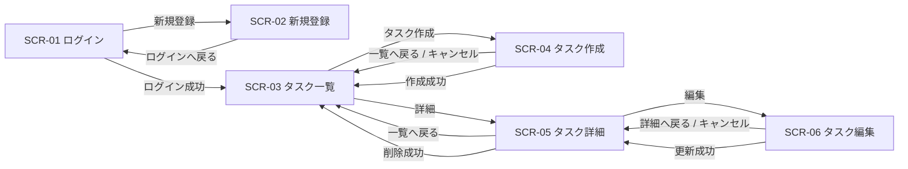

# 画面設計書

## 改訂履歴

| 版数 | 改訂日 | 改訂内容 | 作成者 |
|---|---|---|---|
| 1.0 | 2026-04-13 | 初版作成 | 佐伯 |

## 目次

- 1 [文書概要](#1-文書概要)
- 2 [画面一覧](#2-画面一覧)
- 3 [画面遷移](#3-画面遷移)
- 4 [共通レイアウト](#4-共通レイアウト)
- 6 [共通メッセージ仕様](#6-共通メッセージ仕様)
- 7 [ルーティング仕様](#7-ルーティング仕様)
- 8 [実装済み / 未実装観点](#8-実装済み-未実装観点)
- 9 [備考](#9-備考)

## 1. 文書概要

- システム名: task-manager-app
- 対象ブランチ: `develop`
- 対象ディレクトリ: `frontend`
- 作成方針: 実装済みフロントエンドコードを基準に現行仕様を整理
- 画面遷移方式: 独自ルーティング（`window.history` ベース）
- 主な画面分類:
  - 未認証画面
  - 認証後画面

---

## 2. 画面一覧

| 画面ID | 画面名 | パス | 概要 |
|---|---|---|---|
| SCR-01 | ログイン画面 | `/login` | メールアドレス・パスワードでログインする |
| SCR-02 | 新規登録画面 | `/signup` | ユーザーを新規登録する |
| SCR-03 | タスク一覧画面 | `/tasks` | 参照可能なタスクを一覧表示する |
| SCR-04 | タスク作成画面 | `/tasks/new` | 新しいタスクを登録する |
| SCR-05 | タスク詳細画面 | `/tasks/{taskId}` | タスク詳細を表示する |
| SCR-06 | タスク編集画面 | `/tasks/{taskId}/edit` | 既存タスクを更新する |

---

## 3. 画面遷移

### 遷移補足

- 未認証状態で保護画面にアクセスした場合はログイン画面へ遷移する
- ログイン成功後は、保存済みの遷移先があればその画面へ、なければ `/tasks` へ遷移する
- 認証後画面ではサイドバーから以下に遷移できる
  - タスク一覧
  - タスク作成
- ログアウト押下時はログイン画面へ遷移する

---

## 4. 共通レイアウト

## 4.1 未認証画面共通レイアウト

対象画面:

- ログイン画面
- 新規登録画面

### レイアウト構成

| 領域 | 内容 |
|---|---|
| 全体 | `AuthShell` による中央寄せレイアウト |
| ヘッダー | サービス名 `TaskFlow` |
| 本体 | 認証フォーム |
| メッセージ領域 | エラーメッセージ / 成功メッセージ表示 |

---

## 4.2 認証後画面共通レイアウト

対象画面:

- タスク一覧画面
- タスク作成画面
- タスク詳細画面
- タスク編集画面

### レイアウト構成

| 領域 | 内容 |
|---|---|
| ヘッダー左 | サービス名 `TaskFlow` |
| ヘッダー右 | ログインユーザー表示、ログアウトボタン |
| サイドバー | `タスク一覧` / `タスク作成` ナビゲーション |
| コンテンツヘッダー | 画面タイトル、説明文、画面ごとのアクションボタン |
| コンテンツ本体 | 画面固有の一覧 / 詳細 / フォーム |

### 共通部品

| 部品名 | 用途 |
|---|---|
| `TaskShell` | 認証後画面の共通レイアウト |
| `TaskForm` | タスク作成・編集の共通フォーム |

---

# 5. 画面詳細

## 5.1 SCR-01 ログイン画面

### 5.1.1 目的

既存ユーザーがメールアドレスとパスワードでログインする。

### 5.1.2 パス

`/login`

### 5.1.3 初期表示

| 項目 | 内容 |
|---|---|
| メールアドレス初期値 | `tasktester@example.com` |
| パスワード初期値 | `password123` |

### 5.1.4 画面項目

| 項目ID | 項目名 | 種別 | 必須 | 説明 |
|---|---|---|---|---|
| LGN-01 | メールアドレス | 入力欄 | ○ | ログイン用メールアドレス |
| LGN-02 | パスワード | パスワード入力 | ○ | ログイン用パスワード |
| LGN-03 | ログイン | ボタン |  | 入力内容でログインする |
| LGN-04 | 新規登録 | テキストリンクボタン |  | 新規登録画面へ遷移する |
| LGN-05 | エラーメッセージ | メッセージ |  | ログイン失敗時に表示 |
| LGN-06 | 成功メッセージ | メッセージ |  | 登録完了後などに表示 |

### 5.1.5 入力チェック

| 項目名 | 内容 |
|---|---|
| メールアドレス | 未入力不可、メール形式 |
| パスワード | 未入力不可 |

### 5.1.6 操作

| 操作 | 挙動 |
|---|---|
| ログイン押下 | 認証APIを実行し、成功時は `/tasks` または保存済み遷移先へ遷移 |
| 新規登録押下 | 新規登録画面へ遷移 |

---

## 5.2 SCR-02 新規登録画面

### 5.2.1 目的

新しいユーザーアカウントを登録する。

### 5.2.2 パス

`/signup`

### 5.2.3 画面項目

| 項目ID | 項目名 | 種別 | 必須 | 説明 |
|---|---|---|---|---|
| REG-01 | ユーザー名 | 入力欄 | ○ | 登録ユーザー名 |
| REG-02 | メールアドレス | 入力欄 | ○ | 登録メールアドレス |
| REG-03 | パスワード | パスワード入力 | ○ | 登録用パスワード |
| REG-04 | パスワード確認 | パスワード入力 | ○ | 確認用パスワード |
| REG-05 | 登録する | ボタン |  | 登録処理を実行 |
| REG-06 | ログインへ戻る | テキストリンクボタン |  | ログイン画面へ戻る |
| REG-07 | エラーメッセージ | メッセージ |  | 登録失敗時に表示 |
| REG-08 | 成功メッセージ | メッセージ |  | 登録成功時に表示 |

### 5.2.4 入力チェック

| 項目名 | 内容 |
|---|---|
| ユーザー名 | 未入力不可 |
| メールアドレス | 未入力不可、メール形式 |
| パスワード | 8文字以上 |
| パスワード確認 | 未入力不可、パスワードと一致 |

### 5.2.5 操作

| 操作 | 挙動 |
|---|---|
| 登録する押下 | 登録APIを実行し、成功時はログイン画面へ遷移 |
| ログインへ戻る押下 | ログイン画面へ遷移 |

---

## 5.3 SCR-03 タスク一覧画面

### 5.3.1 目的

ログインユーザーが参照可能なタスクを一覧表示し、詳細や作成へ遷移する。

### 5.3.2 パス

`/tasks`

### 5.3.3 画面項目

| 項目ID | 項目名 | 種別 | 説明 |
|---|---|---|---|
| LST-01 | 取得件数 | サマリー表示 | API取得件数 |
| LST-02 | 表示件数 | サマリー表示 | フィルタ適用後件数 |
| LST-03 | ステータス | プルダウン | `すべて / TODO / DOING / DONE` |
| LST-04 | 優先度 | プルダウン | `すべて / LOW / MEDIUM / HIGH` |
| LST-05 | タスク作成 | ボタン | 作成画面へ遷移 |
| LST-06 | 再読込 | ボタン | 一覧を再取得 |
| LST-07 | 一覧テーブル | 表形式 | タスク一覧を表示 |
| LST-08 | 詳細 | 行ボタン | 対象タスク詳細へ遷移 |
| LST-09 | エラーメッセージ | メッセージ | 一覧取得失敗時に表示 |
| LST-10 | 成功メッセージ | メッセージ | 作成後などに表示 |

### 5.3.4 一覧テーブル項目

| 列名 | 内容 |
|---|---|
| ID | タスクID |
| タイトル | タイトル、説明（説明がある場合のみ補足表示） |
| ステータス | タスク状態 |
| 優先度 | 優先度 |
| 担当者 | 担当ユーザー名 |
| 期限 | 期限日 |
| 操作 | 詳細ボタン |

### 5.3.5 状態別表示

| 状態 | 表示内容 |
|---|---|
| 読み込み中 | `タスクを読み込み中です...` |
| 0件 | `条件に一致するタスクはありません。` |
| 正常 | 一覧テーブル表示 |

### 5.3.6 操作

| 操作 | 挙動 |
|---|---|
| タスク作成押下 | タスク作成画面へ遷移 |
| 再読込押下 | タスク一覧再取得 |
| ステータス変更 | クライアント側で絞り込み |
| 優先度変更 | クライアント側で絞り込み |
| 詳細押下 | 対象タスクの詳細画面へ遷移 |

---

## 5.4 SCR-04 タスク作成画面

### 5.4.1 目的

新しいタスクを登録する。

### 5.4.2 パス

`/tasks/new`

### 5.4.3 画面項目

| 項目ID | 項目名 | 種別 | 必須 | 説明 |
|---|---|---|---|---|
| CRT-01 | タイトル | 入力欄 | ○ | タスクタイトル |
| CRT-02 | 説明 | テキストエリア |  | タスク説明 |
| CRT-03 | ステータス | プルダウン | ○ | `TODO / DOING / DONE` |
| CRT-04 | 優先度 | プルダウン | ○ | `LOW / MEDIUM / HIGH` |
| CRT-05 | 期限 | 日付入力 |  | 期限日 |
| CRT-06 | 担当者 | プルダウン |  | 未選択含むユーザー候補 |
| CRT-07 | キャンセル | ボタン |  | 一覧へ戻る |
| CRT-08 | タスクを作成 | ボタン |  | 作成処理を実行 |
| CRT-09 | 一覧へ戻る | ヘッダーボタン |  | 一覧画面へ戻る |
| CRT-10 | エラーメッセージ | メッセージ |  | 作成失敗時に表示 |
| CRT-11 | 成功メッセージ | メッセージ |  | 成功時に表示 |
| CRT-12 | 担当者候補読込中表示 | 補助表示 |  | 候補取得中に表示 |

### 5.4.4 入力チェック

| 項目名 | 内容 |
|---|---|
| タイトル | 未入力不可、100文字以内 |
| 説明 | 5000文字以内 |
| ステータス | 必須 |
| 優先度 | 必須 |
| 担当者 | 候補一覧に存在する値のみ許可 |

### 5.4.5 操作

| 操作 | 挙動 |
|---|---|
| タスクを作成押下 | 作成APIを実行、成功時は一覧画面へ遷移 |
| キャンセル押下 | 一覧画面へ戻る |
| 一覧へ戻る押下 | 一覧画面へ戻る |

---

## 5.5 SCR-05 タスク詳細画面

### 5.5.1 目的

タスクの詳細情報を表示し、編集・削除へ遷移する。

### 5.5.2 パス

`/tasks/{taskId}`

### 5.5.3 画面項目

| 項目ID | 項目名 | 種別 | 説明 |
|---|---|---|---|
| DTL-01 | タイトル | 表示 | タスクタイトル |
| DTL-02 | ステータス | 表示 | タスク状態 |
| DTL-03 | 優先度 | 表示 | タスク優先度 |
| DTL-04 | 期限 | 表示 | 期限日 |
| DTL-05 | 担当者 | 表示 | 担当ユーザー名 |
| DTL-06 | 作成日 | 表示 | 作成日時 |
| DTL-07 | 更新日 | 表示 | 更新日時 |
| DTL-08 | 作成者 | 表示 | 作成ユーザー名 |
| DTL-09 | 説明 | 表示 | タスク説明 |
| DTL-10 | 一覧へ戻る | ボタン | 一覧画面へ戻る |
| DTL-11 | 編集 | ボタン | 編集画面へ遷移 |
| DTL-12 | 削除 | ボタン | 削除処理を実行 |
| DTL-13 | エラーメッセージ | メッセージ | 取得失敗時等に表示 |
| DTL-14 | 成功メッセージ | メッセージ | 更新後などに表示 |

### 5.5.4 状態別表示

| 状態 | 表示内容 |
|---|---|
| 読み込み中 | `タスクを読み込み中です...` |
| データなし | `タスクが見つかりません。` |
| 正常 | 詳細情報表示 |

### 5.5.5 操作

| 操作 | 挙動 |
|---|---|
| 一覧へ戻る押下 | 一覧画面へ戻る |
| 編集押下 | 編集画面へ遷移 |
| 削除押下 | 確認ダイアログ表示後、削除APIを実行 |
| 削除成功 | 一覧画面へ遷移 |

### 5.5.6 備考

- `commentDraft` の状態は保持しているが、現行画面ではコメント入力欄は描画されていない

---

## 5.6 SCR-06 タスク編集画面

### 5.6.1 目的

既存タスクを更新する。

### 5.6.2 パス

`/tasks/{taskId}/edit`

### 5.6.3 画面項目

| 項目ID | 項目名 | 種別 | 必須 | 説明 |
|---|---|---|---|---|
| EDT-01 | タイトル | 入力欄 | ○ | タスクタイトル |
| EDT-02 | 説明 | テキストエリア |  | タスク説明 |
| EDT-03 | ステータス | プルダウン | ○ | `TODO / DOING / DONE` |
| EDT-04 | 優先度 | プルダウン | ○ | `LOW / MEDIUM / HIGH` |
| EDT-05 | 期限 | 日付入力 |  | 期限日 |
| EDT-06 | 担当者 | プルダウン |  | 未選択含むユーザー候補 |
| EDT-07 | キャンセル | ボタン |  | 詳細へ戻る |
| EDT-08 | 更新する | ボタン |  | 更新処理を実行 |
| EDT-09 | 詳細へ戻る | ヘッダーボタン |  | 詳細画面へ戻る |
| EDT-10 | エラーメッセージ | メッセージ |  | 更新失敗時に表示 |
| EDT-11 | 成功メッセージ | メッセージ |  | 更新後に表示 |
| EDT-12 | 読込中メッセージ | メッセージ |  | 詳細取得中に表示 |

### 5.6.4 入力チェック

| 項目名 | 内容 |
|---|---|
| タイトル | 未入力不可、100文字以内 |
| 説明 | 5000文字以内 |
| ステータス | 必須 |
| 優先度 | 必須 |
| 担当者 | 候補一覧に存在する値のみ許可 |

### 5.6.5 初期表示

- 対象タスクの既存値をフォームにセットする
- 読み込み中はフォームの代わりに読込メッセージを表示する

### 5.6.6 操作

| 操作 | 挙動 |
|---|---|
| 更新する押下 | 更新APIを実行、成功時は詳細画面へ遷移 |
| キャンセル押下 | 詳細画面へ戻る |
| 詳細へ戻る押下 | 詳細画面へ戻る |

---

## 6. 共通メッセージ仕様

| 種別 | 説明 |
|---|---|
| success-box | 成功メッセージ表示 |
| error-box | エラーメッセージ表示 |
| warning-box | 警告メッセージ表示 |
| field-error | 項目単位エラーメッセージ |

---

## 7. ルーティング仕様

| パス | 解決画面 |
|---|---|
| `/tasks/new` | タスク作成 |
| `/tasks/{taskId}/edit` | タスク編集 |
| `/tasks/{taskId}` | タスク詳細 |
| 上記以外 | タスク一覧 |

### 補足

- `/login` と `/signup` は認証状態制御側で扱う
- `/` にアクセスした場合、認証状態に応じてログインまたはタスク一覧へ遷移する

---

## 8. 実装済み / 未実装観点

## 8.1 実装済み画面

- ログイン
- 新規登録
- タスク一覧
- タスク作成
- タスク詳細
- タスク編集

## 8.2 現時点で未確認または未実装の画面・機能

- カレンダー画面
- コメント表示・投稿UI
- 添付ファイルUI
- チーム管理画面
- かんばん表示
- ページネーション
- 検索入力欄によるキーワード検索UI

---

## 9. 備考

- 本設計書は `develop` ブランチの実装を基準とした現行仕様である
- 画面項目名や遷移はフロントエンドコードの実装内容を優先して記載している
- 文言やレイアウトの微調整が今後入る可能性はあるが、現時点では本書を画面仕様の基準とする