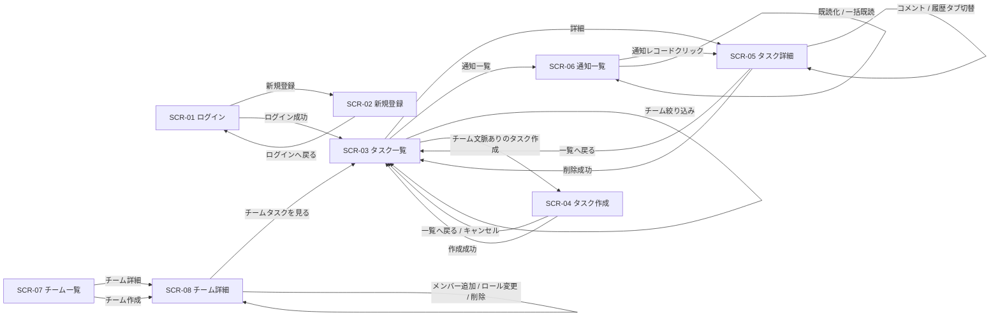
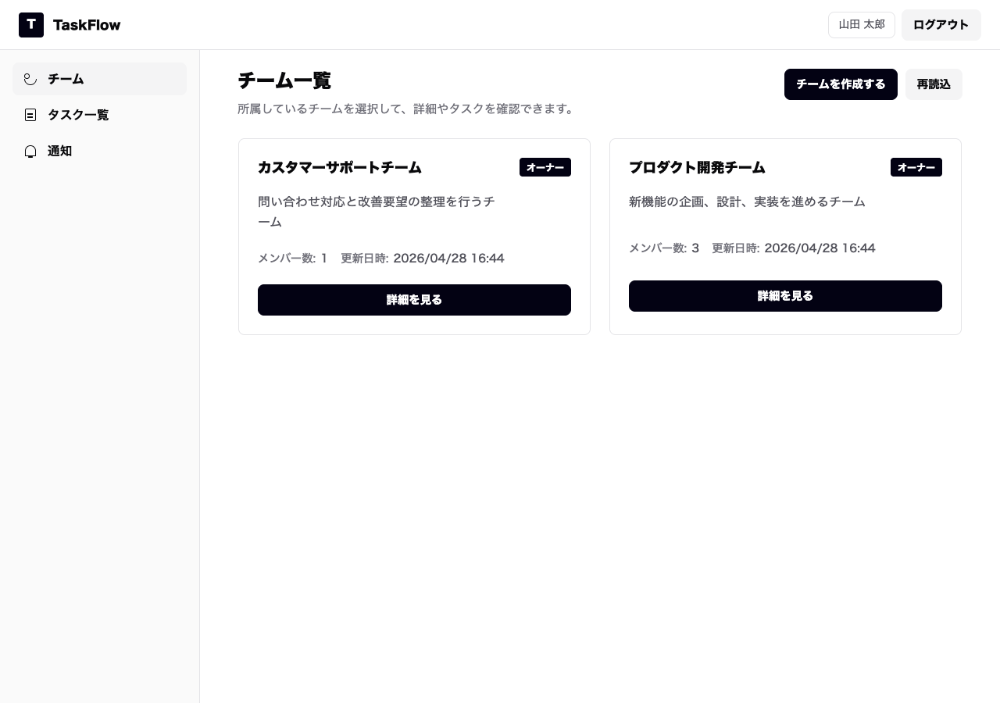
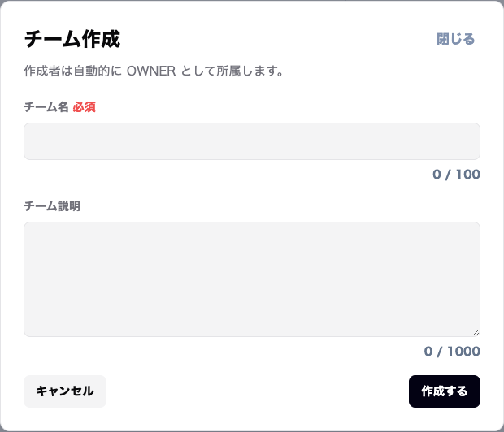
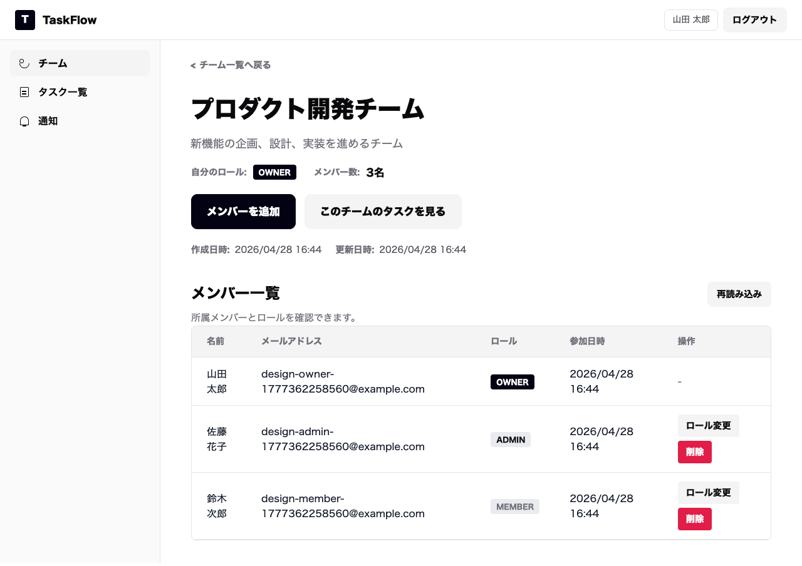
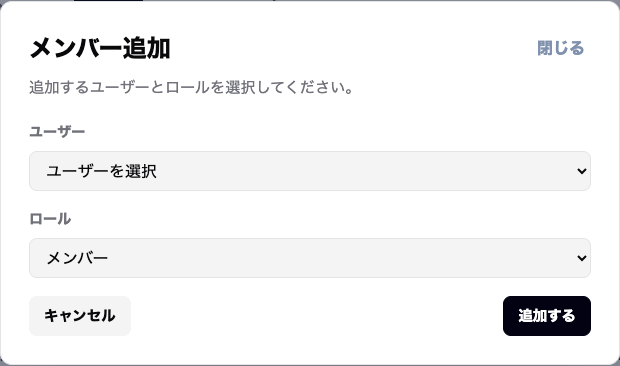
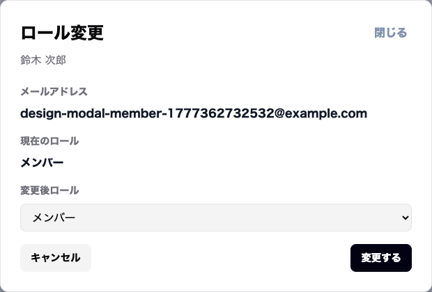
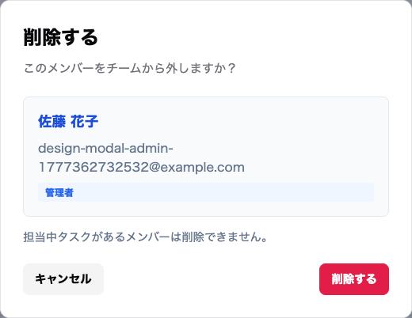

# 画面設計書

## 改訂履歴

| 版数 | 改訂日 | 改訂内容 | 作成者 |
|---|---|---|---|
| 1.0 | 2026-04-13 | 初版作成 | 佐伯 |
| 1.1 | 2026-04-14 | コメント、添付ファイル、通知一覧、タスク詳細内履歴表示を追加 | 佐伯 |
| 1.2 | 2026-04-27 | チーム一覧、チーム詳細、メンバー管理、チーム文脈でのタスク操作を追加 | 佐伯 |

1. 文書概要

## 1. 文書概要

- システム名: task-manager-app
- 対象ブランチ: `develop`
- 対象ディレクトリ: `frontend`
- 画面遷移方式: 独自ルーティング（`window.history` ベース）
- 画面分類:
  - 未認証画面
  - 認証後画面

---

2. 画面一覧

## 2. 画面一覧

| 画面ID | 画面名 | パス | 概要 |
|---|---|---|---|
| SCR-01 | ログイン画面 | `/login` | メールアドレス・パスワードでログインする |
| SCR-02 | 新規登録画面 | `/signup` | ユーザーを新規登録する |
| SCR-03 | タスク一覧画面 | `/tasks`, `/tasks?teamId={teamId}` | 参照可能なタスクを一覧表示する |
| SCR-04 | タスク作成画面 | `/tasks/new?teamId={teamId}` | 指定チームに新しいタスクを登録する |
| SCR-05 | タスク詳細画面 | `/tasks/{taskId}` | タスク詳細、編集モード、添付ファイル、コメント、履歴を表示する |
| SCR-06 | 通知一覧画面 | `/notifications` | ログインユーザー宛の通知を一覧表示する |
| SCR-07 | チーム一覧画面 | `/teams` | 所属チームを一覧表示し、チーム作成や詳細確認を行う |
| SCR-08 | チーム詳細画面 | `/teams/{teamId}` | チーム基本情報、メンバー一覧、メンバー管理、チームタスク導線を表示する |

---

3. 画面遷移

## 3. 画面遷移

### 遷移補足

- 未認証状態で保護画面にアクセスした場合はログイン画面へ遷移する
- ログイン成功後は、保存済みの遷移先があればその画面へ、なければ `/tasks` へ遷移する
- 認証後画面ではサイドバーから以下に遷移できる
  - チーム
  - タスク一覧
  - 通知一覧
- タスク作成は、チーム文脈がある状態で `/tasks/new?teamId={teamId}` へ遷移して行う。
- タスク編集は専用画面へ遷移せず、タスク詳細画面内で表示モード / 編集モードを切り替える。
- `/tasks` は所属チーム横断のタスク一覧として表示する。
- `/tasks?teamId={teamId}` は指定チームのタスク一覧として表示する。
- チーム詳細画面からタスク一覧へ遷移する場合は、`teamId` を指定して表示する。
- 通知レコードをクリックした場合、関連タスクが存在すればタスク詳細画面へ遷移する。
- 独立したアクティビティログ画面は設けず、タスク詳細画面内の履歴タブで表示する。
- ログアウト押下時はログイン画面へ遷移する

---

4. 共通レイアウト

## 4. 共通レイアウト

## 4.1 未認証画面共通レイアウト

対象画面:

- ログイン画面
- 新規登録画面

### レイアウト構成

| 領域 | 内容 |
|---|---|
| 全体 | `AuthShell` による中央寄せレイアウト |
| ヘッダー | サービス名 `TaskFlow` |
| 本体 | 認証フォーム |
| メッセージ領域 | エラーメッセージ / 成功メッセージ表示 |

---

## 4.2 認証後画面共通レイアウト

対象画面:

- チーム一覧画面
- チーム詳細画面
- タスク一覧画面
- タスク作成画面
- タスク詳細画面
- タスク編集画面
- 通知一覧画面

### レイアウト構成

| 領域 | 内容 |
|---|---|
| ヘッダー左 | サービス名 `TaskFlow` |
| ヘッダー右 | ログインユーザー表示、ログアウトボタン |
| サイドバー | `チーム` / `タスク一覧` / `通知一覧` |
| サイドバー通知表示 | 未読通知がある場合、`通知一覧` に未読件数バッジを表示 |
| コンテンツヘッダー | 画面タイトル、説明文、画面ごとのアクションボタン |
| コンテンツ本体 | 画面固有の一覧 / 詳細 / フォーム |

### 共通部品

| 部品名 | 用途 |
|---|---|
| `TaskShell` | 認証後画面の共通レイアウト |
| `TaskForm` | タスク作成フォーム、およびタスク詳細画面内編集フォーム部品 |
| `MessageBox` | 成功 / エラー / 警告メッセージ表示 |
| `Pagination` | ページング操作 |
| `ConfirmDialog` | 削除確認 |
| `Modal` | チーム作成、メンバー追加、ロール変更などの確認・入力表示 |
| `Toast` | 成功メッセージの短時間表示 |

---

5. 画面詳細

5.1 SCR-01 ログイン画面

## 5.1 SCR-01 ログイン画面

### 5.1.1 目的

既存ユーザーがメールアドレスとパスワードでログインする。

### 5.1.2 パス

`/login`

### 5.1.3 画面イメージ

### 5.1.4 画面項目

| 項目ID | 項目名 | 種別 | 必須 | 説明 |
|---|---|---|---|---|
| LGN-01 | メールアドレス | 入力欄 | ○ | ログイン用メールアドレス |
| LGN-02 | パスワード | パスワード入力 | ○ | ログイン用パスワード |
| LGN-03 | ログイン | ボタン |  | 入力内容でログインする |
| LGN-04 | 新規登録 | テキストリンクボタン |  | 新規登録画面へ遷移する |
| LGN-05 | エラーメッセージ | メッセージ |  | ログイン失敗時に表示 |
| LGN-06 | 成功メッセージ | メッセージ |  | 登録完了後などに表示 |

### 5.1.5 入力チェック

| 項目名 | 内容 |
|---|---|
| メールアドレス | 未入力不可、メール形式 |
| パスワード | 未入力不可 |

### 5.1.6 操作

| 操作 | 挙動 |
|---|---|
| ログイン押下 | 認証APIを実行し、成功時は `/tasks` または保存済み遷移先へ遷移 |
| 新規登録押下 | 新規登録画面へ遷移 |

---

5.2 SCR-02 新規登録画面

## 5.2 SCR-02 新規登録画面

### 5.2.1 目的

新しいユーザーアカウントを登録する。

### 5.2.2 パス

`/signup`

### 5.2.3 画面イメージ

### 5.2.４ 画面項目

| 項目ID | 項目名 | 種別 | 必須 | 説明 |
|---|---|---|---|---|
| REG-01 | ユーザー名 | 入力欄 | ○ | 登録ユーザー名 |
| REG-02 | メールアドレス | 入力欄 | ○ | 登録メールアドレス |
| REG-03 | パスワード | パスワード入力 | ○ | 登録用パスワード |
| REG-04 | パスワード確認 | パスワード入力 | ○ | 確認用パスワード |
| REG-05 | 登録する | ボタン |  | 登録処理を実行 |
| REG-06 | ログインへ戻る | テキストリンクボタン |  | ログイン画面へ戻る |
| REG-07 | エラーメッセージ | メッセージ |  | 登録失敗時に表示 |
| REG-08 | 成功メッセージ | メッセージ |  | 登録成功時に表示 |

### 5.2.５ 入力チェック

| 項目名 | 内容 |
|---|---|
| ユーザー名 | 未入力不可 |
| メールアドレス | 未入力不可、メール形式 |
| パスワード | 8文字以上 |
| パスワード確認 | 未入力不可、パスワードと一致 |

### 5.2.6 操作

| 操作 | 挙動 |
|---|---|
| 登録する押下 | 登録APIを実行し、成功時はログイン画面へ遷移 |
| ログインへ戻る押下 | ログイン画面へ遷移 |

---

5.3 SCR-03 タスク一覧画面

## 5.3 SCR-03 タスク一覧画面

### 5.3.1 目的

ログインユーザーが参照可能なタスクを一覧表示し、詳細や作成へ遷移する。

### 5.3.2 パス

`/tasks`

`/tasks?teamId={teamId}`

### 5.3.3 画面イメージ

### 5.3.3 画面項目

| 項目ID | 項目名 | 種別 | 説明 |
|---|---|---|---|
| LST-01 | 取得件数 | サマリー表示 | API取得件数 |
| LST-02 | 表示件数 | サマリー表示 | フィルタ適用後件数 |
| LST-03 | ステータス | プルダウン | `すべて / TODO / DOING / DONE` |
| LST-04 | 優先度 | プルダウン | `すべて / LOW / MEDIUM / HIGH` |
| LST-05 | タスク作成 | ボタン | 作成画面へ遷移 |
| LST-06 | 再読込 | ボタン | 一覧を再取得 |
| LST-07 | 一覧テーブル | 表形式 | タスク一覧を表示 |
| LST-08 | 詳細 | 行ボタン | 対象タスク詳細へ遷移 |
| LST-09 | エラーメッセージ | メッセージ | 一覧取得失敗時に表示 |
| LST-10 | 成功メッセージ | メッセージ | 作成後などに表示 |
| LST-11 | 表示対象 | テキスト | 所属全チームまたは指定チーム名を表示 |
| LST-12 | チーム絞り込み | プルダウン | 所属チームで一覧を絞り込む |
| LST-13 | チーム詳細へ戻る | リンク | 指定チームの詳細画面へ戻る |

### 5.3.4 一覧テーブル項目

| 列名 | 内容 |
|---|---|
| ID | タスクID |
| チーム | タスクが所属するチーム名 |
| タイトル | タイトル、説明（説明がある場合のみ補足表示） |
| ステータス | タスク状態 |
| 優先度 | 優先度 |
| 担当者 | 担当ユーザー名 |
| 期限 | 期限日 |
| 操作 | 詳細ボタン |

### 5.3.5 状態別表示

| 状態 | 表示内容 |
|---|---|
| 読み込み中 | `タスクを読み込み中です...` |
| 0件 | `条件に一致するタスクはありません。` |
| 正常 | 一覧テーブル表示 |

### 5.3.6 操作

| 操作 | 挙動 |
|---|---|
| タスク作成押下 | `teamId` が指定されている場合、タスク作成画面へ遷移 |
| 再読込押下 | タスク一覧再取得 |
| ステータス変更 | クライアント側で絞り込み |
| 優先度変更 | クライアント側で絞り込み |
| チーム絞り込み変更 | 選択チームで一覧を絞り込む |
| 詳細押下 | 対象タスクの詳細画面へ遷移 |
| チーム詳細へ戻る押下 | `/teams/{teamId}` へ遷移 |

### 5.3.7 表示仕様

- `/tasks` では、所属全チームの参照可能タスクを表示する。
- `/tasks` では、表示対象として `所属全チーム` を表示する。
- `/tasks` では、タスク作成ボタンを表示しない。
- `/tasks?teamId={teamId}` では、指定チームの参照可能タスクを表示する。
- `/tasks?teamId={teamId}` では、表示対象としてチーム名を表示する。
- `/tasks?teamId={teamId}` では、タスク作成ボタンとチーム詳細へ戻るリンクを表示する。
- 削除済みタスクは一覧に表示しない。

---

5.4 SCR-04 タスク作成画面

## 5.4 SCR-04 タスク作成画面

### 5.4.1 目的

指定チームに新しいタスクを登録する。

### 5.4.2 パス

`/tasks/new?teamId={teamId}`

### 5.４.3 画面イメージ

### 5.4.3 画面項目

| 項目ID | 項目名 | 種別 | 必須 | 説明 |
|---|---|---|---|---|
| CRT-01 | タイトル | 入力欄 | ○ | タスクタイトル |
| CRT-02 | 説明 | テキストエリア |  | タスク説明 |
| CRT-03 | ステータス | プルダウン | ○ | `TODO / DOING / DONE` |
| CRT-04 | 優先度 | プルダウン | ○ | `LOW / MEDIUM / HIGH` |
| CRT-05 | 期限 | 日付入力 |  | 期限日 |
| CRT-06 | 担当者 | プルダウン |  | 指定チームの所属メンバー候補 |
| CRT-07 | キャンセル | ボタン |  | 一覧へ戻る |
| CRT-08 | タスクを作成 | ボタン |  | 作成処理を実行 |
| CRT-09 | 一覧へ戻る | ヘッダーボタン |  | 一覧画面へ戻る |
| CRT-10 | エラーメッセージ | メッセージ |  | 作成失敗時に表示 |
| CRT-11 | 成功メッセージ | メッセージ |  | 成功時に表示 |
| CRT-12 | 担当者候補読込中表示 | 補助表示 |  | 候補取得中に表示 |
| CRT-13 | チーム | 固定表示 |  | タスクを作成するチーム名 |

### 5.4.4 入力チェック

| 項目名 | 内容 |
|---|---|
| チーム | `teamId` 指定必須 |
| タイトル | 未入力不可、100文字以内 |
| 説明 | 5000文字以内 |
| ステータス | 必須 |
| 優先度 | 必須 |
| 担当者 | 指定チームの所属メンバー候補に存在する値のみ許可 |

### 5.4.5 操作

| 操作 | 挙動 |
|---|---|
| タスクを作成押下 | 作成APIを実行、成功時は指定チームのタスク一覧画面へ遷移 |
| キャンセル押下 | 指定チームのタスク一覧画面へ戻る |
| 一覧へ戻る押下 | 指定チームのタスク一覧画面へ戻る |

### 5.4.6 表示仕様

- チームは入力項目として変更させず、固定表示とする。
- 担当者候補は指定チームの所属メンバーのみ表示する。
- `teamId` が指定されていない場合は `/teams` へ遷移し、タスクを作成するチームの選択を促す。
- 指定チームが存在しない、または作成権限がない場合は `/teams` へ遷移し、タスクを作成できない旨を表示する。

---

5.5 SCR-05 タスク詳細画面

## 5.5 SCR-05 タスク詳細画面

### 5.5.1 目的

タスクの詳細情報、編集モード、添付ファイル、コメント、履歴を表示し、タスク更新・削除・協業操作を行う。

### 5.5.2 パス

`/tasks/{taskId}`

`/tasks/{taskId}?teamId={teamId}`

### 5.5.3 表示モード / 編集モード

| モード | 説明 |
|---|---|
| 表示モード | タスク情報を参照する通常表示 |
| 編集モード | 編集可能な項目を入力可能にし、保存 / キャンセルを表示する |

### 5.5.4 画面イメージ

### 5.5.5 画面構成

| 領域 | 内容 |
|---|---|
| コンテンツヘッダー | 画面タイトル、説明文、一覧へ戻る、編集、削除、保存、キャンセル |
| 左メイン領域 | 本文、添付ファイル、アクティビティ |
| 右属性領域 | チーム、ステータス、優先度、担当者、作成者、期限、作成日、更新日 |
| メッセージ領域 | 各操作の成功 / エラー表示 |

### 5.5.6 コンテンツヘッダー項目
| 表示 | 編集 |
|---|---|
|  |  |

| 項目ID | 項目名 | 種別 | 表示条件 | 説明 |
|---|---|---|---|---|
| HDR-01 | 一覧へ戻る | ボタン | 常時 | 一覧画面へ戻る |
| HDR-02 | 編集 | ボタン | 表示モードかつ更新権限あり | 編集モードへ切り替える |
| HDR-03 | 削除 | ボタン | 表示モードかつ削除権限あり | タスク削除処理を実行 |
| HDR-04 | 保存 | ボタン | 編集モード | 入力内容でタスク更新APIを実行 |
| HDR-05 | キャンセル | ボタン | 編集モード | 編集内容を破棄して表示モードへ戻る |

### 5.5.7 タスク本文項目
| 表示 | 編集 |
|---|---|
|  |  |

| 項目ID | 項目名 | 表示モード | 編集モード | 説明 |
|---|---|---|---|---|
| DTL-01 | タスクID | 表示 | 表示 | タスクID |
| DTL-02 | タイトル | 表示 | 入力欄 | タスクタイトル |
| DTL-03 | 説明 | 表示 | テキストエリア | タスク説明 |
| DTL-04 | 添付 | ボタン | ボタン | OSのファイル選択ダイアログを開く |

### 5.5.8 右属性領域項目

| 表示 | 編集 |
|---|---|
|  |  |

| 項目ID | 項目名 | 表示モード | 編集モード | 説明 |
|---|---|---|---|---|
| PRP-01 | ステータス | 表示 | プルダウン | タスク状態 |
| PRP-02 | 優先度 | 表示 | プルダウン | タスク優先度 |
| PRP-03 | 担当者 | 表示 | プルダウン | 担当ユーザー |
| PRP-04 | 作成者 | 表示 | 表示 | 作成ユーザー名 |
| PRP-05 | 期限 | 表示 | 日付入力 | 期限日 |
| PRP-06 | 作成日 | 表示 | 表示 | 作成日時 |
| PRP-07 | 更新日 | 表示 | 表示 | 更新日時 |
| PRP-08 | チーム | 表示 | 表示 | タスクが所属するチーム名 |

### 5.5.9 編集可能項目

| 項目名 | 入力形式 | バリデーション |
|---|---|---|
| タイトル | テキスト入力 | 未入力不可、100文字以内 |
| 説明 | テキストエリア | 5000文字以内 |
| ステータス | プルダウン | `TODO / DOING / DONE` |
| 優先度 | プルダウン | `LOW / MEDIUM / HIGH` |
| 期限 | 日付入力 | `yyyy-MM-dd` |
| 担当者 | プルダウン | タスク所属チームのメンバー候補に存在するユーザーのみ |

### 5.5.10 編集モード操作仕様

| 操作 | 挙動 |
|---|---|
| 編集押下 | 表示モードから編集モードへ切り替える |
| 保存押下 | タスク更新APIを実行し、成功時は表示モードへ戻る |
| キャンセル押下 | 入力内容を破棄し、表示モードへ戻る |
| 保存成功 | 最新のタスク詳細を再取得またはレスポンス内容で画面を更新する |
| 保存失敗 | 編集モードを維持し、エラーメッセージを表示する |

### 5.5.11 添付ファイル領域項目

| 項目ID | 項目名 | 種別 | 説明 |
|---|---|---|---|
| ATT-01 | 添付ファイル一覧 | 表示 | アップロード済みファイルを小さめの横並びで表示 |
| ATT-02 | ファイル名 | リンク | クリックするとファイルをダウンロード |
| ATT-03 | ファイルサイズ | 表示 | ファイルサイズ |
| ATT-04 | アップロード者 | 表示 | 添付登録者名 |
| ATT-05 | 削除 | ボタン | 添付ファイルを削除 |

### 5.5.12 添付ファイル操作仕様

| 操作 | 挙動 |
|---|---|
| 添付ボタン押下 | OSのファイル選択ダイアログを表示 |
| ファイル選択 | 選択したファイルをアップロード |
| アップロード成功 | 添付ファイル領域にファイル名リンクを表示 |
| ファイル名クリック | 添付ファイルをダウンロード |
| 削除押下 | 確認ダイアログ表示後、添付削除APIを実行 |

### 5.5.13 アクティビティ領域項目

アクティビティ領域は、タブで `コメント` と `履歴` を切り替える。

| コメント | 履歴 |
|---|---|
|  |  |

| 項目ID | 項目名 | 種別 | 説明 |
|---|---|---|---|
| ACT-01 | コメントタブ | タブ | コメント入力・コメント一覧を表示 |
| ACT-02 | 履歴タブ | タブ | タスク関連の履歴を表示 |
| ACT-03 | コメント入力 | テキストエリア | 新規コメント本文を入力 |
| ACT-04 | 投稿 | ボタン | コメント投稿APIを実行 |
| ACT-05 | コメント一覧 | リスト | 対象タスクのコメントを表示 |
| ACT-06 | 投稿者 | 表示 | コメント投稿者名 |
| ACT-07 | 投稿日時 | 表示 | コメント作成日時 |
| ACT-08 | 更新日時 | 表示 | コメント更新日時 |
| ACT-09 | コメント本文 | 表示 / 編集欄 | コメント内容 |
| ACT-10 | 編集 | ボタン | コメント編集モードへ切り替える |
| ACT-11 | 保存 | ボタン | コメント更新APIを実行 |
| ACT-12 | キャンセル | ボタン | コメント編集を取り消す |
| ACT-13 | 削除 | ボタン | コメント削除APIを実行 |
| ACT-14 | 履歴一覧 | リスト | タスク更新、コメント、添付操作の履歴を表示 |
| ACT-15 | イベント種別 | 表示 | 履歴イベント種別 |
| ACT-16 | 概要 | 表示 | 履歴概要 |
| ACT-17 | 発生日時 | 表示 | 履歴発生日時 |

### 5.5.14 状態別表示

| 状態 | 表示内容 |
|---|---|
| 読み込み中 | `タスクを読み込み中です...` |
| データなし | `タスクが見つかりません。` |
| コメント0件 | `コメントはまだありません。` |
| 添付0件 | `添付ファイルはまだありません。` |
| 履歴0件 | `履歴はまだありません。` |
| 正常 | 詳細情報、添付一覧、コメント、履歴を表示 |

### 5.5.15 操作

| 操作 | 挙動 |
|---|---|
| 一覧へ戻る押下 | 遷移元文脈に応じて一覧画面へ戻る |
| 編集押下 | タスク詳細画面を編集モードへ切り替える |
| 保存押下 | タスク更新APIを実行し、成功時は表示モードへ戻る |
| キャンセル押下 | 編集内容を破棄し、表示モードへ戻る |
| 削除押下 | 確認ダイアログ表示後、削除APIを実行 |
| 添付押下 | OSのファイル選択ダイアログを開く |
| ファイル選択 | 添付アップロードAPIを実行 |
| ファイル名クリック | 添付ダウンロードAPIを実行 |
| 添付削除押下 | 確認ダイアログ表示後、添付削除APIを実行 |
| コメントタブ押下 | コメント入力・コメント一覧を表示 |
| 履歴タブ押下 | 履歴一覧を表示 |
| コメント投稿押下 | コメント投稿APIを実行し、成功時はコメント一覧を再取得 |
| コメント編集保存押下 | コメント更新APIを実行し、成功時はコメント一覧を再取得 |
| コメント削除押下 | 確認ダイアログ表示後、コメント削除APIを実行 |

### 5.5.16 表示仕様

- チームは表示専用とし、編集モードでも変更しない。
- `teamId` が指定されている場合は、一覧へ戻る操作時に `teamId` を維持する。
- 通知一覧など特殊導線から遷移した場合は、戻り先判定で `from` を優先する。

---

5.6 SCR-06 通知一覧画面

## 5.6 SCR-06 通知一覧画面

### 5.6.1 目的

ログインユーザー宛の通知を一覧表示し、未読確認、既読化、関連タスクへの遷移を行う。

### 5.6.2 パス

`/notifications`

### 5.6.3 画面イメージ

### 5.6.4 画面項目

| 項目ID | 項目名 | 種別 | 説明 |
|---|---|---|---|
| NTF-01 | 未読のみ表示 | チェックボックス / ボタン | 未読通知のみ表示する |
| NTF-02 | 一括既読 | ボタン | 未読通知をまとめて既読にする |
| NTF-03 | 通知一覧 | リスト | 自分宛通知を表示 |
| NTF-04 | 通知レコード | クリック可能領域 | クリックすると関連タスク詳細へ遷移 |
| NTF-05 | 通知種別 | 表示 | コメント追加、添付追加、担当変更など |
| NTF-06 | 既読状態 | 表示 | 未読 / 既読 |
| NTF-07 | メッセージ | 表示 | 通知本文 |
| NTF-08 | 関連タスク | 表示 | 関連タスク名 |
| NTF-09 | 通知日時 | 表示 | 通知作成日時 |
| NTF-10 | 既読にする | ボタン | 対象通知を既読化する |
| NTF-11 | ページング | ページ操作 | 通知一覧のページを切り替える |
| NTF-12 | エラーメッセージ | メッセージ | 通知取得・更新失敗時に表示 |

### 5.6.5 表示仕様

- 未読通知は背景色またはラベルで強調表示する。
- 既読通知は通常表示とする。
- 通知レコード全体をクリック可能にする。
- 通知レコードクリック時、関連タスクが存在すればタスク詳細画面へ遷移する。
- 関連タスクが削除済み、未存在、または参照権限がない場合は通知一覧画面に留まり、画面上部メッセージで知らせる。

### 5.6.6 状態別表示

| 状態 | 表示内容 |
|---|---|
| 読み込み中 | `通知を読み込み中です...` |
| 0件 | `通知はありません。` |
| 未読0件 | `未読通知はありません。` |
| 正常 | 通知一覧を表示 |

### 5.6.7 操作

| 操作 | 挙動 |
|---|---|
| 未読のみ表示変更 | 通知一覧を再取得または絞り込み |
| 一括既読押下 | 通知一括既読化APIを実行 |
| 既読にする押下 | 通知既読化APIを実行 |
| 通知レコードクリック | 関連タスクの参照可否を確認し、参照可能な場合のみタスク詳細画面へ遷移 |
| ページ切替 | 指定ページの通知一覧を取得 |

---

5.7 SCR-07 チーム一覧画面

## 5.7 SCR-07 チーム一覧画面

### 5.7.1 目的

ログインユーザーが所属しているチームを一覧表示し、チーム詳細確認とチーム作成を行う。

### 5.7.2 パス

`/teams`

### 5.7.3 画面イメージ

### 5.7.4 画面項目

| 項目ID | 項目名 | 種別 | 説明 |
|---|---|---|---|
| TML-01 | 画面タイトル | テキスト | `チーム一覧` |
| TML-02 | 説明文 | テキスト | 所属チームを選択して詳細を確認できる旨を表示 |
| TML-03 | チーム作成 | ボタン | チーム作成モーダルを表示 |
| TML-04 | チーム一覧 | カード / 表形式 | 所属チームを表示 |
| TML-05 | チーム名 | リンク | チーム詳細画面へ遷移 |
| TML-06 | チーム説明 | テキスト | チーム説明を省略表示する |
| TML-07 | 自分のロール | ラベル | `OWNER / ADMIN / MEMBER` を表示 |
| TML-08 | メンバー数 | 数値表示 | チームのメンバー数を表示 |
| TML-09 | 作成日時 / 更新日時 | 日時表示 | チームの作成日時または更新日時を表示 |
| TML-10 | エラーメッセージ | メッセージ | 一覧取得失敗時に表示 |

### 5.7.5 チーム作成モーダル項目

| 項目ID | 項目名 | 種別 | 必須 | 説明 |
|---|---|---|---|---|
| TMC-01 | チーム名 | 入力欄 | ○ | チーム名 |
| TMC-02 | チーム説明 | テキストエリア |  | チーム説明 |
| TMC-03 | 補足文 | テキスト |  | 作成者が OWNER として所属する旨を表示 |
| TMC-04 | 文字数カウンタ | 表示 |  | チーム名 / チーム説明の入力長を表示 |
| TMC-05 | 作成する | ボタン |  | チーム作成APIを実行 |
| TMC-06 | キャンセル | ボタン |  | モーダルを閉じる |
| TMC-07 | エラーメッセージ | メッセージ |  | 作成失敗時に表示 |

### 5.7.6 入力チェック

| 項目名 | 内容 |
|---|---|
| チーム名 | 未入力不可、100文字以内 |
| チーム説明 | 1000文字以内 |
| チーム名重複 | 同一作成者内で重複不可 |

### 5.7.7 状態別表示

| 状態 | 表示内容 |
|---|---|
| 読み込み中 | `チームを読み込み中です...` |
| 0件 | `所属しているチームがありません。まずはチームを作成してください。` |
| 正常 | チーム一覧を表示 |

### 5.7.8 操作

| 操作 | 挙動 |
|---|---|
| チーム作成押下 | チーム作成モーダルを表示 |
| 作成する押下 | チーム作成APIを実行し、成功時は作成したチームの詳細画面へ遷移 |
| キャンセル押下 | チーム作成モーダルを閉じる |
| チーム名押下 | チーム詳細画面へ遷移 |
| 詳細を見る押下 | チーム詳細画面へ遷移 |

---

5.8 SCR-08 チーム詳細画面

## 5.8 SCR-08 チーム詳細画面

### 5.8.1 目的

チームの基本情報とメンバー一覧を表示し、メンバー追加、ロール変更、メンバー削除、チームタスク確認を行う。

### 5.8.2 パス

`/teams/{teamId}`

### 5.8.3 画面イメージ

### 5.8.4 画面項目

| 項目ID | 項目名 | 種別 | 説明 |
|---|---|---|---|
| TMD-01 | 戻る | リンク / ボタン | チーム一覧へ戻る |
| TMD-02 | チーム名 | 見出し | チーム名を表示 |
| TMD-03 | チーム説明 | テキスト | チーム説明を表示 |
| TMD-04 | 自分のロール | ラベル | `OWNER / ADMIN / MEMBER` を表示 |
| TMD-05 | メンバー数 | 数値表示 | チームのメンバー数を表示 |
| TMD-06 | メンバー追加 | ボタン | メンバー追加モーダルを表示 |
| TMD-07 | このチームのタスクを見る | ボタン | `/tasks?teamId={teamId}` へ遷移 |
| TMD-08 | メンバー一覧 | 表形式 | チーム所属メンバーを表示 |
| TMD-09 | メンバー名 | 表示 | メンバー名を表示 |
| TMD-10 | メールアドレス | 表示 | メールアドレスを表示 |
| TMD-11 | ロール | ラベル / 選択 | `OWNER / ADMIN / MEMBER` を表示 |
| TMD-12 | 参加日時 | 日時表示 | チーム参加日時を表示 |
| TMD-13 | ロール変更 | ボタン | ロール変更モーダルを表示 |
| TMD-14 | 削除 | ボタン | メンバー削除確認ダイアログを表示 |
| TMD-15 | エラーメッセージ | メッセージ | チーム詳細取得失敗時に表示 |
| TMD-16 | メンバー一覧エラー | メッセージ | メンバー一覧取得失敗時に表示 |

### 5.8.5 メンバー一覧の表示順

- `OWNER` → `ADMIN` → `MEMBER`
- 同一ロール内は `joinedAt ASC, userId ASC`

### 5.8.6 メンバー追加モーダル項目

| 項目ID | 項目名 | 種別 | 必須 | 説明 |
|---|---|---|---|---|
| TMA-01 | ユーザー選択 | セレクトボックス | ○ | チームに追加するユーザー |
| TMA-02 | ロール選択 | セレクトボックス | ○ | `ADMIN / MEMBER` から選択 |
| TMA-03 | 追加する | ボタン |  | メンバー追加APIを実行 |
| TMA-04 | キャンセル | ボタン |  | モーダルを閉じる |
| TMA-05 | エラーメッセージ | メッセージ |  | 追加失敗時に表示 |
| TMA-06 | 追加候補取得エラー | メッセージ |  | 追加候補取得失敗時に表示 |

### 5.8.7 ロール変更モーダル項目

| 項目ID | 項目名 | 種別 | 必須 | 説明 |
|---|---|---|---|---|
| TMR-01 | 対象ユーザー | 表示 |  | 対象ユーザーの名前 / メールアドレス |
| TMR-02 | 変更後ロール | セレクトボックス | ○ | `ADMIN / MEMBER` から選択 |
| TMR-03 | 変更する | ボタン |  | ロール変更APIを実行 |
| TMR-04 | キャンセル | ボタン |  | モーダルを閉じる |
| TMR-05 | エラーメッセージ | メッセージ |  | ロール変更失敗時に表示 |

### 5.8.8 メンバー削除確認ダイアログ項目

| 項目ID | 項目名 | 種別 | 説明 |
|---|---|---|---|
| TMDL-01 | 確認メッセージ | テキスト | チームから対象メンバーを外す旨を表示 |
| TMDL-02 | 削除する | ボタン | メンバー削除APIを実行 |
| TMDL-03 | キャンセル | ボタン | ダイアログを閉じる |
| TMDL-04 | エラーメッセージ | メッセージ | 削除失敗時に表示 |

### 5.8.9 表示条件

| 操作 | OWNER | ADMIN | MEMBER |
|---|---|---|---|
| メンバー追加ボタン | 表示 | 表示 | 非表示 |
| ロール変更ボタン | 表示 | 非表示 | 非表示 |
| メンバー削除ボタン | 表示 | 表示 | 非表示 |

### 5.8.10 操作制御

- OWNER 自身に対するロール変更ボタンは表示しない。
- OWNER に対する削除ボタンは表示しない。
- ADMIN はロール変更ボタンを表示しない。
- ADMIN は OWNER の削除ボタンを表示しない。
- MEMBER は管理系操作ボタンを表示しない。
- メンバー追加で `available-users` の取得に失敗した場合は、追加確定ボタンを無効化する。
- `available-users` が0件の場合は追加候補なしとして表示する。

### 5.8.11 状態別表示

| 状態 | 表示内容 |
|---|---|
| 読み込み中 | `チームを読み込み中です...` |
| チーム未存在 | `対象のチームが存在しません。` |
| 権限不足 | `このチームにアクセスする権限がありません。` |
| メンバー一覧取得失敗 | `メンバー一覧の取得に失敗しました。再読み込みしてください。` |
| 正常 | チーム基本情報とメンバー一覧を表示 |

### 5.8.12 操作

| 操作 | 挙動 |
|---|---|
| 戻る押下 | チーム一覧画面へ戻る |
| このチームのタスクを見る押下 | `/tasks?teamId={teamId}` へ遷移 |
| メンバー追加押下 | メンバー追加モーダルを表示 |
| 追加する押下 | メンバー追加APIを実行し、成功時はチーム基本情報とメンバー一覧を再取得 |
| ロール変更押下 | ロール変更モーダルを表示 |
| 変更する押下 | ロール変更APIを実行し、成功時はチーム基本情報とメンバー一覧を再取得 |
| 削除押下 | メンバー削除確認ダイアログを表示 |
| 削除する押下 | メンバー削除APIを実行し、成功時はチーム基本情報とメンバー一覧を再取得 |
| 自分をチームから外す操作成功 | チーム一覧画面へ遷移し、チームから外れた旨を表示 |

### 5.8.13 表示仕様

- チーム基本情報は `GET /api/teams/{teamId}` で取得する。
- メンバー一覧は `GET /api/teams/{teamId}/members` で取得する。
- 追加候補ユーザー一覧は `GET /api/teams/{teamId}/available-users` で取得する。
- チーム基本情報取得結果を画面全体の主判定とする。
- チーム基本情報が取得でき、メンバー一覧取得に失敗した場合は、画面本体を表示したままメンバー一覧領域に部分エラーを表示する。
- メンバー追加 / ロール変更 / メンバー削除の成功メッセージは必要最小限のトースト表示とする。

---

6. 共通メッセージ仕様

## 6. 共通メッセージ仕様

| 場面 | メッセージ |
|---|---|
| タスク更新成功 | `タスクを更新しました。` |
| コメント投稿成功 | `コメントを投稿しました。` |
| コメント更新成功 | `コメントを更新しました。` |
| コメント削除成功 | `コメントを削除しました。` |
| 添付アップロード成功 | `ファイルをアップロードしました。` |
| 添付削除成功 | `添付ファイルを削除しました。` |
| 通知既読化成功 | `通知を既読にしました。` |
| 通知一括既読化成功 | `すべての通知を既読にしました。` |
| チーム作成成功 | `チームを作成しました。` |
| メンバー追加成功 | `メンバーを追加しました。` |
| ロール変更成功 | `ロールを変更しました。` |
| メンバー削除成功 | `メンバーを削除しました。` |
| チーム離脱成功 | `チームから外れました。` |
| 認可エラー | `操作権限がありません。` |
| チーム参照権限エラー | `このチームにアクセスする権限がありません。` |
| タスク作成チーム未指定 | `タスクを作成するチームを選択してください。` |
| タスク作成チーム不正 | `指定されたチームでタスクを作成できません。` |

---

7. ルーティング仕様

## 7. ルーティング仕様

| パス | 解決画面 |
|---|---|
| `/login` | ログイン |
| `/signup` | 新規登録 |
| `/teams` | チーム一覧 |
| `/teams/{teamId}` | チーム詳細 |
| `/tasks/new?teamId={teamId}` | タスク作成 |
| `/tasks/{taskId}` | タスク詳細 |
| `/tasks/{taskId}?teamId={teamId}` | タスク詳細 |
| `/tasks` | タスク一覧 |
| `/tasks?teamId={teamId}` | タスク一覧 |
| `/notifications` | 通知一覧 |
| `/` | 認証状態に応じてログインまたはタスク一覧へ遷移 |
| 上記以外 | タスク一覧または404相当表示 |

### 7.1 URLパラメータ

| パラメータ | 用途 |
|---|---|
| `teamId` | チーム文脈を維持する |
| `from` | 通知など特殊導線からの戻り先判定を補助する |

---

8. 表示制御・権限制御

## 8. 表示制御・権限制御

## 8.1 タスク操作

| 操作 | 表示条件 |
|---|---|
| タスク作成ボタン | `teamId` が指定され、指定チームでタスク作成可能な場合に表示 |
| タスク編集ボタン | 表示モードかつタスク更新権限がある場合に表示 |
| タスク保存ボタン | 編集モードかつタスク更新権限がある場合に表示 |
| タスクキャンセルボタン | 編集モードの場合に表示 |
| タスク削除ボタン | 表示モードかつタスク削除権限がある場合に表示 |

## 8.2 コメント操作

| 操作 | 表示条件 |
|---|---|
| コメント投稿欄 | 対象タスクを参照できる場合に表示 |
| コメント編集ボタン | コメント投稿者本人またはチーム管理者（OWNER / ADMIN）の場合に表示 |
| コメント削除ボタン | コメント投稿者本人またはチーム管理者（OWNER / ADMIN）の場合に表示 |

## 8.3 添付ファイル操作

| 操作 | 表示条件 |
|---|---|
| 添付ボタン | 対象タスクを更新できる場合に表示 |
| 添付ファイル名リンク | 対象タスクを参照できる場合に表示 |
| 添付削除ボタン | 添付登録者本人またはチーム管理者（OWNER / ADMIN）の場合に表示 |

## 8.4 通知操作

| 操作 | 表示条件 |
|---|---|
| 通知一覧 | 自分宛通知のみ表示 |
| 未読件数バッジ | 未読通知が1件以上ある場合に表示 |
| 既読化ボタン | 自分宛の未読通知のみ表示 |
| 一括既読ボタン | 未読通知が存在する場合に表示 |
| 通知レコード | 自分宛通知のみ表示 |

## 8.5 履歴表示

| 操作 | 表示条件 |
|---|---|
| 履歴タブ | 対象タスクを参照できる場合に表示 |
| 履歴一覧 | 対象タスクに紐づく参照可能な履歴のみ表示 |

## 8.6 チーム操作

| 操作 | OWNER | ADMIN | MEMBER | 非所属 |
|---|---|---|---|---|
| チーム一覧参照 | 表示 | 表示 | 表示 | - |
| チーム詳細参照 | 表示 | 表示 | 表示 | 非表示 |
| チーム作成ボタン | 表示 | 表示 | 表示 | - |
| メンバー追加ボタン | 表示 | 表示 | 非表示 | 非表示 |
| ロール変更ボタン | 表示 | 非表示 | 非表示 | 非表示 |
| メンバー削除ボタン | 表示 | 表示 | 非表示 | 非表示 |
| チームタスク一覧遷移 | 表示 | 表示 | 表示 | 非表示 |

---

9. 備考

## 9. 備考

- 本設計書は `develop` ブランチの画面仕様を定義する。
- 画面項目名や遷移は、API設計書およびフロントエンド設計書と整合させる。
- 権限によって利用できない操作は、原則としてボタン非表示または非活性で表現する。
- API実行後に認可エラーが返却された場合は、共通エラーメッセージとして表示する。
- チーム文脈は `teamId` クエリパラメータで維持する。
- タスクの所属チームは、タスク作成時に指定し、タスク編集画面では変更しない。
- チーム関連操作の詳細な権限判定は、認可設計書およびAPI設計書と整合させる。

