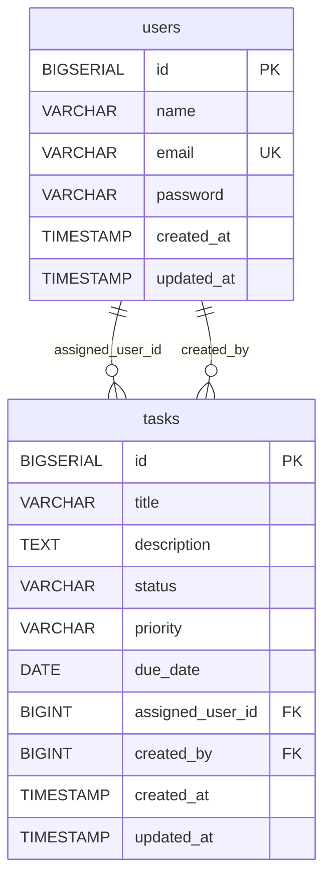

# DB設計書

## 改訂履歴

| 版数 | 改訂日 | 改訂内容 | 作成者 |
|---|---|---|---|
| 1.0 | 2026-04-13 | 初版作成 | 佐伯 |

## 目次

- 1 [文書概要](#1-文書概要)
- 2 [DB概要](#2-db概要)
- 3 [ER図](#3-er図)
- 4 [テーブル一覧](#4-テーブル一覧)
- 5 [テーブル定義](#5-テーブル定義)
- 6 [コード値定義](#6-コード値定義)
- 7 [リレーション](#7-リレーション)
- 8 [共通カラム仕様](#8-共通カラム仕様)
- 9 [物理設計補足](#9-物理設計補足)
- 10 [現行DDL要約](#10-現行ddl要約)
- 11 [備考](#11-備考)

## 1. 文書概要

- システム名: task-manager-app
- 対象ブランチ: `develop`
- 対象ディレクトリ: `backend`
- DBMS: PostgreSQL
- ORM: Spring Data JPA / Hibernate
- マイグレーション: Flyway
- 作成方針: 実コード・DDLベースで現行仕様を整理

## 2. DB概要

本システムの現行DBは、以下の2テーブルで構成される。

- `users`
- `tasks`

`tasks` は以下2つのユーザー関連項目を持つ。

- 担当者: `assigned_user_id`
- 作成者: `created_by`

## 3. ER図



## 4. テーブル一覧

| テーブル名 | 論理名 | 概要 |
|---|---|---|
| users | ユーザー | タスク管理システムの利用者情報を保持する |
| tasks | タスク | タスク本体、担当者、作成者を保持する |

## 5. テーブル定義

## 5.1 users

### 5.1.1 概要

利用者情報を保持するテーブル。  
ログインや担当者選択の基礎データとなる。

### 5.1.2 カラム定義

| No | カラム名 | データ型 | PK | UK | NN | FK | 説明 |
|---|---|---|---|---|---|---|---|
| 1 | id | BIGSERIAL | ○ |  | ○ |  | ユーザーID |
| 2 | name | VARCHAR(100) |  |  | ○ |  | ユーザー名 |
| 3 | email | VARCHAR(255) |  | ○ | ○ |  | メールアドレス |
| 4 | password | VARCHAR(255) |  |  | ○ |  | パスワード |
| 5 | created_at | TIMESTAMP |  |  | ○ |  | 作成日時 |
| 6 | updated_at | TIMESTAMP |  |  | ○ |  | 更新日時 |

### 5.1.3 制約

| 制約名 | 種別 | 内容 |
|---|---|---|
| users_pkey | 主キー | id |
| users_email_key | 一意制約 | email |

## 5.2 tasks

### 5.2.1 概要

タスク情報を保持するテーブル。  
タイトル、説明、状態、優先度、期限日、担当者、作成者を管理する。

### 5.2.2 カラム定義

| No | カラム名 | データ型 | PK | UK | NN | FK | 説明 |
|---|---|---|---|---|---|---|---|
| 1 | id | BIGSERIAL | ○ |  | ○ |  | タスクID |
| 2 | title | VARCHAR(200) |  |  | ○ |  | タスクタイトル |
| 3 | description | TEXT |  |  |  |  | タスク説明 |
| 4 | status | VARCHAR(20) |  |  | ○ |  | タスク状態 |
| 5 | priority | VARCHAR(20) |  |  | ○ |  | 優先度 |
| 6 | due_date | DATE |  |  |  |  | 期限日 |
| 7 | assigned_user_id | BIGINT |  |  |  | ○ | 担当ユーザーID |
| 8 | created_by | BIGINT |  |  | ○ | ○ | 作成ユーザーID |
| 9 | created_at | TIMESTAMP |  |  | ○ |  | 作成日時 |
| 10 | updated_at | TIMESTAMP |  |  | ○ |  | 更新日時 |

### 5.2.3 制約

| 制約名 | 種別 | 内容 |
|---|---|---|
| tasks_pkey | 主キー | id |
| fk_tasks_assigned_user | 外部キー | assigned_user_id → users.id |
| fk_tasks_created_by | 外部キー | created_by → users.id |

### 5.2.4 インデックス

| インデックス名 | 対象カラム | 説明 |
|---|---|---|
| idx_tasks_created_by | created_by | 作成者による検索性能向上用 |

## 6. コード値定義

## 6.1 tasks.status

タスク状態を表す。

| 値 | 意味 |
|---|---|
| TODO | 未着手 |
| DOING | 対応中 |
| DONE | 完了 |

## 6.2 tasks.priority

タスク優先度を表す。

| 値 | 意味 |
|---|---|
| LOW | 低 |
| MEDIUM | 中 |
| HIGH | 高 |

## 7. リレーション

## 7.1 users - tasks（担当者）

- 親テーブル: `users`
- 子テーブル: `tasks`
- 外部キー: `tasks.assigned_user_id`
- 関係: 1対多
- 必須/任意: 任意

### 説明
1ユーザーは複数タスクの担当者になれる。  
タスクに担当者が未設定の場合、`assigned_user_id` は NULL。

## 7.2 users - tasks（作成者）

- 親テーブル: `users`
- 子テーブル: `tasks`
- 外部キー: `tasks.created_by`
- 関係: 1対多
- 必須/任意: 必須

### 説明
1ユーザーは複数タスクの作成者になれる。  
すべてのタスクは必ず作成者を持つ。

## 8. 共通カラム仕様

`users` と `tasks` は共通で以下カラムを持つ。

| カラム名 | データ型 | 説明 |
|---|---|---|
| created_at | TIMESTAMP | レコード作成日時 |
| updated_at | TIMESTAMP | レコード更新日時 |

### 補足

- `created_at` は新規登録時に設定される
- `updated_at` は新規登録時・更新時に設定される
- アプリケーション側で自動設定される

## 9. 物理設計補足

## 9.1 ID採番

| テーブル | カラム | 採番方式 |
|---|---|---|
| users | id | BIGSERIAL / IDENTITY |
| tasks | id | BIGSERIAL / IDENTITY |

## 9.2 日付・日時型

| カラム名 | 型 | 用途 |
|---|---|---|
| created_at | TIMESTAMP | 作成日時 |
| updated_at | TIMESTAMP | 更新日時 |
| due_date | DATE | 期限日 |

### 補足

- `due_date` は時刻を持たない
- 過去DDLでは `TIMESTAMP` だったが、現行は `DATE`

## 9.3 削除方式

- 論理削除カラムなし
- 現行は物理削除方式

## 10. 現行DDL要約

```sql
CREATE TABLE users (
    id BIGSERIAL PRIMARY KEY,
    name VARCHAR(100) NOT NULL,
    email VARCHAR(255) NOT NULL UNIQUE,
    password VARCHAR(255) NOT NULL,
    created_at TIMESTAMP NOT NULL,
    updated_at TIMESTAMP NOT NULL
);

CREATE TABLE tasks (
    id BIGSERIAL PRIMARY KEY,
    title VARCHAR(200) NOT NULL,
    description TEXT,
    status VARCHAR(20) NOT NULL,
    priority VARCHAR(20) NOT NULL,
    due_date DATE,
    assigned_user_id BIGINT,
    created_by BIGINT NOT NULL,
    created_at TIMESTAMP NOT NULL,
    updated_at TIMESTAMP NOT NULL,
    CONSTRAINT fk_tasks_assigned_user
        FOREIGN KEY (assigned_user_id) REFERENCES users(id),
    CONSTRAINT fk_tasks_created_by
        FOREIGN KEY (created_by) REFERENCES users(id)
);

CREATE INDEX idx_tasks_created_by
ON tasks(created_by);
```

## 11. 備考

- 本設計書は `develop` ブランチの実装を基準とした現行仕様である
- コメント機能、添付ファイル機能、チーム機能に対応するテーブルは現時点では未実装
- 今後テーブル追加が発生した場合は、本書の改訂が必要