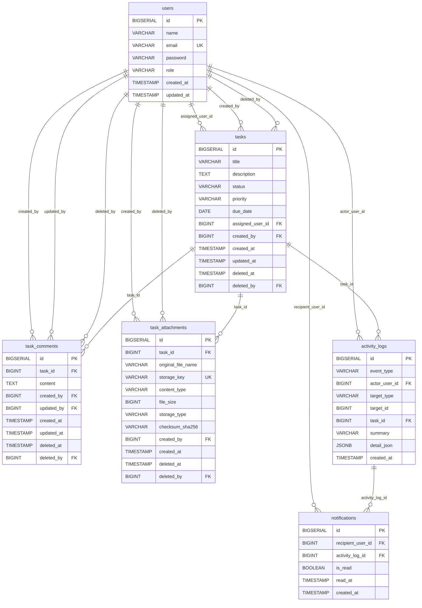

# DB設計書

## 改訂履歴

| 版数 | 改訂日 | 改訂内容 | 作成者 |
|---|---|---|---|
| 1.0 | 2026-04-13 | 初版作成 | 佐伯 |
| 1.1 | 2026-04-14 | RBAC、コメント、添付、通知、アクティビティログを含むDB設計に更新 | 佐伯 |

<details>
<summary>1. 文書概要</summary>

## 1. 文書概要

- システム名: task-manager-app
- DBMS: PostgreSQL
- ORM: Spring Data JPA / Hibernate
- マイグレーション: Flyway

### 1.1 対象機能

本書では、以下の機能を対象とする。

- ユーザー管理
- タスク管理
- RBAC
- コメント
- 添付ファイル
- 通知
- アクティビティログ

### 1.2 対象外

以下は本書では扱わない。

- チーム管理
- メンバー招待
- 招待リンク
- ロール管理画面
- メール通知 / Push通知
- 添付ファイルのバージョン管理

</details>

<details>
<summary>2. DB概要</summary>

## 2. DB概要

本システムのDBは、以下のテーブルで構成する。

- `users`
- `tasks`
- `task_comments`
- `task_attachments`
- `notifications`
- `activity_logs`

### 2.1 設計方針

- ユーザー権限は `users.role` で保持する
- ファイル本体はDBに保存せず、添付ファイルのメタ情報のみDBで管理する
- タスク、コメント、添付ファイルは論理削除とする
- 通知は通知本文や関連情報を重複保持せず、通知受信者と既読状態を管理する
- アクティビティログはタスク詳細画面の履歴タブ表示および通知生成元として利用する
- アクティビティログは追記専用とし、更新・削除は行わない
- チーム単位のロール管理は、チーム管理機能の設計時に別途定義する

</details>

<details>
<summary>3. ER図</summary>

## 3. ER図



</details>

<details>
<summary>4. テーブル一覧</summary>

## 4. テーブル一覧

| テーブル名 | 論理名 | 概要 |
|---|---|---|
| users | ユーザー | タスク管理システムの利用者情報と権限を保持する |
| tasks | タスク | タスク本体、担当者、作成者を保持する |
| task_comments | タスクコメント | タスクに対するコメントを保持する |
| task_attachments | タスク添付ファイル | タスクに添付されたファイルのメタ情報を保持する |
| notifications | 通知 | ユーザーごとの通知受信状態と既読状態を保持する |
| activity_logs | アクティビティログ | タスク・コメント・添付操作などの履歴と通知生成元イベントを保持する |

</details>

<details>
<summary>5. テーブル定義</summary>

## 5. テーブル定義

<details>
<summary>5.1 users</summary>

## 5.1 users

### 5.1.1 概要

利用者情報を保持するテーブル。  
ログイン、担当者選択、RBAC判定の基礎データとなる。

### 5.1.2 カラム定義

| No | カラム名 | データ型 | PK | UK | NN | FK | 説明 |
|---|---|---|---|---|---|---|---|
| 1 | id | BIGSERIAL | ○ |  | ○ |  | ユーザーID |
| 2 | name | VARCHAR(100) |  |  | ○ |  | ユーザー名 |
| 3 | email | VARCHAR(255) |  | ○ | ○ |  | メールアドレス |
| 4 | password | VARCHAR(255) |  |  | ○ |  | パスワード |
| 5 | role | VARCHAR(20) |  |  | ○ |  | ユーザー権限。`MEMBER` / `ADMIN` |
| 6 | created_at | TIMESTAMP |  |  | ○ |  | 作成日時 |
| 7 | updated_at | TIMESTAMP |  |  | ○ |  | 更新日時 |

### 5.1.3 制約

| 制約名 | 種別 | 内容 |
|---|---|---|
| users_pkey | 主キー | id |
| users_email_key | 一意制約 | email |
| chk_users_role | CHECK制約 | role in (`MEMBER`, `ADMIN`) |

### 5.1.4 補足

- `role` が未設定のユーザーにはマイグレーション時に `MEMBER` を設定する
- チーム単位のロール管理は、チーム管理機能の設計時に別途定義する

</details>

<details>
<summary>5.2 tasks</summary>

## 5.2 tasks

### 5.2.1 概要

タスク情報を保持するテーブル。  
タイトル、説明、状態、優先度、期限日、担当者、作成者を管理する。

### 5.2.2 カラム定義

| No | カラム名 | データ型 | PK | UK | NN | FK | 説明 |
|---|---|---|---|---|---|---|---|
| 1 | id | BIGSERIAL | ○ |  | ○ |  | タスクID |
| 2 | title | VARCHAR(100) |  |  | ○ |  | タスクタイトル |
| 3 | description | TEXT |  |  |  |  | タスク説明 |
| 4 | status | VARCHAR(20) |  |  | ○ |  | タスク状態 |
| 5 | priority | VARCHAR(20) |  |  | ○ |  | 優先度 |
| 6 | due_date | DATE |  |  |  |  | 期限日 |
| 7 | assigned_user_id | BIGINT |  |  |  | ○ | 担当ユーザーID |
| 8 | created_by | BIGINT |  |  | ○ | ○ | 作成ユーザーID |
| 9 | created_at | TIMESTAMP |  |  | ○ |  | 作成日時 |
| 10 | updated_at | TIMESTAMP |  |  | ○ |  | 更新日時 |
| 11 | version | BIGINT |  |  | ○ |  | 楽観ロック用バージョン |
| 12 | deleted_at | TIMESTAMP |  |  |  |  | 削除日時 |
| 13 | deleted_by | BIGINT |  |  |  | ○ | 削除者ID |

### 5.2.3 制約

| 制約名 | 種別 | 内容 |
|---|---|---|
| tasks_pkey | 主キー | id |
| fk_tasks_assigned_user | 外部キー | assigned_user_id → users.id |
| fk_tasks_created_by | 外部キー | created_by → users.id |
| fk_tasks_deleted_by | 外部キー | deleted_by → users.id |

### 5.2.4 インデックス

| インデックス名 | 対象カラム | 説明 |
|---|---|---|
| idx_tasks_created_by | created_by | 作成者による検索性能向上用 |
| idx_tasks_assigned_user_id | assigned_user_id | 担当者による検索性能向上用 |
| idx_tasks_due_date | due_date | 期限日による検索・ソート用 |
| idx_tasks_deleted_at | deleted_at | 論理削除済みタスク除外用 |

### 5.2.5 補足

- タスク更新者の履歴は `activity_logs` で表現する
- `tasks` には更新者カラムを持たせず、操作履歴はアクティビティログへ集約する
- タスクタイトルの上限は、画面設計書・API設計書と合わせて100文字とする
- `tasks.version` はタスク更新APIの楽観ロック用比較値として利用する
- タスク作成時の `version` 初期値は `0` とし、更新成功時に `+1` する
- タスク削除は物理削除ではなく、`deleted_at`、`deleted_by` を設定する論理削除とする
- 通常の一覧・詳細取得では `deleted_at IS NULL` のタスクのみを対象とする

</details>

<details>
<summary>5.3 task_comments</summary>

## 5.3 task_comments

### 5.3.1 概要

タスクに対するコメントを保持するテーブル。  
タスク詳細画面でのコメント一覧、投稿、編集、削除に利用する。

### 5.3.2 カラム定義

| No | カラム名 | データ型 | PK | UK | NN | FK | 説明 |
|---|---|---|---|---|---|---|---|
| 1 | id | BIGSERIAL | ○ |  | ○ |  | コメントID |
| 2 | task_id | BIGINT |  |  | ○ | ○ | 紐づくタスクID |
| 3 | content | TEXT |  |  | ○ |  | コメント本文 |
| 4 | created_by | BIGINT |  |  | ○ | ○ | 投稿者ID |
| 5 | updated_by | BIGINT |  |  |  | ○ | 更新者ID |
| 6 | created_at | TIMESTAMP |  |  | ○ |  | 作成日時 |
| 7 | updated_at | TIMESTAMP |  |  | ○ |  | 更新日時 |
| 8 | version | BIGINT |  |  | ○ |  | 楽観ロック用バージョン |
| 9 | deleted_at | TIMESTAMP |  |  |  |  | 削除日時 |
| 10 | deleted_by | BIGINT |  |  |  | ○ | 削除者ID |

### 5.3.3 制約

| 制約名 | 種別 | 内容 |
|---|---|---|
| task_comments_pkey | 主キー | id |
| fk_task_comments_task | 外部キー | task_id → tasks.id |
| fk_task_comments_created_by | 外部キー | created_by → users.id |
| fk_task_comments_updated_by | 外部キー | updated_by → users.id |
| fk_task_comments_deleted_by | 外部キー | deleted_by → users.id |

### 5.3.4 インデックス

| インデックス名 | 対象カラム | 説明 |
|---|---|---|
| idx_task_comments_task_created_at | task_id, created_at DESC | タスク詳細画面のコメント一覧取得用 |
| idx_task_comments_created_by | created_by | 投稿者による認可判定・検索用 |

### 5.3.5 補足

- コメント削除は論理削除とする
- `task_comments.version` はコメント更新APIの楽観ロック用比較値として利用する
- コメント作成時の `version` 初期値は `0` とし、更新成功時に `+1` する
- 論理削除済みコメントはコメント一覧取得対象から除外し、コメントタブでは表示しない
- コメント削除の事実は `activity_logs` の `COMMENT_DELETED` で表現し、削除済みコメント本文は履歴表示しない

</details>

<details>
<summary>5.4 task_attachments</summary>

## 5.4 task_attachments

### 5.4.1 概要

タスクに添付されたファイルのメタ情報を保持するテーブル。  
ファイル本体はDBに保存せず、ローカルストレージまたはS3等の外部ストレージに保存する。

### 5.4.2 カラム定義

| No | カラム名 | データ型 | PK | UK | NN | FK | 説明 |
|---|---|---|---|---|---|---|---|
| 1 | id | BIGSERIAL | ○ |  | ○ |  | 添付ID |
| 2 | task_id | BIGINT |  |  | ○ | ○ | 紐づくタスクID |
| 3 | original_file_name | VARCHAR(255) |  |  | ○ |  | アップロード時の元ファイル名 |
| 4 | storage_key | VARCHAR(512) |  | ○ | ○ |  | 保存先キー |
| 5 | content_type | VARCHAR(255) |  |  | ○ |  | MIMEタイプ |
| 6 | file_size | BIGINT |  |  | ○ |  | ファイルサイズ（byte） |
| 7 | storage_type | VARCHAR(20) |  |  | ○ |  | 保存先種別。`LOCAL` / `S3` |
| 8 | checksum_sha256 | VARCHAR(64) |  |  |  |  | SHA-256チェックサム |
| 9 | created_by | BIGINT |  |  | ○ | ○ | アップロード者ID |
| 10 | created_at | TIMESTAMP |  |  | ○ |  | 作成日時 |
| 11 | deleted_at | TIMESTAMP |  |  |  |  | 削除日時 |
| 12 | deleted_by | BIGINT |  |  |  | ○ | 削除者ID |

### 5.4.3 制約

| 制約名 | 種別 | 内容 |
|---|---|---|
| task_attachments_pkey | 主キー | id |
| task_attachments_storage_key_key | 一意制約 | storage_key |
| fk_task_attachments_task | 外部キー | task_id → tasks.id |
| fk_task_attachments_created_by | 外部キー | created_by → users.id |
| fk_task_attachments_deleted_by | 外部キー | deleted_by → users.id |
| chk_task_attachments_storage_type | CHECK制約 | storage_type in (`LOCAL`, `S3`) |
| chk_task_attachments_file_size | CHECK制約 | file_size >= 0 |

### 5.4.4 インデックス

| インデックス名 | 対象カラム | 説明 |
|---|---|---|
| idx_task_attachments_task_created_at | task_id, created_at DESC | タスク詳細画面の添付一覧取得用 |
| idx_task_attachments_created_by | created_by | アップロード者による認可判定・検索用 |

### 5.4.5 補足

- 添付削除はメタ情報の論理削除を基本とする
- ファイル本体を物理削除するかどうかは、ファイル保存方式設計で定義する
- `storage_key` はシステム内部用であり、画面には表示しない

</details>

<details>
<summary>5.5 notifications</summary>

## 5.5 notifications

### 5.5.1 概要

ユーザーごとの通知受信状態と既読状態を保持するテーブル。  
通知本文や関連タスク情報は `activity_logs` を参照して組み立てる。

### 5.5.2 カラム定義

| No | カラム名 | データ型 | PK | UK | NN | FK | 説明 |
|---|---|---|---|---|---|---|---|
| 1 | id | BIGSERIAL | ○ |  | ○ |  | 通知ID |
| 2 | recipient_user_id | BIGINT |  |  | ○ | ○ | 通知受信者ID |
| 3 | activity_log_id | BIGINT |  |  | ○ | ○ | 紐づくアクティビティログID |
| 4 | is_read | BOOLEAN |  |  | ○ |  | 既読フラグ |
| 5 | read_at | TIMESTAMP |  |  |  |  | 既読日時 |
| 6 | created_at | TIMESTAMP |  |  | ○ |  | 作成日時 |

### 5.5.3 制約

| 制約名 | 種別 | 内容 |
|---|---|---|
| notifications_pkey | 主キー | id |
| fk_notifications_recipient_user | 外部キー | recipient_user_id → users.id |
| fk_notifications_activity_log | 外部キー | activity_log_id → activity_logs.id |
| uk_notifications_recipient_activity | 一意制約 | recipient_user_id, activity_log_id |

### 5.5.4 インデックス

| インデックス名 | 対象カラム | 説明 |
|---|---|---|
| idx_notifications_recipient_read_created | recipient_user_id, is_read, created_at DESC | 未読件数取得・通知一覧取得用 |
| idx_notifications_recipient_created | recipient_user_id, created_at DESC | 通知一覧取得用 |
| idx_notifications_activity_log | activity_log_id | 通知からイベント詳細を参照するため |

### 5.5.5 補足

- 通知は削除しない。
- 既読状態は `is_read` と `read_at` で管理する。
- 他人宛通知の参照は認可設計で禁止する。
- 同一 `recipient_user_id` と `activity_log_id` の組み合わせは1件のみ許可し、同一イベントの重複通知を防止する。
- 通知種別、通知メッセージ、関連タスク、関連コメント、関連添付は `activity_logs` から取得または組み立てる。
- 通知一覧画面のレコードクリック時は、`activity_logs.task_id` をもとに関連タスク詳細画面へ遷移する。
- 未読通知バッジは `recipient_user_id` と `is_read` を条件に集計する。

</details>

<details>
<summary>5.6 activity_logs</summary>

## 5.6 activity_logs

### 5.6.1 概要

タスク、コメント、添付ファイルなどの操作履歴を保持するテーブル。  
タスク詳細画面の履歴タブ表示、および通知一覧の表示内容生成に利用する。

### 5.6.2 カラム定義

| No | カラム名 | データ型 | PK | UK | NN | FK | 説明 |
|---|---|---|---|---|---|---|---|
| 1 | id | BIGSERIAL | ○ |  | ○ |  | アクティビティログID |
| 2 | event_type | VARCHAR(50) |  |  | ○ |  | イベント種別 |
| 3 | actor_user_id | BIGINT |  |  | ○ | ○ | 操作実行者ID |
| 4 | target_type | VARCHAR(30) |  |  | ○ |  | 操作対象種別 |
| 5 | target_id | BIGINT |  |  | ○ |  | 操作対象ID |
| 6 | task_id | BIGINT |  |  |  | ○ | 関連タスクID |
| 7 | summary | VARCHAR(255) |  |  | ○ |  | 表示用概要 |
| 8 | detail_json | JSONB |  |  |  |  | 変更前後などの詳細情報 |
| 9 | created_at | TIMESTAMP |  |  | ○ |  | 作成日時 |

### 5.6.3 制約

| 制約名 | 種別 | 内容 |
|---|---|---|
| activity_logs_pkey | 主キー | id |
| fk_activity_logs_actor_user | 外部キー | actor_user_id → users.id |
| fk_activity_logs_task | 外部キー | task_id → tasks.id |
| chk_activity_logs_event_type | CHECK制約 | event_type in アクティビティイベント種別定義 |
| chk_activity_logs_target_type | CHECK制約 | target_type in (`TASK`, `COMMENT`, `ATTACHMENT`) |

### 5.6.4 インデックス

| インデックス名 | 対象カラム | 説明 |
|---|---|---|
| idx_activity_logs_task_created | task_id, created_at DESC | タスク単位の履歴取得用 |
| idx_activity_logs_actor_created | actor_user_id, created_at DESC | 操作ユーザー単位の履歴取得用 |
| idx_activity_logs_event_created | event_type, created_at DESC | イベント種別による絞り込み用 |

### 5.6.5 補足

- アクティビティログは追記専用とする
- 更新・削除は行わない
- `target_id` は対象テーブルが複数あるため、外部キー制約を付与しない
- `detail_json` は変更内容や補足情報を保持する拡張領域とする
- 通知一覧のメッセージや関連タスク遷移は、本テーブルの `event_type`、`summary`、`task_id` を利用する
- 独立したアクティビティログ画面は設けず、タスク詳細画面内の履歴タブで参照する

</details>

</details>

<details>
<summary>6. コード値定義</summary>

## 6. コード値定義

## 6.1 tasks.status

タスク状態を表す。

| 値 | 意味 |
|---|---|
| TODO | 未着手 |
| DOING | 対応中 |
| DONE | 完了 |

## 6.2 tasks.priority

タスク優先度を表す。

| 値 | 意味 |
|---|---|
| LOW | 低 |
| MEDIUM | 中 |
| HIGH | 高 |

## 6.3 users.role

ユーザー権限を表す。

| 値 | 意味 |
|---|---|
| MEMBER | 一般ユーザー |
| ADMIN | 管理者ユーザー |

## 6.4 task_attachments.storage_type

添付ファイルの保存先種別を表す。

| 値 | 意味 |
|---|---|
| LOCAL | ローカルストレージ（将来拡張または互換用途） |
| S3 | Amazon S3（本フェーズ採用） |

## 6.5 activity_logs.event_type

アクティビティログのイベント種別を表す。

| 値 | 意味 |
|---|---|
| TASK_CREATED | タスクが作成された |
| TASK_UPDATED | タスクが更新された |
| TASK_DELETED | タスクが削除された |
| COMMENT_CREATED | コメントが投稿された |
| COMMENT_UPDATED | コメントが更新された |
| COMMENT_DELETED | コメントが削除された |
| ATTACHMENT_UPLOADED | 添付ファイルが追加された |
| ATTACHMENT_DELETED | 添付ファイルが削除された |

## 6.6 activity_logs.target_type

操作対象種別を表す。

| 値 | 意味 |
|---|---|
| TASK | タスク |
| COMMENT | コメント |
| ATTACHMENT | 添付ファイル |

</details>

<details>
<summary>7. リレーション</summary>

## 7. リレーション

## 7.1 users - tasks（担当者）

| 項目 | 内容 |
|---|---|
| 親テーブル | `users` |
| 子テーブル | `tasks` |
| 外部キー | `tasks.assigned_user_id` |
| 参照先 | `users.id` |

1ユーザーは複数タスクの担当者になれる。

## 7.2 users - tasks（作成者）

| 項目 | 内容 |
|---|---|
| 親テーブル | `users` |
| 子テーブル | `tasks` |
| 外部キー | `tasks.created_by` |
| 参照先 | `users.id` |

1ユーザーは複数タスクを作成できる。

## 7.3 users - tasks（削除者）

| 項目 | 内容 |
|---|---|
| 親テーブル | `users` |
| 子テーブル | `tasks` |
| 外部キー | `tasks.deleted_by` |
| 参照先 | `users.id` |

1ユーザーは複数タスクの削除者になれる。

## 7.4 tasks - task_comments

| 項目 | 内容 |
|---|---|
| 親テーブル | `tasks` |
| 子テーブル | `task_comments` |
| 外部キー | `task_comments.task_id` |
| 参照先 | `tasks.id` |

1タスクは複数コメントを持てる。

## 7.5 tasks - task_attachments

| 項目 | 内容 |
|---|---|
| 親テーブル | `tasks` |
| 子テーブル | `task_attachments` |
| 外部キー | `task_attachments.task_id` |
| 参照先 | `tasks.id` |

1タスクは複数添付ファイルを持てる。

## 7.6 users - notifications（通知受信者）

| 項目 | 内容 |
|---|---|
| 親テーブル | `users` |
| 子テーブル | `notifications` |
| 外部キー | `notifications.recipient_user_id` |
| 参照先 | `users.id` |

1ユーザーは複数通知を受け取れる。

## 7.7 activity_logs - notifications

| 項目 | 内容 |
|---|---|
| 親テーブル | `activity_logs` |
| 子テーブル | `notifications` |
| 外部キー | `notifications.activity_log_id` |
| 参照先 | `activity_logs.id` |

1つのアクティビティログは、通知対象ユーザーごとに複数通知へ展開される。

## 7.8 users - activity_logs（操作実行者）

| 項目 | 内容 |
|---|---|
| 親テーブル | `users` |
| 子テーブル | `activity_logs` |
| 外部キー | `activity_logs.actor_user_id` |
| 参照先 | `users.id` |

1ユーザーは複数の操作履歴を発生させる。

## 7.9 tasks - activity_logs

| 項目 | 内容 |
|---|---|
| 親テーブル | `tasks` |
| 子テーブル | `activity_logs` |
| 外部キー | `activity_logs.task_id` |
| 参照先 | `tasks.id` |

1タスクは複数の操作履歴を持つ。タスク詳細画面の履歴タブでは、この関係を利用して履歴を取得する。

</details>

<details>
<summary>8. 共通カラム仕様</summary>

## 8. 共通カラム仕様

## 8.1 作成・更新系カラム

| カラム名 | データ型 | 説明 |
|---|---|---|
| created_at | TIMESTAMP | レコード作成日時 |
| updated_at | TIMESTAMP | レコード更新日時 |
| created_by | BIGINT | レコード作成者 |
| updated_by | BIGINT | レコード更新者 |

### 補足

- `created_at` はレコード作成時に設定される
- `updated_at` はレコード作成時・更新時に設定される
- `created_by` / `updated_by` は業務上必要なテーブルにのみ保持する
- アプリケーション側で自動設定する

## 8.2 削除系カラム

| カラム名 | データ型 | 説明 |
|---|---|---|
| deleted_at | TIMESTAMP | 論理削除日時 |
| deleted_by | BIGINT | 論理削除実行者 |

### 補足

- 論理削除を採用するテーブルにのみ保持する
- 論理削除済みレコードの画面表示方針は画面設計で定義する

</details>

<details>
<summary>9. 物理設計補足</summary>

## 9. 物理設計補足

## 9.1 ID採番

| テーブル | カラム | 採番方式 |
|---|---|---|
| users | id | BIGSERIAL / IDENTITY |
| tasks | id | BIGSERIAL / IDENTITY |
| task_comments | id | BIGSERIAL / IDENTITY |
| task_attachments | id | BIGSERIAL / IDENTITY |
| notifications | id | BIGSERIAL / IDENTITY |
| activity_logs | id | BIGSERIAL / IDENTITY |

## 9.2 日付・日時型

| カラム名 | 型 | 用途 |
|---|---|---|
| created_at | TIMESTAMP | 作成日時 |
| updated_at | TIMESTAMP | 更新日時 |
| deleted_at | TIMESTAMP | 論理削除日時 |
| read_at | TIMESTAMP | 通知既読日時 |
| due_date | DATE | 期限日 |

### 補足

- `due_date` は時刻を持たない
- `due_date` は日付のみを扱うため `DATE` 型で管理する

## 9.3 削除方式

| テーブル | 削除方式 | 理由 |
|---|---|---|
| users | 物理削除想定なし | 認証・監査整合性のため |
| tasks | 論理削除 | アクティビティログ・コメント・添付・通知との参照整合性を保つため |
| task_comments | 論理削除 | コメント履歴・通知・ログとの整合性を保つため |
| task_attachments | 論理削除 | 添付履歴・通知・ログとの整合性を保つため |
| notifications | 削除なし | 既読管理で対応するため |
| activity_logs | 削除なし | 追記専用の監査情報とするため |

## 9.4 JSONB利用方針

`activity_logs.detail_json` は、イベントごとの変更内容や補足情報を保持するために利用する。

例:

```json
{
  "field": "status",
  "before": "TODO",
  "after": "DOING"
}
```

### 補足

- 一覧表示に必要な主要項目は通常カラムとして保持する
- `detail_json` は検索主軸にはしない
- 頻繁に検索する項目は将来的に通常カラム化を検討する

</details>

<details>
<summary>10. DDL要約</summary>

## 10. DDL要約

```sql
CREATE TABLE users (
    id BIGSERIAL PRIMARY KEY,
    name VARCHAR(100) NOT NULL,
    email VARCHAR(255) NOT NULL UNIQUE,
    password VARCHAR(255) NOT NULL,
    role VARCHAR(20) NOT NULL DEFAULT 'MEMBER',
    created_at TIMESTAMP NOT NULL,
    updated_at TIMESTAMP NOT NULL,
    CONSTRAINT chk_users_role
        CHECK (role IN ('MEMBER', 'ADMIN'))
);

CREATE TABLE tasks (
    id BIGSERIAL PRIMARY KEY,
    title VARCHAR(100) NOT NULL,
    description TEXT,
    status VARCHAR(20) NOT NULL,
    priority VARCHAR(20) NOT NULL,
    due_date DATE,
    assigned_user_id BIGINT,
    created_by BIGINT NOT NULL,
    created_at TIMESTAMP NOT NULL,
    updated_at TIMESTAMP NOT NULL,
    version BIGINT NOT NULL DEFAULT 0,
    deleted_at TIMESTAMP,
    deleted_by BIGINT,
    CONSTRAINT fk_tasks_assigned_user
        FOREIGN KEY (assigned_user_id) REFERENCES users(id),
    CONSTRAINT fk_tasks_created_by
        FOREIGN KEY (created_by) REFERENCES users(id),
    CONSTRAINT fk_tasks_deleted_by
        FOREIGN KEY (deleted_by) REFERENCES users(id)
);

CREATE INDEX idx_tasks_created_by
ON tasks(created_by);

CREATE INDEX idx_tasks_assigned_user_id
ON tasks(assigned_user_id);

CREATE INDEX idx_tasks_due_date
ON tasks(due_date);

CREATE INDEX idx_tasks_deleted_at
ON tasks(deleted_at);

CREATE TABLE task_comments (
    id BIGSERIAL PRIMARY KEY,
    task_id BIGINT NOT NULL,
    content TEXT NOT NULL,
    created_by BIGINT NOT NULL,
    updated_by BIGINT,
    created_at TIMESTAMP NOT NULL,
    updated_at TIMESTAMP NOT NULL,
    version BIGINT NOT NULL DEFAULT 0,
    deleted_at TIMESTAMP,
    deleted_by BIGINT,
    CONSTRAINT fk_task_comments_task
        FOREIGN KEY (task_id) REFERENCES tasks(id),
    CONSTRAINT fk_task_comments_created_by
        FOREIGN KEY (created_by) REFERENCES users(id),
    CONSTRAINT fk_task_comments_updated_by
        FOREIGN KEY (updated_by) REFERENCES users(id),
    CONSTRAINT fk_task_comments_deleted_by
        FOREIGN KEY (deleted_by) REFERENCES users(id)
);

CREATE INDEX idx_task_comments_task_created_at
ON task_comments(task_id, created_at DESC);

CREATE INDEX idx_task_comments_created_by
ON task_comments(created_by);

CREATE TABLE task_attachments (
    id BIGSERIAL PRIMARY KEY,
    task_id BIGINT NOT NULL,
    original_file_name VARCHAR(255) NOT NULL,
    storage_key VARCHAR(512) NOT NULL UNIQUE,
    content_type VARCHAR(255) NOT NULL,
    file_size BIGINT NOT NULL,
    storage_type VARCHAR(20) NOT NULL,
    checksum_sha256 VARCHAR(64),
    created_by BIGINT NOT NULL,
    created_at TIMESTAMP NOT NULL,
    deleted_at TIMESTAMP,
    deleted_by BIGINT,
    CONSTRAINT fk_task_attachments_task
        FOREIGN KEY (task_id) REFERENCES tasks(id),
    CONSTRAINT fk_task_attachments_created_by
        FOREIGN KEY (created_by) REFERENCES users(id),
    CONSTRAINT fk_task_attachments_deleted_by
        FOREIGN KEY (deleted_by) REFERENCES users(id),
    CONSTRAINT chk_task_attachments_storage_type
        CHECK (storage_type IN ('LOCAL', 'S3')),
    CONSTRAINT chk_task_attachments_file_size
        CHECK (file_size >= 0)
);

CREATE INDEX idx_task_attachments_task_created_at
ON task_attachments(task_id, created_at DESC);

CREATE INDEX idx_task_attachments_created_by
ON task_attachments(created_by);

CREATE TABLE activity_logs (
    id BIGSERIAL PRIMARY KEY,
    event_type VARCHAR(50) NOT NULL,
    actor_user_id BIGINT NOT NULL,
    target_type VARCHAR(30) NOT NULL,
    target_id BIGINT NOT NULL,
    task_id BIGINT,
    summary VARCHAR(255) NOT NULL,
    detail_json JSONB,
    created_at TIMESTAMP NOT NULL,
    CONSTRAINT fk_activity_logs_actor_user
        FOREIGN KEY (actor_user_id) REFERENCES users(id),
    CONSTRAINT fk_activity_logs_task
        FOREIGN KEY (task_id) REFERENCES tasks(id),
    CONSTRAINT chk_activity_logs_event_type
        CHECK (event_type IN (
            'TASK_CREATED',
            'TASK_UPDATED',
            'TASK_DELETED',
            'COMMENT_CREATED',
            'COMMENT_UPDATED',
            'COMMENT_DELETED',
            'ATTACHMENT_UPLOADED',
            'ATTACHMENT_DELETED'
        )),
    CONSTRAINT chk_activity_logs_target_type
        CHECK (target_type IN ('TASK', 'COMMENT', 'ATTACHMENT'))
);

CREATE TABLE notifications (
    id BIGSERIAL PRIMARY KEY,
    recipient_user_id BIGINT NOT NULL,
    activity_log_id BIGINT NOT NULL,
    is_read BOOLEAN NOT NULL DEFAULT FALSE,
    read_at TIMESTAMP NULL,
    created_at TIMESTAMP NOT NULL DEFAULT CURRENT_TIMESTAMP,
    CONSTRAINT fk_notifications_recipient_user
        FOREIGN KEY (recipient_user_id) REFERENCES users(id),
    CONSTRAINT fk_notifications_activity_log
        FOREIGN KEY (activity_log_id) REFERENCES activity_logs(id),
    CONSTRAINT uk_notifications_recipient_activity
        UNIQUE (recipient_user_id, activity_log_id)
);

CREATE INDEX idx_notifications_recipient_read_created
ON notifications(recipient_user_id, is_read, created_at DESC);

CREATE INDEX idx_notifications_recipient_created
ON notifications(recipient_user_id, created_at DESC);

CREATE INDEX idx_notifications_activity_log
ON notifications(activity_log_id);

CREATE INDEX idx_activity_logs_task_created
ON activity_logs(task_id, created_at DESC);

CREATE INDEX idx_activity_logs_actor_created
ON activity_logs(actor_user_id, created_at DESC);

CREATE INDEX idx_activity_logs_event_created
ON activity_logs(event_type, created_at DESC);
```

</details>

<details>
<summary>11. 備考</summary>

## 11. 備考

- `users.role` はRBACの最小構成として定義する
- チーム単位のロール管理を導入する場合は、`teams`、`team_members`、ロール管理用テーブルの追加を検討する
- 添付ファイルの保存先をS3にする場合、インフラ設計書および非機能要件定義書との整合確認を行う
- 本書更新後、API設計書、画面設計書、エラー設計書、認可設計書との整合確認を行う

</details>
