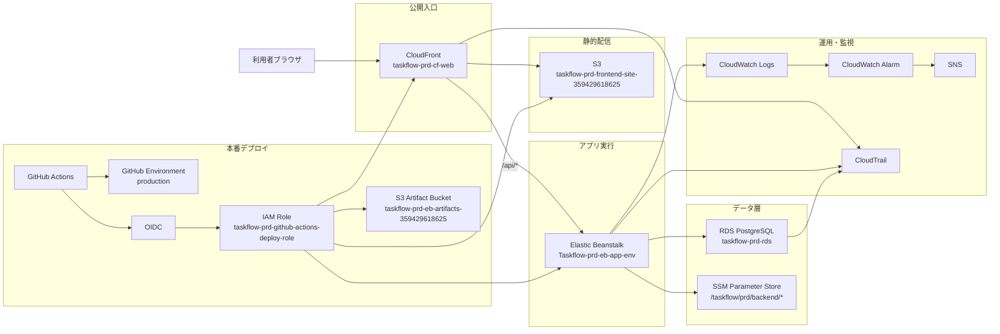

# TaskFlow インフラ設計書

## 改訂履歴

| 版数 | 改訂日 | 改訂者 | 改訂内容 |
| --- | --- | --- | --- |
| 1.0 | 2026-04-19 | 佐伯 | 初版作成 |

<strong>1. 文書概要</strong>

### 1.1 目的
本書は、個人開発プロジェクト **TaskFlow** の AWS 本番環境について、構成、設計意図、運用前提、既知課題を整理するためのインフラ設計書である。  
単なる理想構成ではなく、**実際に構築・検証した結果を反映した as-built 寄りの設計書**として扱う。

### 1.2 対象範囲
- AWS 上で公開している MVP 環境
- frontend 配信基盤
- backend 実行基盤
- DB 基盤
- secrets / CI/CD / 監視 / 監査 / 復旧導線

### 1.3 対象外
- コメント機能
- 添付ファイル機能の本番保存設計
- チーム管理 / 通知 / 管理者画面
- DR 構成、Multi-AZ、独自ドメイン導入

### 1.4 システム名
- 画面上のサービス名: `TaskFlow`
- リポジトリ名: `task-manager-app`
- 環境コード: `prd`
- リージョン: `ap-northeast-1`

---

<strong>2. 設計方針</strong>

### 2.1 基本方針
- 初回公開は **MVP を早く、安全に公開する** ことを優先する
- 日本国内向け利用を前提とし、リージョンは `ap-northeast-1` を採用する
- frontend / backend / DB を責務ごとに分離する
- DB は外部公開せず private subnet に配置する
- frontend は S3 直公開ではなく CloudFront 経由で公開する
- backend secret は Parameter Store を使い、Git や `.env` に本番値を置かない
- 本番 deploy はローカル手動ではなく GitHub Actions を正規手順とする
- 監視・ログ・復旧導線まで含めて「公開後に運用できる状態」を目指す

### 2.2 初回公開で採用しない方針
- NAT Gateway を前提とした private app 構成
- bastion 常設
- RDS public access 有効化
- S3 website hosting 前提の公開
- 独自ドメイン導入
- Multi-AZ / DR リージョン構成

---

<strong>3. 採用アーキテクチャ概要</strong>

### 3.1 構成の要点
- 利用者の公開入口は **CloudFront** に一本化する
- frontend は **S3 + CloudFront** で配信する
- backend API は **CloudFront `/api/*` → Elastic Beanstalk** で到達させる
- DB は **RDS PostgreSQL** を private subnet に配置する
- secret は **SSM Parameter Store** から Elastic Beanstalk が参照する
- 本番 deploy は **GitHub Actions + OIDC + production Environment 承認** で実施する
- 運用は **CloudWatch Logs / Alarm / SNS / CloudTrail** を基本にする

---

<strong>4. 命名規約・タグ規約</strong>

### 4.1 命名規約
命名規約は以下で統一する。

- 形式: `taskflow-<env>-<resource>`
- 例:
  - `taskflow-prd-vpc`
  - `taskflow-prd-rds`
  - `taskflow-prd-eb-app`
  - `taskflow-prd-cf-web`

### 4.2 環境コード
- `local`: ローカル確認用
- `dev`: 開発環境
- `stg`: ステージング環境
- `prd`: 本番環境

### 4.3 必須タグ
| Key | Value 例 |
| --- | --- |
| `Project` | `taskflow` |
| `System` | `task-manager-app` |
| `Environment` | `prd` |
| `Region` | `ap-northeast-1` |
| `Scope` | `mvp` |
| `ManagedBy` | `manual` |

### 4.4 任意タグ
| Key | Value 例 |
| --- | --- |
| `Owner` | `team-taskflow` |
| `Purpose` | `frontend-static-hosting` |
| `Phase` | `phase4` |

---

<strong>5. ネットワーク設計</strong>

<strong>5.1 VPC 設計</strong>

| 項目 | 値 |
| --- | --- |
| VPC 名 | `taskflow-prd-vpc` |
| VPC ID | `vpc-0c923d9f3616e4f65` |
| CIDR | `10.0.0.0/16` |
| DNS 解決 | 有効 |
| DNS ホスト名 | 有効 |

### 5.2 Subnet 設計
| 種別 | Name | Subnet ID | CIDR | 用途 |
| --- | --- | --- | --- | --- |
| Public A | `taskflow-prd-subnet-public-a` | `subnet-0620ef37ddb586208` | `10.0.1.0/24` | app 配置候補 |
| Public C | `taskflow-prd-subnet-public-c` | `subnet-02cc8b52e22d96aec` | `10.0.2.0/24` | app 配置候補 |
| Private A | `taskflow-prd-subnet-private-a` | `subnet-0142da2df4d49ac04` | `10.0.11.0/24` | DB 用 |
| Private C | `taskflow-prd-subnet-private-c` | `subnet-0e7ac4e833ccd98e9` | `10.0.12.0/24` | DB 用 |

### 5.3 Route / Internet Gateway
| 項目 | 値 |
| --- | --- |
| Internet Gateway | `taskflow-prd-igw / igw-02fa72bad69103922` |
| Public Route Table | `taskflow-prd-rt-public / rtb-0d41db5d78c712f94` |
| Public Route | `0.0.0.0/0 -> IGW` |

### 5.4 ネットワーク方針
- `public subnet 2 + private subnet 2` の簡易分離構成を採用する
- 初回公開では **NAT Gateway を置かない**
- app は public 側、DB は private 側とし、コストと安全性のバランスを取る
- DB 直接公開は行わない

---

<strong>6. Security Group 設計</strong>

### 6.1 app 用 Security Group
| 項目 | 値 |
| --- | --- |
| Name | `taskflow-prd-sg-app` |
| SG ID | `sg-0e79604022597200d` |
| 役割 | Elastic Beanstalk / backend 受信用 |

#### Inbound
- 現在運用中の HTTP/80 は **CloudFront origin-facing managed prefix list (`pl-58a04531`) からのみ許可**
- Phase3 時点では backend 単体確認のため `0.0.0.0/0` を一時許可していたが、Phase4 で閉塞済み

#### Outbound
- DB 接続
- AWS サービス接続
- 一般的なアプリ外向き通信

### 6.2 db 用 Security Group
| 項目 | 値 |
| --- | --- |
| Name | `taskflow-prd-sg-db` |
| SG ID | `sg-06bfddce58a3b9cec` |
| 役割 | RDS 接続制御 |

#### Inbound
- 正規経路: `5432/tcp` from `taskflow-prd-sg-app`
- 継続課題: `sg-06db941d256dcaaa1` からの `5432/tcp` inbound が残存

### 6.3 セキュリティ設計上の注意
- DB は public access 無効
- app は CloudFront 経由の到達を前提とする
- DB の追加 inbound source は暫定設定として扱い、将来見直す

---

<strong>7. backend 実行基盤設計</strong>

### 7.1 Elastic Beanstalk 構成
| 項目 | 値 |
| --- | --- |
| Application | `taskflow-prd-eb-app` |
| Environment | `Taskflow-prd-eb-app-env` |
| Environment ID | `e-gvcyudrrcs` |
| CNAME | `Taskflow-prd-eb-app-env.eba-8xzqpp6j.ap-northeast-1.elasticbeanstalk.com` |
| Platform | `Corretto 17 running on 64bit Amazon Linux 2023 / 4.11.0` |
| 構成 | `Single instance` |

### 7.2 ランタイム設定
#### Plain text 環境変数
- `SPRING_PROFILES_ACTIVE=prod`
- `SERVER_PORT=5000`

#### secrets 参照
- `DB_URL`
- `DB_USERNAME`
- `DB_PASSWORD`
- `JWT_SECRET`
- `JWT_EXPIRATION_MILLIS`
- `CORS_ALLOWED_ORIGINS`

### 7.3 IAM 関連
| 種別 | Name |
| --- | --- |
| Service Role | `aws-elasticbeanstalk-service-role` |
| EC2 Role / Instance Profile | `aws-elasticbeanstalk-ec2-role` |
| Custom Policy | `taskflow-prd-eb-ssm-read-policy` |

### 7.4 実行確認
- `/actuator/health` は `200 / status=UP / db=UP`
- `register / login / /api/users` の代表 API は Phase3 で疎通確認済み
- EB ログで Flyway migration と Tomcat `5000` 起動を確認済み

---

<strong>8. DB 設計</strong>

### 8.1 RDS 基本情報
| 項目 | 値 |
| --- | --- |
| DB Identifier | `taskflow-prd-rds` |
| Endpoint | `taskflow-prd-rds.c5smu4yyoz4b.ap-northeast-1.rds.amazonaws.com` |
| Port | `5432` |
| DB Name | `taskflow` |
| Engine | `PostgreSQL 15.17-R1` |
| Instance Class | `db.t4g.micro` |
| Storage | `gp3 / 20 GiB` |
| Storage Auto Scaling | `100 GiB` |
| Public Access | `なし` |
| Deletion Protection | `有効` |
| Backup Retention | `1日` |
| DB Subnet Group | `taskflow-prd-rds-subnet` |

### 8.2 DB 配置方針
- RDS は private subnet に配置する
- app からのみ接続を許可する
- public access は無効とする
- DB 削除より snapshot / restore を優先する

### 8.3 バックアップ / 復旧
- 自動バックアップ: 有効
- `LatestRestorableTime`: 確認可能
- 手動 snapshot: `taskflow-prd-rds-manual-20260410-phase6`
- 復旧方針:
  - PITR または snapshot restore を使う
  - **既存本番 DB を直接上書きしない**
  - 復元時は新しい DB identifier を使う

---

<strong>9. frontend 配信設計</strong>

### 9.1 S3
| 項目 | 値 |
| --- | --- |
| Bucket | `taskflow-prd-frontend-site-359429618625` |
| 用途 | frontend 配信用静的ファイル配置 |
| Website Hosting | 無効 |
| Block Public Access | 4 項目すべて有効 |

### 9.2 CloudFront
| 項目 | 値 |
| --- | --- |
| Distribution Name | `taskflow-prd-cf-web` |
| Distribution ID | `E688SH91TX10P` |
| Domain Name | `d3jotedl3xn7u4.cloudfront.net` |
| 公開 URL | `https://d3jotedl3xn7u4.cloudfront.net` |
| Default Root Object | `index.html` |

### 9.3 Origin 構成
- Default origin: S3 bucket
- Backend origin name: `taskflow-prd-origin-backend`
- Backend origin domain: `Taskflow-prd-eb-app-env.eba-8xzqpp6j.ap-northeast-1.elasticbeanstalk.com`

### 9.4 Behavior 設計
#### Default Behavior
- SPA 画面配信用
- `index.html` を入口にする

#### `/api/*` Behavior
- target origin: backend origin
- viewer protocol policy: `Redirect HTTP to HTTPS`
- allowed methods: `GET, HEAD, OPTIONS, PUT, POST, PATCH, DELETE`
- cache policy: `CachingDisabled`
- origin request policy: `AllViewerExceptHostHeader`

### 9.5 OAC / SPA ルーティング
- Phase4 時点では手動作成 OAC と自動生成 OAC のずれがあった
- Phase7 で CloudFront Function による SPA rewrite へ切り替えた
- 維持対象:
  - `frontend/cloudfront/spa-viewer-request.js`
  - `frontend/scripts/ensure-cloudfront-spa-routing.mjs`
  - `.github/workflows/deploy-frontend-prd.yml`

### 9.6 backend への公開導線
- 利用者は backend 直 URL ではなく、**CloudFront `/api/*`** を通じてアクセスする
- `CORS_ALLOWED_ORIGINS` は CloudFront ドメインに合わせて登録済み

---

<strong>10. secret / 設定値管理設計</strong>

### 10.1 基本方針
- backend secret は **SSM Parameter Store SecureString** で管理する
- frontend の `VITE_API_BASE_URL` は secret ではなく build 設定値として扱う
- Git や `.env.example` に本番 secret 実値は置かない

### 10.2 Parameter Store パス
- `/taskflow/prd/backend/DB_URL`
- `/taskflow/prd/backend/DB_USERNAME`
- `/taskflow/prd/backend/DB_PASSWORD`
- `/taskflow/prd/backend/JWT_SECRET`
- `/taskflow/prd/backend/JWT_EXPIRATION_MILLIS`
- `/taskflow/prd/backend/CORS_ALLOWED_ORIGINS`

### 10.3 権限制御
- Elastic Beanstalk 側は `taskflow-prd-eb-ssm-read-policy` を使って最小参照を行う
- 参照対象は backend が必要とする ARN のみに絞る

### 10.4 残課題
- `DB_PASSWORD / JWT_SECRET` はローテーション要判定後、未実施
- 特に `JWT_SECRET` は metadata 上 `Version=1` のまま

---

<strong>11. CI/CD 設計</strong>

### 11.1 基本方針
- 本番 deploy は GitHub Actions を正規手順とする
- ローカルからの手動本番 deploy は行わない
- 認証は **OIDC + IAM Role** を使い、長期 access key を使わない
- 本番反映は `production` Environment の承認前提とする

### 11.2 GitHub Actions 構成
| Workflow | 目的 |
| --- | --- |
| `ci.yml` | backend / frontend の test・build 確認 |
| `deploy-backend-prd.yml` | backend を Elastic Beanstalk へ反映 |
| `deploy-frontend-prd.yml` | frontend を S3 / CloudFront へ反映 |

### 11.3 GitHub Environment
| 項目 | 値 |
| --- | --- |
| Environment Name | `production` |
| Deployment Branch | `develop` のみ |
| Required Reviewer | 有効 |
| Prevent Self Review | 初回検証時は `false` で運用した実績あり |

### 11.4 OIDC / IAM
| 項目 | 値 |
| --- | --- |
| Deploy Role | `taskflow-prd-github-actions-deploy-role` |
| Trust Policy | `repo:kitune-udon/task-manager-app:environment:production` のみ信頼 |
| Artifact Bucket | `taskflow-prd-eb-artifacts-359429618625` |

### 11.5 Deploy 実績
- `ci` 成功
- `deploy-backend-prd` 成功
- `deploy-frontend-prd` 成功
- backend version label 例: `taskflow-prd-backend-20260413-0242-2bca460`

### 11.6 運用上の注意
- policy 更新時は以下を常に同期する
  - repo 本体
  - workflow template
  - AWS inline policy
- 本番再反映時は `deploy-backend-prd` → `deploy-frontend-prd` の順で実施する

---

<strong>12. 監視・ログ・監査設計</strong>

### 12.1 CloudWatch Logs
対象ロググループ:
- `/aws/elasticbeanstalk/Taskflow-prd-eb-app-env/var/log/web.stdout.log`
- `/aws/elasticbeanstalk/Taskflow-prd-eb-app-env/environment-health.log`

### 12.2 ログ設計方針
- `requestId` と `eventId` を対応付けて追跡する
- Logs Insights 保存クエリを起点に障害調査する
- `/actuator/health` と `/api/auth-test/**` の `2xx` は `LOG-REQ-001` を出さない

### 12.3 Alarm 設計
#### SNS 通知先
- `ap-northeast-1`: `taskflow-prd-alerts-apne1`
- `us-east-1`: `taskflow-prd-alerts-use1`

#### Alarm 一覧
- `taskflow-prd-eb-environment-health`
- `taskflow-prd-rds-cpu-high`
- `taskflow-prd-rds-storage-low`
- `taskflow-prd-rds-memory-low`
- `taskflow-prd-cf-5xx-rate-high`

### 12.4 監視上の既知課題
- `taskflow-prd-eb-environment-health` は EB 実状態 `Green/Ok` と不整合な `ALARM` を示すことがある
- `eventId` 単位の `Metric Filter / Alarm` は未作成
- 現時点では **Logs Insights 保存クエリまで** を整備範囲とする

### 12.5 CloudTrail
| 項目 | 値 |
| --- | --- |
| Trail | `taskflow-prd-trail` |
| 保存先 S3 | `aws-cloudtrail-logs-359429618625-0b416378` |
| 方式 | multi-Region trail + log file validation |

---

<strong>13. 障害初動・復旧設計</strong>

### 13.1 初動確認順
1. 症状を固定する
2. CloudFront を確認する
3. Elastic Beanstalk health / events を確認する
4. CloudWatch Logs / Logs Insights を `eventId` 軸で確認する
5. EB tail / bundle ログを確認する
6. RDS 状態と `LatestRestorableTime` を確認する
7. 復旧方式を判断する

### 13.2 DB 復旧方針
- PITR または snapshot restore を利用する
- 本番 DB を直接上書きしない
- 新しい DB instance identifier を使う
- 復元後に migration 状態と接続先切替要否を確認する

---

<strong>14. コスト・運用方針</strong>

### 14.1 予算方針
- 月額上限: `10,000 円`
- 通知閾値:
  - 50%
  - 80%
  - 100%
  - 予測超過

### 14.2 停止方針
- 本番環境は即停止しない
- 一時環境 → 非本番 → 本番縮退 の順で判断する
- DB は削除より snapshot 保全を優先する

### 14.3 削除方針
- 一時環境は利用終了後 24 時間以内削除
- 本番 RDS 削除前は snapshot 必須

---

<strong>15. 既知課題・次フェーズ対応</strong>

### 15.1 継続課題
1. DB 向け Security Group に暫定設定が残っており、整理が未完
2. `DB_PASSWORD / JWT_SECRET` のローテーション未実施
3. `taskflow-cli-operator` の最小権限化未実施
4. `eventId` 単位の監視未整備
5. EB health alarm の参照メトリクス / しきい値見直し未完

### 15.2 解消済みの主要不具合
- frontend が `localhost` を API 接続先に解決する不具合
- `Procfile` と `SERVER_PORT` の不整合による `502` 問題
- CloudFront の `403/404 -> index.html` による API 認可エラー HTML 化問題

---

<strong>16. 今後の拡張方針</strong>

- `eventId` 単位の `Metric Filter / Alarm` 追加
- DB / CLI user の権限整理
- secret ローテーション運用の定常化
- 独自ドメイン導入
- より厳密な private app 構成への移行検討
- コメント / 添付 / チーム管理機能の本番設計追加

---

<strong>17. 参考資料</strong>

- Phase0: リージョン / 命名 / ネットワーク / secret / deploy 順序メモ
- Phase2: AWS 基盤初期構築メモ
- Phase3: Elastic Beanstalk backend 配備メモ
- Phase4: S3 + CloudFront frontend 公開メモ
- Phase6: セキュリティ・運用整備メモ
- Phase6.5: GitHub Actions + OIDC deploy 自動化メモ
- Phase7: 公開 URL 総合テスト・監視 spot check メモ

