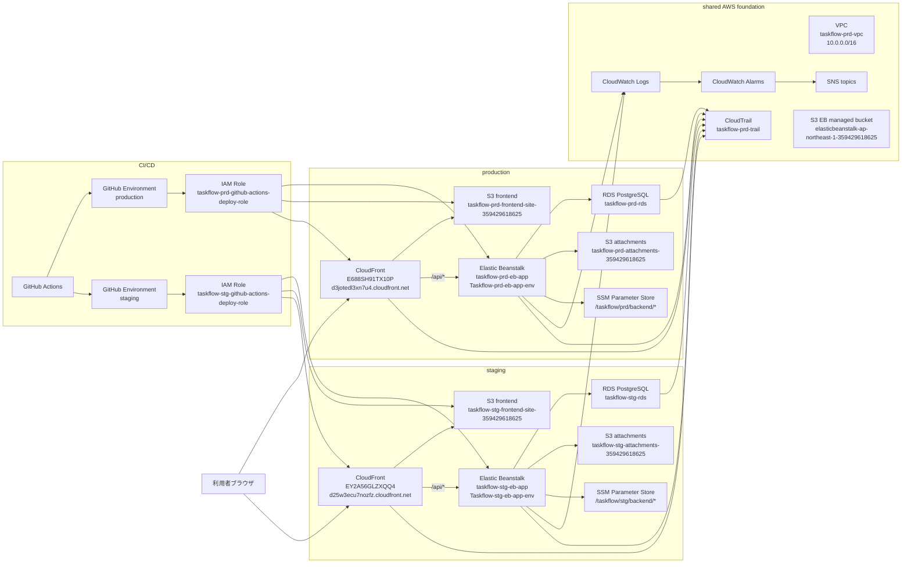

# TaskFlow インフラ設計書

## 改訂履歴

| 版数 | 改訂日 | 改訂者 | 改訂内容 |
| --- | --- | --- | --- |
| 1.0 | 2026-04-19 | 佐伯 | 初版作成 |
| 2.0 | 2026-04-22 | 佐伯 | 機能追加、STG 環境増築に伴い、全面的に更新 |

<strong>1. 文書概要</strong>

### 1.1 目的
本書は、個人開発プロジェクト **TaskFlow** の AWS 環境について、構成、設計意図、運用前提、既知課題を整理するためのインフラ設計書である。

本書は理想構成ではなく、**2026-04-22 時点で AWS 上に構築済みの production / staging 環境を反映した as-built 寄りの設計書**として扱う。

### 1.2 対象範囲
- AWS アカウント `359429618625` 上の TaskFlow 関連リソース
- production 環境
- staging 環境
- frontend 配信基盤
- backend 実行基盤
- DB 基盤
- 添付ファイル保存用 S3
- secrets / CI/CD / 監視 / 監査 / 復旧導線

### 1.3 対象外
- コメント機能の詳細設計
- 添付ファイル機能の詳細仕様
  - 別紙 `16_添付ファイル詳細設計書` に定義
  - 本書では AWS 実行基盤上の保存先、IAM、環境変数のみ扱う
- チーム管理 / 通知 / 管理者画面の機能詳細
- DR 構成、Multi-AZ、独自ドメイン導入

### 1.4 システム名・環境
| 項目 | 値 |
| --- | --- |
| 画面上のサービス名 | `TaskFlow` |
| リポジトリ | `kitune-udon/task-manager-app` |
| AWS Account | `359429618625` |
| メインリージョン | `ap-northeast-1` |
| CloudFront / 一部監視リージョン | `global` / `us-east-1` |
| production 環境コード | `prd` |
| staging 環境コード | `stg` |

---

<strong>2. 設計方針</strong>

### 2.1 基本方針
- 日本国内向け利用を前提とし、主要リージョンは `ap-northeast-1` とする
- frontend / backend / DB / 添付ファイルを責務ごとに分離する
- frontend は S3 直公開ではなく CloudFront 経由で公開する
- backend API も CloudFront の `/api/*` 経由を正規導線とする
- DB は public access を無効化し、private subnet に配置する
- backend secret は SSM Parameter Store で管理し、Git や `.env` に本番値を置かない
- deploy は GitHub Actions + OIDC + GitHub Environment 承認を正規手順とする
- production と staging は同一 AWS アカウント / 同一 VPC を共有しつつ、リソース名と IAM policy の参照先を環境ごとに分離する
- 監視・ログ・復旧導線まで含めて「公開後に運用できる状態」を維持する

### 2.2 初回構成で採用していない方針
- NAT Gateway を前提とした private app 構成
- bastion 常設
- RDS public access 有効化
- S3 website hosting 前提の公開
- 独自ドメイン導入
- Multi-AZ / DR リージョン構成
- 環境ごとの AWS アカウント分離

---

<strong>3. 採用アーキテクチャ概要</strong>

### 3.1 構成の要点
- production / staging とも公開入口は CloudFront
- frontend は S3 + CloudFront OAC で private 配信
- backend は Elastic Beanstalk single instance 構成
- DB は RDS PostgreSQL 15.17
- 添付ファイル保存は S3 を利用
- secret は SSM Parameter Store の environment secrets として EB へ渡す
- GitHub Actions は production / staging で workflow と Environment を分離
- VPC、subnet、CloudTrail、Elastic Beanstalk managed bucket は共有基盤として利用

---

<strong>4. 命名規約・タグ規約</strong>

### 4.1 命名規約
基本形式は以下とする。

- 形式: `taskflow-<env>-<resource>`
- 例:
  - `taskflow-prd-rds`
  - `taskflow-stg-rds`
  - `taskflow-prd-eb-app`
  - `taskflow-stg-eb-app`

### 4.2 環境コード
| 環境 | コード | 用途 |
| --- | --- | --- |
| local | `local` | ローカル開発 |
| development | `dev` | 開発環境候補 |
| staging | `stg` | リリース前検証 |
| production | `prd` | 本番 |

### 4.3 必須タグ
| Key | Value 例 |
| --- | --- |
| `Project` | `taskflow` |
| `System` | `task-manager-app` |
| `Environment` | `prd` / `stg` |
| `Region` | `ap-northeast-1` |
| `Scope` | `mvp` |
| `ManagedBy` | `manual` / `github-actions` |

### 4.4 注意
- 現行環境には AWS / Elastic Beanstalk が自動生成した security group や stack 名も存在する
- 自動生成リソースは命名規約と完全一致しないため、Environment ID や関連 stack 名で追跡する

---

<strong>5. ネットワーク設計</strong>

### 5.1 VPC
| 項目 | 値 |
| --- | --- |
| VPC 名 | `taskflow-prd-vpc` |
| VPC ID | `vpc-0c923d9f3616e4f65` |
| CIDR | `10.0.0.0/16` |
| State | `available` |
| 用途 | production / staging 共有 |

### 5.2 Subnet
| 種別 | Name | Subnet ID | AZ | CIDR | Public IP 自動付与 | 用途 |
| --- | --- | --- | --- | --- | --- | --- |
| Public A | `taskflow-prd-subnet-public-a` | `subnet-0620ef37ddb586208` | `ap-northeast-1a` | `10.0.1.0/24` | `true` | EB 配置 |
| Public C | `taskflow-prd-subnet-public-c` | `subnet-02cc8b52e22d96aec` | `ap-northeast-1c` | `10.0.2.0/24` | `true` | EB 配置 |
| Private A | `taskflow-prd-subnet-private-a` | `subnet-0142da2df4d49ac04` | `ap-northeast-1a` | `10.0.11.0/24` | `false` | RDS |
| Private C | `taskflow-prd-subnet-private-c` | `subnet-0e7ac4e833ccd98e9` | `ap-northeast-1c` | `10.0.12.0/24` | `false` | RDS |

### 5.3 Route / Internet Gateway
| 項目 | 値 |
| --- | --- |
| Internet Gateway | `igw-02fa72bad69103922` |
| Public Route Table | `taskflow-prd-rt-public / rtb-0d41db5d78c712f94` |
| 関連 subnet | `subnet-0620ef37ddb586208`, `subnet-02cc8b52e22d96aec` |
| Public Route | `0.0.0.0/0 -> igw-02fa72bad69103922` |
| NAT Gateway | 未導入 |

### 5.4 ネットワーク方針
- production / staging は同一 VPC を共有する
- EB は public subnet 側に配置する
- RDS は private subnet group に配置する
- RDS public access は無効
- 初回構成では NAT Gateway を置かない

---

<strong>6. Security Group 設計</strong>

### 6.1 環境別 Security Group
| 環境 | 用途 | Name | SG ID | Inbound | 備考 |
| --- | --- | --- | --- | --- | --- |
| prd | app | `taskflow-prd-sg-app` | `sg-0e79604022597200d` | `80/tcp` from CloudFront managed prefix list `pl-58a04531` | EB に追加 attach |
| prd | db | `taskflow-prd-sg-db` | `sg-06bfddec58a3b9cec` | `5432/tcp` from `sg-0e79604022597200d`, `sg-06db941d256dcaaa1` | `sg-06db941d256dcaaa1` は残存設定 |
| stg | app | `taskflow-stg-sg-app` | `sg-0d30ced331019dba9` | `80/tcp` from CloudFront managed prefix list `pl-58a04531` | EB に追加 attach |
| stg | db | `taskflow-stg-sg-db` | `sg-04cfeca4a9514bc1c` | `5432/tcp` from `sg-0d30ced331019dba9` | staging RDS 用 |

### 6.2 Elastic Beanstalk 自動生成 Security Group
| 環境 | Name | SG ID | Inbound | 備考 |
| --- | --- | --- | --- | --- |
| prd | `awseb-e-gvcyudrrcs-stack-AWSEBSecurityGroup-cPErUZLHpVTX` | `sg-0e83d125126940b93` | `80/tcp` from `0.0.0.0/0` | EB 自動生成 |
| stg | `awseb-e-k7ktyxpaur-stack-AWSEBSecurityGroup-gkefJkoJGFOx` | `sg-0c395e9e934d64dff` | `80/tcp`, `22/tcp` from `0.0.0.0/0` | EB 自動生成 |

### 6.3 Outbound
- app / db / EB 自動生成 SG は `0.0.0.0/0` への outbound を許可

### 6.4 セキュリティ上の注意
- 正規の backend 到達経路は CloudFront `/api/*`
- app SG は CloudFront managed prefix list のみ許可
- ただし EB 自動生成 SG に `0.0.0.0/0` inbound が残っているため、backend 直 URL の閉塞を厳密化する場合は EB 自動生成 SG の扱いを見直す
- staging の EB 自動生成 SG は `22/tcp` from `0.0.0.0/0` が残っているため、不要であれば削除または制限する

---

<strong>7. backend 実行基盤設計</strong>

### 7.1 Elastic Beanstalk 構成
| 項目 | production | staging |
| --- | --- | --- |
| Application | `taskflow-prd-eb-app` | `taskflow-stg-eb-app` |
| Environment | `Taskflow-prd-eb-app-env` | `Taskflow-stg-eb-app-env` |
| Environment ID | `e-gvcyudrrcs` | `e-k7ktyxpaur` |
| CNAME | `Taskflow-prd-eb-app-env.eba-8xzqpp6j.ap-northeast-1.elasticbeanstalk.com` | `Taskflow-stg-eb-app-env.eba-tmhj2uhb.ap-northeast-1.elasticbeanstalk.com` |
| Platform | `Corretto 17 running on 64bit Amazon Linux 2023 / 4.11.0` | `Corretto 17 running on 64bit Amazon Linux 2023 / 4.11.0` |
| 構成 | `SingleInstance` | `SingleInstance` |
| Instance Type | `t3.micro` | `t3.micro` |
| Status / Health | `Ready / Green / Ok` | `Ready / Green / Ok` |
| Current VersionLabel | `taskflow-prd-backend-20260413-1349-7b7b99f` | `taskflow-stg-backend-20260422-0334-cfbbf8c` |

### 7.2 Runtime / 環境変数
| 項目 | production | staging |
| --- | --- | --- |
| `SERVER_PORT` | `5000` | `5000` |
| `SPRING_PROFILES_ACTIVE` | `prod` | `prod` |
| `APP_ATTACHMENT_STORAGE_TYPE` | `S3` | `S3` |
| `APP_ATTACHMENT_S3_BUCKET` | `taskflow-prd-attachments-359429618625` | `taskflow-stg-attachments-359429618625` |
| `APP_ATTACHMENT_S3_REGION` | `ap-northeast-1` | `ap-northeast-1` |
| `APP_ATTACHMENT_S3_PREFIX` | `attachments` | `attachments` |

補足:

- staging も現行設定では `SPRING_PROFILES_ACTIVE=prod` を利用している
- 環境差分は DB 接続先、SSM Parameter パス、S3 bucket、GitHub Environment で分離する

### 7.3 environment secrets
| 変数 | production SSM path | staging SSM path |
| --- | --- | --- |
| `DB_URL` | `/taskflow/prd/backend/DB_URL` | `/taskflow/stg/backend/DB_URL` |
| `DB_USERNAME` | `/taskflow/prd/backend/DB_USERNAME` | `/taskflow/stg/backend/DB_USERNAME` |
| `DB_PASSWORD` | `/taskflow/prd/backend/DB_PASSWORD` | `/taskflow/stg/backend/DB_PASSWORD` |
| `JWT_SECRET` | `/taskflow/prd/backend/JWT_SECRET` | `/taskflow/stg/backend/JWT_SECRET` |
| `JWT_EXPIRATION_MILLIS` | `/taskflow/prd/backend/JWT_EXPIRATION_MILLIS` | `/taskflow/stg/backend/JWT_EXPIRATION_MILLIS` |
| `CORS_ALLOWED_ORIGINS` | `/taskflow/prd/backend/CORS_ALLOWED_ORIGINS` | `/taskflow/stg/backend/CORS_ALLOWED_ORIGINS` |

### 7.4 IAM 関連
| 種別 | production | staging |
| --- | --- | --- |
| EB Service Role | `aws-elasticbeanstalk-service-role` | `aws-elasticbeanstalk-service-role` |
| EC2 Role / Instance Profile | `aws-elasticbeanstalk-ec2-role` | `taskflow-stg-eb-ec2-role` |
| SSM read policy | `taskflow-prd-eb-ssm-read-policy` | `taskflow-stg-eb-ssm-read-policy` |

---

<strong>8. DB 設計</strong>

### 8.1 RDS 基本情報
| 項目 | production | staging |
| --- | --- | --- |
| DB Identifier | `taskflow-prd-rds` | `taskflow-stg-rds` |
| Endpoint | `taskflow-prd-rds.c5smu4yyoz4b.ap-northeast-1.rds.amazonaws.com` | `taskflow-stg-rds.c5smu4yyoz4b.ap-northeast-1.rds.amazonaws.com` |
| Port | `5432` | `5432` |
| DB Name | `taskflow` | `taskflow` |
| Engine | `postgres` | `postgres` |
| Engine Version | `15.17` | `15.17` |
| Instance Class | `db.t4g.micro` | `db.t4g.micro` |
| Storage | `gp3 / 20 GiB` | `gp3 / 20 GiB` |
| Storage Auto Scaling | `100 GiB` | 未設定 |
| Public Access | `false` | `false` |
| Deletion Protection | `true` | `false` |
| Backup Retention | `1日` | `1日` |
| DB Subnet Group | `taskflow-prd-rds-subnet` | `taskflow-stg-rds-subnet` |
| VPC Security Group | `sg-06bfddec58a3b9cec` | `sg-04cfeca4a9514bc1c` |
| Status | `available` | `available` |

### 8.2 DB subnet group
| 環境 | Subnet group | Subnets |
| --- | --- | --- |
| prd | `taskflow-prd-rds-subnet` | `subnet-0142da2df4d49ac04`, `subnet-0e7ac4e833ccd98e9` |
| stg | `taskflow-stg-rds-subnet` | `subnet-0142da2df4d49ac04`, `subnet-0e7ac4e833ccd98e9` |

### 8.3 DB 配置方針
- RDS は private subnet に配置する
- app SG からのみ接続を許可する
- public access は無効とする
- production DB は deletion protection を有効にする
- staging DB は検証用途のため deletion protection は無効
- DB 削除より snapshot / restore を優先する

---

<strong>9. frontend 配信設計</strong>

### 9.1 S3 frontend bucket
| 項目 | production | staging |
| --- | --- | --- |
| Bucket | `taskflow-prd-frontend-site-359429618625` | `taskflow-stg-frontend-site-359429618625` |
| 用途 | frontend 静的ファイル配信 | frontend 静的ファイル配信 |
| Website Hosting | 無効 | 無効 |
| Public Access Block | 4項目すべて有効 | 4項目すべて有効 |
| Bucket Policy | CloudFront service principal からの `s3:GetObject` のみ許可 | CloudFront service principal からの `s3:GetObject` のみ許可 |

### 9.2 CloudFront
| 項目 | production | staging |
| --- | --- | --- |
| Distribution ID | `E688SH91TX10P` | `EY2A56GLZXQQ4` |
| Domain Name | `d3jotedl3xn7u4.cloudfront.net` | `d25w3ecu7nozfz.cloudfront.net` |
| 公開 URL | `https://d3jotedl3xn7u4.cloudfront.net` | `https://d25w3ecu7nozfz.cloudfront.net` |
| Status | `Deployed` | `Deployed` |
| Enabled | `true` | `true` |
| Default Root Object | `index.html` | `index.html` |
| OAC | `taskflow-prd-oac-frontend / E26GNIW5QOQ2X5` | `taskflow-stg-oac-frontend / E3FYQJ4L83GZ6F` |
| SPA Function | `taskflow-prd-spa-router` | `taskflow-stg-spa-router` |

### 9.3 Origin
| 環境 | Origin | Domain | 備考 |
| --- | --- | --- | --- |
| prd | frontend | `taskflow-prd-frontend-site-359429618625.s3.ap-northeast-1.amazonaws.com` | OAC 使用 |
| prd | backend | `taskflow-prd-eb-app-env.eba-8xzqpp6j.ap-northeast-1.elasticbeanstalk.com` | `http-only` |
| stg | frontend | `taskflow-stg-frontend-site-359429618625.s3.ap-northeast-1.amazonaws.com` | OAC 使用 |
| stg | backend | `taskflow-stg-eb-app-env.eba-tmhj2uhb.ap-northeast-1.elasticbeanstalk.com` | `http-only` |

### 9.4 Behavior
| Behavior | 設定 |
| --- | --- |
| Default | frontend origin、viewer protocol policy `redirect-to-https`、Cache Policy `Managed-CachingOptimized` |
| `/api/*` | backend origin、viewer protocol policy `redirect-to-https`、allowed methods `GET, HEAD, OPTIONS, PUT, POST, PATCH, DELETE` |
| `/api/*` cache policy | `4135ea2d-6df8-44a3-9df3-4b5a84be39ad` |
| `/api/*` origin request policy | `AllViewerExceptHostHeader / b689b0a8-53d0-40ab-baf2-68738e2966ac` |

### 9.5 SPA ルーティング
- CloudFront Function を viewer-request に関連付ける
- `403/404 -> index.html -> 200` の Custom Error Response には依存しない
- API の `401/403/404` を SPA HTML に誤変換しない

---

<strong>10. S3 / 添付ファイル / artifact 設計</strong>

### 10.1 S3 bucket 一覧
| 用途 | production | staging |
| --- | --- | --- |
| frontend | `taskflow-prd-frontend-site-359429618625` | `taskflow-stg-frontend-site-359429618625` |
| backend deploy artifact | `taskflow-prd-eb-artifacts-359429618625` | `taskflow-stg-eb-artifacts-359429618625` |
| attachment | `taskflow-prd-attachments-359429618625` | `taskflow-stg-attachments-359429618625` |
| EB managed | `elasticbeanstalk-ap-northeast-1-359429618625` | 共有 |
| CloudTrail logs | `aws-cloudtrail-logs-359429618625-0b416378` | 共有 |

### 10.2 backend deploy artifact bucket
- `backend/<version-label>.zip` を配置する
- production / staging とも bucket policy は未設定
- GitHub Actions deploy role に artifact bucket への `s3:PutObject`, `s3:GetObject`, `s3:DeleteObject`, `s3:ListBucket` を付与する

### 10.3 attachment bucket
- production: `taskflow-prd-attachments-359429618625`
- staging: `taskflow-stg-attachments-359429618625`
- bucket policy は未設定
- Public Access Block は 4 項目すべて有効
- backend から `APP_ATTACHMENT_STORAGE_TYPE=S3` で利用する

### 10.4 EB managed bucket
- Bucket: `elasticbeanstalk-ap-northeast-1-359429618625`
- bucket policy に以下が含まれる
  - `aws-elasticbeanstalk-ec2-role` の log upload 用 `s3:PutObject`
  - `aws-elasticbeanstalk-ec2-role` と `taskflow-stg-eb-ec2-role` の `resources/environments/*` 参照
  - bucket delete deny

---

<strong>11. secret / 設定値管理設計</strong>

### 11.1 基本方針
- backend secret は SSM Parameter Store で管理する
- `DB_PASSWORD` と `JWT_SECRET` は SecureString
- GitHub Actions や `.env` に AWS 本番 secret 実値は置かない
- Elastic Beanstalk は environment secrets として SSM parameter ARN を参照する

### 11.2 Parameter Store
| Parameter | production | staging |
| --- | --- | --- |
| `DB_URL` | String / Version 1 | String / Version 2 |
| `DB_USERNAME` | String / Version 1 | String / Version 2 |
| `DB_PASSWORD` | SecureString / Version 2 | SecureString / Version 1 |
| `JWT_SECRET` | SecureString / Version 1 | SecureString / Version 1 |
| `JWT_EXPIRATION_MILLIS` | String / Version 1 | String / Version 1 |
| `CORS_ALLOWED_ORIGINS` | String / Version 1 | String / Version 2 |

### 11.3 IAM 制御
| 環境 | EC2 role | Policy | 許可対象 |
| --- | --- | --- | --- |
| prd | `aws-elasticbeanstalk-ec2-role` | `taskflow-prd-eb-ssm-read-policy` | `/taskflow/prd/backend/*` の必要 parameter |
| stg | `taskflow-stg-eb-ec2-role` | `taskflow-stg-eb-ssm-read-policy` | `/taskflow/stg/backend/*` の必要 parameter |

---

<strong>12. CI/CD 設計</strong>

### 12.1 基本方針
- deploy は GitHub Actions を正規手順とする
- 認証は OIDC + IAM Role
- 長期 access key は使わない
- production と staging は GitHub Environment / IAM Role / workflow を分離する

### 12.2 Workflow
| Workflow | 用途 | 既定 ref | GitHub Environment |
| --- | --- | --- | --- |
| `ci.yml` | backend / frontend の test・build | push / pull_request | なし |
| `deploy-backend-prd.yml` | backend を production EB へ deploy | `master` | `production` |
| `deploy-frontend-prd.yml` | frontend を production S3 / CloudFront へ deploy | `master` | `production` |
| `deploy-backend-stg.yml` | backend を staging EB へ deploy | `develop` | `staging` |
| `deploy-frontend-stg.yml` | frontend を staging S3 / CloudFront へ deploy | `develop` | `staging` |

### 12.3 GitHub Environment variables
| 変数 | production | staging |
| --- | --- | --- |
| `AWS_GITHUB_ACTIONS_DEPLOY_ROLE_ARN` | `arn:aws:iam::359429618625:role/taskflow-prd-github-actions-deploy-role` | `arn:aws:iam::359429618625:role/taskflow-stg-github-actions-deploy-role` |
| `AWS_REGION` | `ap-northeast-1` | `ap-northeast-1` |
| `EB_APPLICATION_NAME` | `taskflow-prd-eb-app` | `taskflow-stg-eb-app` |
| `EB_ENVIRONMENT_NAME` | `Taskflow-prd-eb-app-env` | `Taskflow-stg-eb-app-env` |
| `EB_S3_BUCKET` | `taskflow-prd-eb-artifacts-359429618625` | `taskflow-stg-eb-artifacts-359429618625` |
| `VERSION_LABEL_PREFIX` | `taskflow-prd-backend` | `taskflow-stg-backend` |
| `BACKEND_JAR_NAME` | `task-0.0.1-SNAPSHOT.jar` | `task-0.0.1-SNAPSHOT.jar` |
| `FRONTEND_BUCKET` | `taskflow-prd-frontend-site-359429618625` | `taskflow-stg-frontend-site-359429618625` |
| `CLOUDFRONT_DISTRIBUTION_ID` | `E688SH91TX10P` | `EY2A56GLZXQQ4` |

### 12.4 OIDC / IAM deploy role
| 項目 | production | staging |
| --- | --- | --- |
| Role | `taskflow-prd-github-actions-deploy-role` | `taskflow-stg-github-actions-deploy-role` |
| Trust sub | `repo:kitune-udon/task-manager-app:environment:production` | `repo:kitune-udon/task-manager-app:environment:staging` |
| 主な許可 | EB deploy、S3 artifact/frontend、EB managed bucket、CloudFormation、Auto Scaling、LaunchTemplate read、CloudWatch Logs、CloudFront | EB deploy、S3 artifact/frontend、EB managed/resource bucket、CloudFormation read/list、Auto Scaling、EC2 describe、CloudWatch Logs、CloudFront、`sts:GetCallerIdentity` |

### 12.5 運用上の注意
- production の deploy role policy と staging の deploy role policy は現行 AWS 上で差分がある
- staging deploy role には、staging 初回 deploy 時に必要になった `ec2:DescribeSubnets`, `ec2:DescribeImages`, EB resource bucket 参照などが含まれる
- `.github/workflows/github_actions_deploy_role_policy_stg.json` は現行 AWS の staging inline policy と差分があるため、policy JSON を正とする運用に戻す場合は同期が必要
- deploy role / workflow / GitHub Environment variables / AWS 実 IAM policy は常に同期する
- backend deploy workflow は EB failure event や期待しない `VersionLabel` のまま `Ready` に戻るケースを失敗扱いにする

---

<strong>13. 監視・ログ・監査設計</strong>

### 13.1 CloudWatch Logs
主な対象ロググループ:

- `/aws/elasticbeanstalk/Taskflow-prd-eb-app-env/var/log/web.stdout.log`
- `/aws/elasticbeanstalk/Taskflow-prd-eb-app-env/environment-health.log`
- `/aws/elasticbeanstalk/Taskflow-stg-eb-app-env/var/log/web.stdout.log`
- `/aws/elasticbeanstalk/Taskflow-stg-eb-app-env/environment-health.log`

### 13.2 SNS Topic
| リージョン | production | staging |
| --- | --- | --- |
| `ap-northeast-1` | `arn:aws:sns:ap-northeast-1:359429618625:taskflow-prd-alerts-apne1` | `arn:aws:sns:ap-northeast-1:359429618625:taskflow-stg-alerts-apne1` |
| `us-east-1` | `arn:aws:sns:us-east-1:359429618625:taskflow-prd-alerts-use1` | `arn:aws:sns:us-east-1:359429618625:taskflow-stg-alerts-use1` |

### 13.3 Alarm
| Alarm | 環境 | Region | Metric | Threshold | 現在状態 |
| --- | --- | --- | --- | --- | --- |
| `taskflow-prd-eb-environment-health` | prd | `ap-northeast-1` | `AWS/ElasticBeanstalk EnvironmentHealth` | `< 15` | `ALARM` |
| `taskflow-prd-rds-cpu-high` | prd | `ap-northeast-1` | `AWS/RDS CPUUtilization` | `> 80` | `OK` |
| `taskflow-prd-rds-storage-low` | prd | `ap-northeast-1` | `AWS/RDS FreeStorageSpace` | `< 5GiB` | `OK` |
| `taskflow-prd-rds-memory-low` | prd | `ap-northeast-1` | `AWS/RDS FreeableMemory` | `< 128MiB` | `OK` |
| `taskflow-prd-cf-5xx-rate-high` | prd | `us-east-1` | `AWS/CloudFront 5xxErrorRate` | `> 1` | `INSUFFICIENT_DATA` |
| `taskflow-stg-eb-environment-health` | stg | `ap-northeast-1` | `AWS/ElasticBeanstalk EnvironmentHealth` | `>= 15` | `OK` |
| `taskflow-stg-rds-cpu-high` | stg | `ap-northeast-1` | `AWS/RDS CPUUtilization` | `> 80` | `OK` |
| `taskflow-stg-rds-storage-low` | stg | `ap-northeast-1` | `AWS/RDS FreeStorageSpace` | `< 5GiB` | `OK` |
| `taskflow-stg-rds-memory-low` | stg | `ap-northeast-1` | `AWS/RDS FreeableMemory` | `< 128MiB` | `OK` |
| `taskflow-stg-cf-5xx-rate-high` | stg | `us-east-1` | `AWS/CloudFront 5xxErrorRate` | `> 5` | `OK` |

### 13.4 CloudTrail
| 項目 | 値 |
| --- | --- |
| Trail | `taskflow-prd-trail` |
| 保存先 S3 | `aws-cloudtrail-logs-359429618625-0b416378` |
| Home Region | `ap-northeast-1` |
| Multi-Region Trail | `true` |
| Log File Validation | `true` |
| Logging | `true` |

### 13.5 監視上の注意
- production EB は AWS 上で `Ready / Green / Ok` だが、`taskflow-prd-eb-environment-health` Alarm は `ALARM` のまま残っている
- EB health alarm のメトリクス条件や比較演算子は見直し候補

---

<strong>14. 障害初動・復旧設計</strong>

### 14.1 初動確認順
1. 症状、対象環境、発生時刻を固定する
2. CloudFront distribution と `/api/*` behavior を確認する
3. Elastic Beanstalk health / events / current `VersionLabel` を確認する
4. CloudWatch Logs / Logs Insights を `eventId` や request id 軸で確認する
5. EB tail / bundle / `eb-engine.log` / `web.stdout.log` を確認する
6. RDS 状態、接続元 SG、`LatestRestorableTime` を確認する
7. GitHub Actions run と deploy role 権限を確認する
8. 復旧方式を判断する

### 14.2 DB 復旧方針
- PITR または snapshot restore を利用する
- 本番 DB を直接上書きしない
- 復元時は新しい DB instance identifier を使う
- 復元後に migration 状態と接続先切替要否を確認する

### 14.3 deploy rollback 方針
- backend は EB application version / `VersionLabel` を基準に戻す
- frontend は S3 上の artifact と CloudFront invalidation を確認する
- DB migration を伴う場合は DB restore / forward fix の判断を優先する

---

<strong>15. コスト・運用方針</strong>

### 15.1 予算方針
- 月額上限目安: `10,000 円`
- 通知閾値:
  - 50%
  - 80%
  - 100%
  - 予測超過

### 15.2 停止方針
- production は即停止しない
- staging は検証用途のため縮退・削除候補になり得る
- DB は削除より snapshot 保全を優先する

### 15.3 削除方針
- 一時環境は利用終了後 24 時間以内削除
- production RDS 削除前は snapshot 必須
- staging RDS は deletion protection 無効のため、削除前確認を厳格に行う

---

<strong>16. 既知課題・次フェーズ対応</strong>

### 16.1 継続課題
1. production DB SG に `sg-06db941d256dcaaa1` からの `5432/tcp` inbound が残存している
2. EB 自動生成 SG に direct inbound が残っている
   - prd: `80/tcp` from `0.0.0.0/0`
   - stg: `80/tcp`, `22/tcp` from `0.0.0.0/0`
3. production EB は Green/Ok だが `taskflow-prd-eb-environment-health` Alarm が `ALARM`
4. staging deploy role の AWS 実 inline policy と `.github/workflows/github_actions_deploy_role_policy_stg.json` に差分がある
5. `DB_PASSWORD / JWT_SECRET` のローテーション運用は未整理
6. `taskflow-cli-operator` の最小権限化は未整理
7. production / staging は同一 VPC / 同一 AWS アカウントを共有しており、強い環境分離ではない
8. staging は `SPRING_PROFILES_ACTIVE=prod` を利用しているため、将来的に `stg` profile を分離するか判断が必要

### 16.2 解消済みの主要不具合
- frontend が `localhost` を API 接続先に解決する不具合
- `Procfile` と `SERVER_PORT` の不整合による `502` 問題
- CloudFront の `403/404 -> index.html` による API 認可エラー HTML 化問題
- staging backend deploy 初回の IAM 権限不足
  - `ec2:DescribeSubnets`
  - `ec2:DescribeImages`
  - EB resource bucket 参照

### 16.3 次フェーズ候補
- EB 自動生成 SG の direct inbound 閉塞
- production EB alarm の条件見直し
- deploy role policy JSON と AWS 実 IAM の同期
- staging 専用 Spring profile の導入検討
- secret ローテーション運用の定常化
- 独自ドメイン / ACM 導入
- private app 構成への移行検討

---

<strong>17. 参考資料</strong>

- `docs/02_製造/AWS環境構築/01_初期環境構築`
- `docs/02_製造/AWS環境構築/02_STG環境構築`
- `.github/workflows`
- AWS CLI による 2026-04-22 時点の現行環境棚卸し結果

