# データフロー図設計書

## 改訂履歴

| 版数 | 改訂日 | 改訂内容 | 作成者 |
|---|---|---|---|
| 1.0 | 2026-04-13 | 初版作成 | 佐伯 |
| 1.1 | 2026-04-15 | コメント、添付ファイル、通知、履歴、S3連携、詳細画面内編集、論理削除を反映して全面更新 | 佐伯 |


<details>
<summary>1. 文書概要</summary>

- システム名: task-manager-app
- 対象ブランチ: `develop`
- 対象ディレクトリ: `backend`, `frontend`
- 作成方針: 現仕様として採用するデータの流れと、将来拡張とする論点を分けて整理する
- 対象範囲:
  - 認証フロー
  - タスク一覧取得フロー
  - タスク詳細取得フロー
  - タスク作成フロー
  - タスク更新フロー
  - タスク削除フロー
  - 担当者候補一覧取得フロー
  - コメント一覧取得 / 投稿 / 更新 / 削除フロー
  - 添付一覧取得 / アップロード / ダウンロード / 削除フロー
  - タスク別履歴一覧取得フロー
  - 通知一覧取得 / 未読件数取得 / 既読化 / 一括既読化フロー
  - 401発生時の再ログイン誘導フロー

---

</details>
<details>
<summary>2. 本書における設計前提</summary>

### 2.1 現フェーズで設計対象に含めるもの

本フェーズでは、**複数ユーザーで協業できるタスク管理アプリ** として、以下を現仕様に含める。

- タスク一覧 / 詳細 / 作成 / 更新 / 削除
- タスク詳細画面内での編集
- タスク単位のコメント
- タスク単位の添付ファイル
- タスク単位のアクティビティログ
- アプリ内通知一覧と未読件数表示
- 通知既読化 / 一括既読化
- 添付ファイルの S3 保存
- タスク削除、コメント削除、添付削除の論理削除方針

### 2.2 現フェーズで採用するUI/操作方針

phase2 の検討経緯を踏まえ、以下を現仕様として固定する。

- コメント、添付、履歴は**タスク詳細画面に集約**する
- タスク編集は**詳細画面内の表示モード / 編集モード切替**で行う
- タスク削除は**物理削除ではなく論理削除**とする
- 通知は**アプリ内通知を中心**とし、メール通知やプッシュ通知は将来拡張とする
- 添付ファイルは**バックエンド経由でS3に保存 / 取得**する

### 2.3 将来構想として扱うもの

本書では、以下は将来拡張として扱い、現仕様のデータフローには含めない。

- チーム境界の厳密なデータモデル（`teams`, `team_members`, `tasks.team_id` など）
- メール通知 / プッシュ通知 / リアルタイム通知
- コメントのリアルタイム更新
- 署名付きURLによる添付直接ダウンロード
- 添付ファイルの物理削除ジョブや高度なライフサイクル管理
- watcher / mention / チーム通知など通知対象の高度化

### 2.4 「チーム向け」の扱い

企画上はチーム利用を想定しているが、現フェーズの設計・実装粒度としては、**チーム境界まで厳密にモデル化したシステム** ではなく、**複数ユーザーによる協業機能付きタスク管理アプリ** として整理する。

そのため、本書では以下の前提で記載する。

- 複数ユーザーが同一タスクに関与できる
- コメント、添付、通知、履歴により協業できる
- ただし、チーム単位の所属境界やチーム内ロール分離は将来拡張とする

---

</details>
<details>
<summary>3. システム構成上の主要要素</summary>

### 3.1 外部エンティティ

| ID | 名称 | 説明 |
|---|---|---|
| E-01 | 利用者 | 画面から操作するユーザー |
| E-02 | ブラウザ | React SPA を実行し、localStorage を保持する |
| E-03 | PostgreSQL | 永続データストア |
| E-04 | AWS S3 | 添付ファイル実体の保存先 |

### 3.2 プロセス

| ID | 名称 | 説明 |
|---|---|---|
| P-01 | 画面UI | 入力受付、表示更新、画面遷移 |
| P-02 | useAuthState | 認証状態管理、ログイン、登録、ログアウト制御 |
| P-03 | useTaskState | タスク状態管理、一覧、詳細、作成、更新、削除、コメント、添付、履歴制御 |
| P-04 | useNotificationState | 通知一覧、未読件数、既読化、一括既読、ポーリング制御 |
| P-05 | apiClient | HTTP送信、JWT自動付与、401検知 |
| P-06 | Spring Security | JWT検証、認証、認可 |
| P-07 | Controller | API受付 |
| P-08 | Service | 業務処理、権限制御、DTO変換、通知生成 |
| P-09 | Repository | DBアクセス |
| P-10 | AttachmentStorage | 添付ファイルのS3保存 / 読込 / 補償削除 |

### 3.3 データストア

| ID | 名称 | 物理格納先 | 説明 |
|---|---|---|---|
| D-01 | 認証トークン | localStorage | `authToken` |
| D-02 | 表示ユーザー名 | localStorage | `userDisplayName` |
| D-03 | ログイン後遷移先 | localStorage | `postLoginRedirectPath` |
| D-04 | users | PostgreSQL | ユーザー情報 |
| D-05 | tasks | PostgreSQL | タスク情報 |
| D-06 | task_comments | PostgreSQL | コメント情報 |
| D-07 | task_attachments | PostgreSQL | 添付メタ情報 |
| D-08 | activity_logs | PostgreSQL | 履歴情報 |
| D-09 | notifications | PostgreSQL | 通知受信者・既読状態 |
| D-10 | フロント認証状態 | React State | `isLoggedIn`, `currentUserLabel`, 認証メッセージ等 |
| D-11 | フロントタスク状態 | React State | `tasks`, `selectedTask`, `comments`, `attachments`, `activities`, 各フォーム状態等 |
| D-12 | フロント通知状態 | React State | `notifications`, `unreadCount`, `unreadOnly`, 読込状態等 |
| D-13 | 添付ファイル実体 | AWS S3 | 添付ファイル本体 |

---

</details>
<details>
<summary>4. 全体データフロー図</summary>

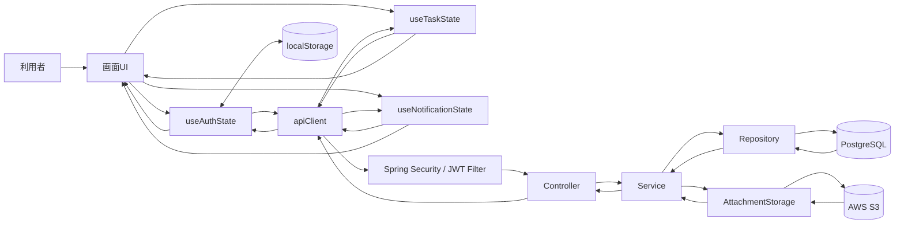

---

</details>
<details>
<summary>5. 認証・認可データフロー</summary>


</details>
<details>
<summary>5.1 ログインフロー</summary>

### 概要

ログイン画面入力値を `useAuthState` が受け取り、`authApi.login` 経由で `POST /api/auth/login` を呼び出す。  
バックエンドでは `AuthService` がユーザー検索とパスワード照合を行い、成功時に JWT を発行する。  
フロントは JWT と表示名を localStorage に保存し、保護画面へ遷移する。

### データフロー図

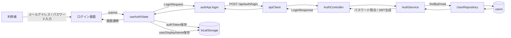

### 補足

- ログイン失敗時は `401` を受け取り、画面にエラーメッセージを表示する
- `token` が空の場合はフロント側で異常扱いにする

---

</details>
<details>
<summary>5.2 新規登録フロー</summary>

### 概要

新規登録画面入力値を `useAuthState` が受け取り、`authApi.register` 経由で `POST /api/auth/register` を呼び出す。  
バックエンドではメールアドレス重複確認後、パスワードをハッシュ化して users に保存する。  
登録成功後、フロントはログイン画面へ戻し、成功メッセージとメールアドレスをセットする。

### データフロー図

```mermaid
flowchart LR
    U["利用者"]
    RP["新規登録画面"]
    AS["useAuthState"]
    RA["authApi.register"]
    AC["apiClient"]
    C["AuthController"]
    S["AuthService"]
    UR["UserRepository"]
    DB[("users")]

    U -->|"名前 / メール / パスワード入力"| RP
    RP -->|"submit"| AS
    AS -->|"RegisterRequest"| RA
    RA -->|"POST /api/auth/register"| AC
    AC --> C
    C --> S
    S -->|"existsByEmail"| UR
    UR --> DB
    DB --> UR
    UR --> S
    S -->|"重複なしなら保存"| UR
    UR --> DB
    DB --> UR
    UR --> S
    S -->|"RegisterResponse"| C
    C --> AC
    AC --> RA
    RA --> AS
    AS -->|"成功メッセージ設定 / ログイン画面遷移"| RP
```

### 補足

- メールアドレス重複時は `409 ERR-USR-001`
- パスワードはハッシュ化して保存される
- 登録成功時に `userDisplayName` は保存されるが、`authToken` は保存されない

---

</details>
<details>
<summary>5.3 保護API呼び出し時のJWT認証フロー</summary>

### 概要

保護API呼び出し時、`apiClient` の request interceptor が localStorage の `authToken` を Authorization ヘッダーに付与する。  
バックエンドでは `JwtAuthenticationFilter` がトークン検証を行い、妥当であれば SecurityContext に認証情報を設定して Controller に処理を渡す。

### データフロー図

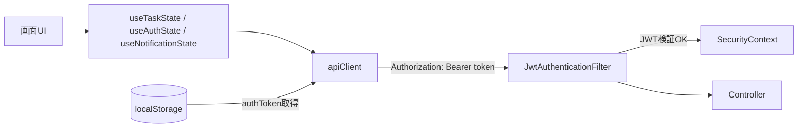

### 補足

- Bearer トークンなしの場合は未認証のまま後続に進む
- 期限切れ時は `ERR-AUTH-004`
- 不正トークン時は `ERR-AUTH-003`

---

</details>
<details>
<summary>5.4 401発生時の再ログイン誘導フロー</summary>

### 概要

保護APIで `401` を受けた場合、`apiClient` の response interceptor が `authToken` を削除し、`app:unauthorized` イベントを発火する。  
`useAuthState` はこのイベントを受け、必要に応じて現在パスを保存してログイン画面へ遷移させる。

### データフロー図

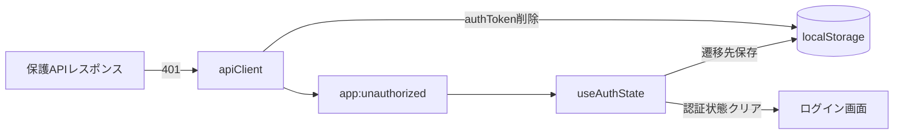

### 補足

- 認証APIの `401` ではこのイベントは発火しない
- 保護パスにいた場合のみ `postLoginRedirectPath` を保存する
- 再ログイン成功後は保存済みパスへ戻る

---

</details>
<details>
<summary>6. タスク・コメント・添付・履歴データフロー</summary>


</details>
<details>
<summary>6.1 認証後初期ロードフロー</summary>

### 概要

ログイン状態になると、認証後レイアウト配下で以下を初期ロードする。

- `useTaskState` によるタスク一覧取得
- `useTaskState` による担当者候補一覧取得
- `useNotificationState` による未読通知件数取得

### データフロー図

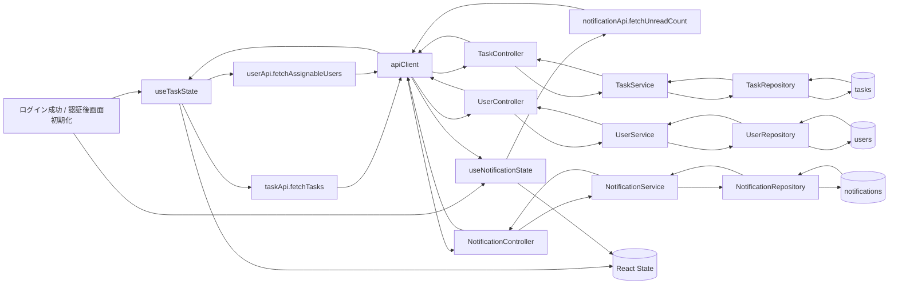

### 補足

- phase2 では、通知やコメントなど追加機能を別画面へ分散させず、**認証後の共通レイアウトとタスク詳細画面を中心に集約する方針** を採用している

---

</details>
<details>
<summary>6.2 タスク一覧取得フロー</summary>

### 概要

一覧画面表示や再読込時に `useTaskState.loadTasks()` が `taskApi.fetchTasks()` を呼び出す。  
バックエンドではログインユーザーが参照可能な未削除タスクを取得し、一覧DTOへ変換して返却する。

### データフロー図

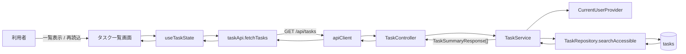

### 補足

- 本フェーズでは、チーム境界による絞り込みではなく、現行認可ルールに基づく参照可能タスク取得を前提とする
- サーバーサイド検索やページングは将来拡張とする

---

</details>
<details>
<summary>6.3 タスク詳細取得フロー</summary>

### 概要

`selectedTaskId` が変わると `useTaskState` がタスク詳細取得を起点に、タスク本体、コメント、添付、履歴を読み込む。  
タスク詳細画面では表示モード / 編集モードを切り替えて利用する。

### データフロー図

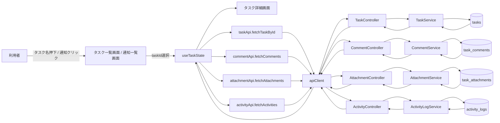

### 補足

- phase2 の方針として、**タスクに紐づく情報は可能な限り詳細画面へ集約**する
- そのため、コメント画面や添付専用画面、履歴専用画面は作らず、タスク詳細画面内で完結する前提とする

---

</details>
<details>
<summary>6.4 タスク作成フロー</summary>

### 概要

作成画面で入力した値を `useTaskState.handleCreateTask()` が受け取り、ローカル検証後に `taskApi.createTask()` を呼び出す。  
バックエンドでは作成者にログインユーザーを設定し、必要に応じて担当者ユーザーを解決して tasks に保存する。  
成功後フロントは一覧再取得を行い、一覧画面へ遷移する。

### データフロー図

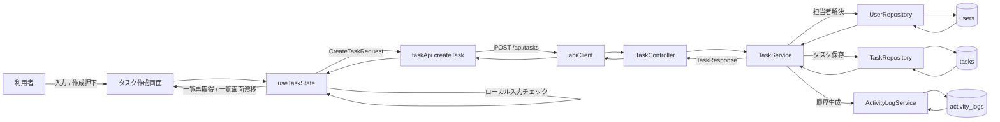

### 補足

- 本フェーズでは、タスク作成時の通知は必須要件に含めない
- まずは作成、詳細、更新、コメント、添付、履歴、通知一覧の基本導線を優先する

---

</details>
<details>
<summary>6.5 タスク更新フロー（詳細画面内編集）</summary>

### 概要

タスク詳細画面の表示モードから編集ボタンで編集モードへ切り替える。  
更新時はローカル検証後に `taskApi.updateTask()` を呼び出し、バックエンドで更新権限判定後に tasks を更新する。  
成功後フロントは詳細再取得と一覧再取得を行い、表示モードへ戻る。

### データフロー図

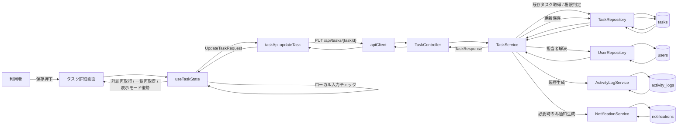

### 補足

- 編集専用画面 `/tasks/{id}/edit` は採用しない
- phase2 の検討経緯を踏まえ、**詳細確認と更新操作を同一画面にまとめる**
- 更新に伴う履歴記録は現仕様に含める
- 更新通知はアプリ内通知として扱い、通知チャネルの多様化は将来拡張とする

---

</details>
<details>
<summary>6.6 タスク削除フロー（論理削除）</summary>

### 概要

詳細画面で削除ボタン押下後、確認ダイアログで承認されると `taskApi.deleteTask()` を呼び出す。  
バックエンドは対象タスクを取得し、削除権限を判定した上で `deleted_at`, `deleted_by` を設定する論理削除を行う。  
成功後フロントは一覧再取得し、一覧画面へ戻る。

### データフロー図

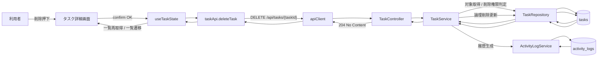

### 補足

- 削除は復元余地と監査性を意識し、物理削除ではなく論理削除とする
- 関連コメント / 添付 / 履歴 / 通知との関係整理は別設計書側で詳細化する

---

</details>
<details>
<summary>6.7 担当者候補一覧取得フロー</summary>

### 概要

ログイン後、`useTaskState` が `fetchAssignableUsers()` を呼び出して `GET /api/users` から候補一覧を取得する。  
取得結果はタスク作成画面およびタスク詳細画面の編集モードで利用される。

### データフロー図

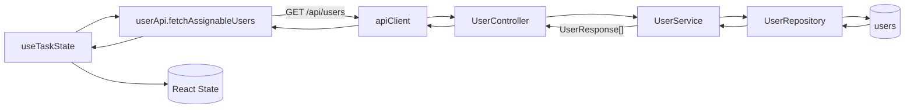

### 補足

- 本フェーズでは、チーム所属で候補を制限する設計までは行わない
- 将来、チーム境界を導入する場合は取得条件を見直す

---

</details>
<details>
<summary>6.8 コメント一覧取得フロー</summary>

### 概要

タスク詳細画面のコメントタブ表示時、`commentApi.fetchComments()` を呼び出して対象タスクのコメント一覧を取得する。  
バックエンドは対象タスク参照権限を確認し、削除済みコメントを除外して返却する。

### データフロー図

```mermaid
flowchart LR
    DP["タスク詳細画面"]
    TS["useTaskState"]
    CA["commentApi.fetchComments"]
    AC["apiClient"]
    CC["CommentController"]
    CS["CommentService"]
    CR["CommentRepository"]
    DB[("task_comments")]

    DP -->|"コメント表示"| TS
    TS --> CA
    CA -->|"GET /api/tasks/{taskId}/comments"| AC
    AC --> CC
    CC --> CS
    CS --> CR
    CR --> DB
    DB --> CR
    CR --> CS
    CS -->|"CommentResponse[]"| CC
    CC --> AC
    AC --> CA
    CA --> TS
    TS --> DP
```

### 補足

- 削除済みコメントは返却しない
- コメント一覧は投稿日時順で表示する

---

</details>
<details>
<summary>6.9 コメント投稿フロー</summary>

### 概要

タスク詳細画面で入力したコメント本文を `commentApi.createComment()` が送信する。  
バックエンドではコメントを作成し、同一トランザクション内で `activity_logs` と `notifications` を生成する。  
成功後フロントはコメント一覧、履歴、未読通知件数を再取得する。

### データフロー図

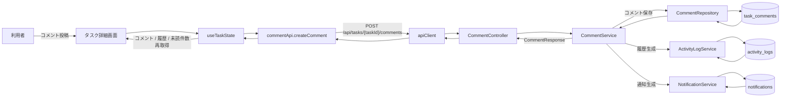

### 補足

- コメントはタスク単位で追加可能とする
- コメントのリアルタイム同期は現フェーズ対象外とする
- コメント投稿は履歴記録対象に含める
- コメント通知はアプリ内通知を基本とする

---

</details>
<details>
<summary>6.10 コメント更新 / 削除フロー</summary>

### 概要

コメント更新・削除はコメント投稿者本人または権限を持つユーザーが実行する。  
更新時はコメントを更新し履歴を記録する。削除時は論理削除し履歴を記録する。  
どちらも成功後フロントはコメント一覧と履歴を再取得する。

### データフロー図

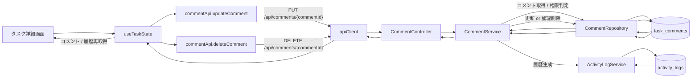

### 補足

- コメント更新 / 削除通知は本フェーズでは生成しない
- コメント削除は論理削除であり、一覧返却対象から除外する

---

</details>
<details>
<summary>6.11 添付一覧取得フロー</summary>

### 概要

タスク詳細画面の添付エリア表示時、`attachmentApi.fetchAttachments()` を呼び出して対象タスクの添付一覧を取得する。  
バックエンドは対象タスク参照権限を確認し、削除済み添付を除外して返却する。

### データフロー図

```mermaid
flowchart LR
    DP["タスク詳細画面"]
    TS["useTaskState"]
    AA["attachmentApi.fetchAttachments"]
    AC["apiClient"]
    ATC["AttachmentController"]
    ATS["AttachmentService"]
    AR["AttachmentRepository"]
    DB[("task_attachments")]

    DP -->|"添付表示"| TS
    TS --> AA
    AA -->|"GET /api/tasks/{taskId}/attachments"| AC
    AC --> ATC
    ATC --> ATS
    ATS --> AR
    AR --> DB
    DB --> AR
    AR --> ATS
    ATS -->|"AttachmentResponse[]"| ATC
    ATC --> AC
    AC --> AA
    AA --> TS
    TS --> DP
```

### 補足

- 削除済み添付は返却しない
- 保存先は `storageType = S3` を前提とする

---

</details>
<details>
<summary>6.12 添付アップロードフロー</summary>

### 概要

タスク詳細画面で `添付` ボタン押下後、OSのファイル選択ダイアログからファイルを選ぶと、`attachmentApi.uploadAttachment()` が `multipart/form-data` で送信する。  
バックエンドではS3へファイル本体を保存し、`task_attachments` メタ情報を登録する。  
成功後、同一トランザクション内で `activity_logs` と `notifications` を生成し、フロントは添付一覧、履歴、未読件数を再取得する。

### データフロー図

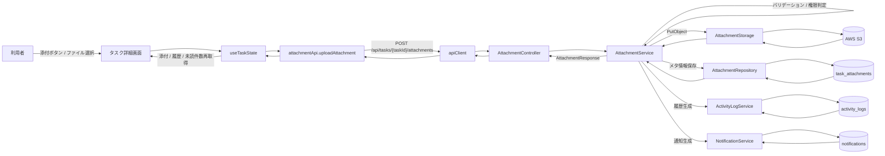

### 補足

- 添付はタスク単位で扱う
- 添付ファイル実体は S3 保存を現仕様に含める
- 署名付きURLや直接アップロードは将来拡張とする
- 添付アップロードは履歴 / 通知連携対象に含める
- S3保存成功後にDB登録が失敗した場合は補償削除を行う

---

</details>
<details>
<summary>6.13 添付ダウンロードフロー</summary>

### 概要

添付ファイル名リンク押下時、`attachmentApi.downloadAttachment()` がバックエンド経由でS3からファイルを取得する。  
バックエンドは添付メタ情報とタスク参照権限を確認した上で、S3オブジェクトを取得してレスポンスとして返却する。

### データフロー図

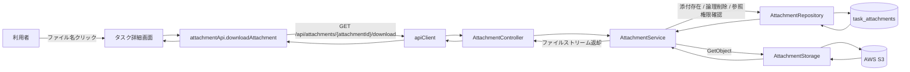

### 補足

- 署名付きURLは利用せず、バックエンド経由で返却する
- 削除済み添付はダウンロード不可とする

---

</details>
<details>
<summary>6.14 添付削除フロー</summary>

### 概要

添付削除ボタン押下後、確認ダイアログで承認されると `attachmentApi.deleteAttachment()` を呼び出す。  
バックエンドは添付メタ情報を論理削除し、履歴を記録する。  
成功後フロントは添付一覧と履歴を再取得する。

### データフロー図

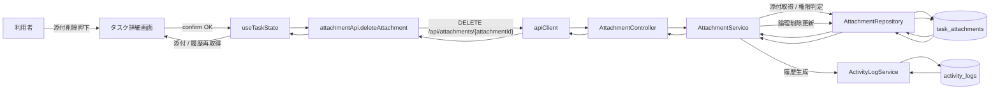

### 補足

- 添付削除はDBメタ情報の論理削除とする
- 本フェーズでは通常削除時にS3オブジェクトは削除しない
- 添付削除通知は本フェーズでは生成しない

---

</details>
<details>
<summary>6.15 タスク別履歴一覧取得フロー</summary>

### 概要

タスク詳細画面の履歴タブ表示時、`activityApi.fetchActivities()` を呼び出して対象タスクの履歴一覧を取得する。  
履歴にはタスク更新、コメント操作、添付操作が含まれる。

### データフロー図

```mermaid
flowchart LR
    DP["タスク詳細画面"]
    TS["useTaskState"]
    AA["activityApi.fetchActivities"]
    AC["apiClient"]
    ALC["ActivityController"]
    ALS["ActivityLogService"]
    ALR["ActivityLogRepository"]
    DB[("activity_logs")]

    DP -->|"履歴タブ表示"| TS
    TS --> AA
    AA -->|"GET /api/tasks/{taskId}/activities"| AC
    AC --> ALC
    ALC --> ALS
    ALS --> ALR
    ALR --> DB
    DB --> ALR
    ALR --> ALS
    ALS -->|"ActivityResponse[]"| ALC
    ALC --> AC
    AC --> AA
    AA --> TS
    TS --> DP
```

### 補足

- phase2 では、変更経緯を利用者が追えるようにするため、履歴参照を詳細画面に含める
- ログの運用詳細や高度な監査用途は将来拡張とする

---

</details>
<details>
<summary>7. 通知データフロー</summary>


</details>
<details>
<summary>7.1 通知一覧取得フロー</summary>

### 概要

通知一覧画面表示時、`useNotificationState` が `notificationApi.fetchNotifications()` を呼び出す。  
バックエンドは `notifications` と `activity_logs` を参照して、自分宛通知のみを返却する。

### データフロー図

```mermaid
flowchart LR
    U["利用者"]
    NP["通知一覧画面"]
    NS["useNotificationState"]
    NA["notificationApi.fetchNotifications"]
    AC["apiClient"]
    NC["NotificationController"]
    NSV["NotificationService"]
    NR["NotificationRepository"]
    ALR["ActivityLogRepository"]
    DB1[("notifications")]
    DB2[("activity_logs")]

    U -->|"通知一覧表示"| NP
    NP --> NS
    NS --> NA
    NA -->|"GET /api/notifications"| AC
    AC --> NC
    NC --> NSV
    NSV --> NR
    NSV --> ALR
    NR --> DB1
    ALR --> DB2
    DB1 --> NR
    DB2 --> ALR
    NR --> NSV
    ALR --> NSV
    NSV -->|"NotificationResponse[]"| NC
    NC --> AC
    AC --> NA
    NA --> NS
    NS --> NP
```

### 補足

- 現フェーズの通知は**アプリ内通知**を中心とする
- 通知一覧画面と共通レイアウト上の未読件数表示をセットで扱う

---

</details>
<details>
<summary>7.2 未読通知件数取得 / ポーリングフロー</summary>

### 概要

認証後レイアウト表示時、画面遷移時、一定間隔、既読化後に `useNotificationState` が `GET /api/notifications/unread-count` を呼び出す。  
結果はサイドバーの未読通知バッジに反映される。

### データフロー図

```mermaid
flowchart LR
    A["ログイン直後 / 画面遷移 / 60秒ごと / 既読化後"]
    NS["useNotificationState"]
    NA["notificationApi.fetchUnreadCount"]
    AC["apiClient"]
    NC["NotificationController"]
    NSV["NotificationService"]
    NR["NotificationRepository"]
    DB[("notifications")]
    UI["サイドバー未読バッジ"]

    A --> NS
    NS --> NA
    NA -->|"GET /api/notifications/unread-count"| AC
    AC --> NC
    NC --> NSV
    NSV --> NR
    NR --> DB
    DB --> NR
    NR --> NSV
    NSV -->|"unreadCount"| NC
    NC --> AC
    AC --> NA
    NA --> NS
    NS --> UI
```

### 補足

- リアルタイム通知ではなく、定期ポーリング方式を採用する
- WebSocket / SSE 化は将来拡張とする

---

</details>
<details>
<summary>7.3 通知既読化フロー</summary>

### 概要

通知一覧画面で既読化ボタン押下、または通知レコードクリック時に `notificationApi.markAsRead()` を呼び出す。  
バックエンドは自分宛通知であることを確認して `is_read = true`, `read_at = now()` を設定する。  
成功後フロントは通知一覧と未読件数を再取得する。

### データフロー図

```mermaid
flowchart LR
    U["利用者"]
    NP["通知一覧画面"]
    NS["useNotificationState"]
    NA["notificationApi.markAsRead"]
    AC["apiClient"]
    NC["NotificationController"]
    NSV["NotificationService"]
    NR["NotificationRepository"]
    DB[("notifications")]

    U -->|"既読化押下 / 通知クリック"| NP
    NP --> NS
    NS --> NA
    NA -->|"PATCH /api/notifications/{notificationId}/read"| AC
    AC --> NC
    NC --> NSV
    NSV --> NR
    NR --> DB
    DB --> NR
    NR --> NSV
    NSV -->|"既読更新"| NR
    NR --> DB
    DB --> NR
    NR --> NSV
    NSV --> NC
    NC --> AC
    AC --> NA
    NA --> NS
    NS -->|"通知一覧 / 未読件数再取得"| NP
```

### 補足

- 既読化済み通知に再実行しても正常終了とする
- 通知レコードクリック時の遷移先は関連タスク詳細画面とする
- 通知クリック時の削除済みタスク / 権限喪失時挙動は関連設計書で詳細化する

---

</details>
<details>
<summary>7.4 通知一括既読化フロー</summary>

### 概要

通知一覧画面で一括既読ボタン押下時、`notificationApi.markAllAsRead()` を呼び出す。  
バックエンドは自分宛の未読通知のみを既読化し、成功後フロントは通知一覧と未読件数を再取得する。

### データフロー図

```mermaid
flowchart LR
    U["利用者"]
    NP["通知一覧画面"]
    NS["useNotificationState"]
    NA["notificationApi.markAllAsRead"]
    AC["apiClient"]
    NC["NotificationController"]
    NSV["NotificationService"]
    NR["NotificationRepository"]
    DB[("notifications")]

    U -->|"一括既読押下"| NP
    NP --> NS
    NS --> NA
    NA -->|"PATCH /api/notifications/read-all"| AC
    AC --> NC
    NC --> NSV
    NSV --> NR
    NR --> DB
    DB --> NR
    NR --> NSV
    NSV -->|"未読通知を一括更新"| NR
    NR --> DB
    DB --> NR
    NR --> NSV
    NSV --> NC
    NC --> AC
    AC --> NA
    NA --> NS
    NS -->|"通知一覧 / 未読件数再取得"| NP
```

### 補足

- 対象は自分宛の未読通知のみとする
- 画面側は処理後に一覧と未読件数を同期する

---

</details>
<details>
<summary>8. フロント内部状態フロー</summary>


</details>
<details>
<summary>8.1 ルーティング制御フロー</summary>

### 概要

本システムは `react-router` を使わず、`window.history.pushState` と `replaceState`、`popstate` を用いてルーティングしている。  
`useRouteState` が `window.location.pathname` を解析し、現在画面を解決する。

### データフロー図

```mermaid
flowchart LR
    UI["利用者操作"]
    NAV["navigateTo"]
    WH["window.history"]
    POP["popstate"]
    RS["useRouteState"]
    APP["App.tsx"]

    UI --> NAV
    NAV --> WH
    WH --> POP
    POP --> RS
    RS --> APP
```

### 補足

- 画面遷移は軽量構成を優先する
- phase2 ではまず主要画面導線を成立させることを優先する

---

</details>
<details>
<summary>8.2 タスク詳細画面の表示モード / 編集モード制御フロー</summary>

### 概要

タスク詳細画面は専用編集画面へ遷移せず、同一画面内で表示モード / 編集モードを切り替える。  
編集開始時に現在値をフォームへコピーし、保存成功時は最新詳細を再取得して表示モードへ戻る。

### データフロー図

```mermaid
flowchart LR
    DT[("selectedTask")]
    MODE["isEditMode"]
    FORM[("editForm")]
    SAVE["updateTask()"]
    UI["タスク詳細画面"]

    DT --> UI
    DT --> FORM
    MODE --> UI
    UI --> MODE
    FORM --> UI
    UI --> SAVE
    SAVE --> DT
    SAVE --> MODE
```

### 補足

- 画面分割よりも、文脈を切らずに編集できることを優先した設計である
- 詳細確認、コメント閲覧、添付操作、履歴確認、編集操作を1画面で完結させる

---

</details>
<details>
<summary>8.3 アクティビティタブ切替フロー</summary>

### 概要

タスク詳細画面のアクティビティ領域は `コメント` と `履歴` のタブを持ち、選択タブに応じてコメント一覧または履歴一覧を表示する。

### データフロー図

```mermaid
flowchart LR
    TAB["activeActivityTab"]
    COMMENTS[("comments state")]
    ACTIVITIES[("activities state")]
    UI["アクティビティ領域"]

    TAB --> UI
    COMMENTS --> UI
    ACTIVITIES --> UI
    UI --> TAB
```

### 補足

- コメントと履歴は別画面に分けず、詳細画面内で切り替える
- 追加機能を増やしつつも、利用者視点で追いやすいUIを優先する

---

</details>
<details>
<summary>8.4 タスク一覧フィルタフロー</summary>

### 概要

一覧取得後、表示絞り込みは API 再実行ではなく、React State 内の `tasks` から `filteredTasks` を `useMemo` で計算する。

### データフロー図

```mermaid
flowchart LR
    T[("tasks state")]
    SF["statusFilter"]
    PF["priorityFilter"]
    FM["filteredTasks useMemo"]
    UI["一覧テーブル"]

    T --> FM
    SF --> FM
    PF --> FM
    FM --> UI
```

### 補足

- 現在は一覧の基本利用を優先する
- 高度検索やサーバーサイド絞り込みは将来拡張とする

---

</details>
<details>
<summary>9. データストア入出力マトリクス</summary>

| 処理 | localStorage | users | tasks | task_comments | task_attachments | activity_logs | notifications | S3 | React State |
|---|---|---|---|---|---|---|---|---|---|
| ログイン | 読取 / 更新 | 参照 |  |  |  |  |  |  | 更新 |
| 新規登録 | 更新（一部） | 参照 / 追加 |  |  |  |  |  |  | 更新 |
| 認証付きAPI呼出 | 読取 |  |  |  |  |  |  |  |  |
| 401発生 | 削除 / 更新 |  |  |  |  |  |  |  | 更新 |
| タスク一覧取得 |  |  | 参照 |  |  |  |  |  | 更新 |
| タスク詳細取得 |  |  | 参照 | 参照 | 参照 | 参照 |  |  | 更新 |
| タスク作成 |  | 参照 | 追加 |  |  | 追加 |  |  | 更新 |
| タスク更新 |  | 参照 | 参照 / 更新 |  |  | 追加 | 条件付き追加 |  | 更新 |
| タスク削除 |  |  | 参照 / 更新 |  |  | 追加 |  |  | 更新 |
| 担当者候補取得 |  | 参照 |  |  |  |  |  |  | 更新 |
| コメント一覧取得 |  |  | 参照 | 参照 |  |  |  |  | 更新 |
| コメント投稿 |  |  | 参照 | 追加 |  | 追加 | 追加 |  | 更新 |
| コメント更新 |  |  | 参照 | 更新 |  | 追加 |  |  | 更新 |
| コメント削除 |  |  | 参照 | 更新 |  | 追加 |  |  | 更新 |
| 添付一覧取得 |  |  | 参照 |  | 参照 |  |  |  | 更新 |
| 添付アップロード |  |  | 参照 |  | 追加 | 追加 | 追加 | 追加 | 更新 |
| 添付ダウンロード |  |  | 参照 |  | 参照 |  |  | 読取 |  |
| 添付削除 |  |  | 参照 |  | 更新 | 追加 |  |  | 更新 |
| 通知一覧取得 |  |  |  |  |  | 参照 | 参照 |  | 更新 |
| 未読通知件数取得 |  |  |  |  |  |  | 参照 |  | 更新 |
| 通知既読化 |  |  |  |  |  |  | 更新 |  | 更新 |
| 通知一括既読化 |  |  |  |  |  |  | 更新 |  | 更新 |

---

</details>
<details>
<summary>10. 特記事項</summary>

1. 本書では、phase2 の検討経緯を踏まえ、コメント / 添付 / 履歴 / 通知を**現仕様**として扱う
2. タスク更新は独立編集画面ではなく、タスク詳細画面内の表示モード / 編集モード切替で行う
3. タスク削除は物理削除ではなく、`deleted_at`, `deleted_by` を設定する論理削除とする
4. コメント一覧 / 添付一覧は論理削除済みデータを返却しない
5. 添付ファイル実体はS3に保存し、画面との入出力はバックエンド経由で行う
6. 通知は現フェーズではアプリ内通知を中心とし、未読件数はポーリングで管理する
7. 複数ユーザーでの協業は現仕様に含めるが、厳密なチーム境界モデルは将来拡張とする
8. コメントのリアルタイム同期、メール通知、プッシュ通知、直接ダウンロードURLは本書の対象外とする

---

</details>
<details>
<summary>11. 今後拡張時の設計観点</summary>

### 11.1 チーム境界導入時

以下の権限制御変更が想定される。

- `teams`, `team_members` データ追加
- タスク / コメント / 添付 / 通知の参照境界見直し
- 担当者候補取得条件の変更
- チーム内ロールとシステムロールの分離

### 11.2 通知の高度化

以下を導入する場合は通知フロー変更が必要。

- WebSocket / SSE によるリアルタイム通知
- メール通知 / ブラウザプッシュ通知
- watcher / mention / チーム通知
- 通知遷移失敗時UXの厳密化

### 11.3 添付ファイル運用拡張

以下を導入する場合は添付フロー変更が必要。

- S3オブジェクトの物理削除ジョブ
- 署名付きURLによる直接ダウンロード
- 大容量ファイル向け Multipart Upload
- ウイルススキャン

### 11.4 一覧・検索の高度化

以下を導入する場合はデータフロー変更が必要。

- キーワード検索入力
- 担当者フィルタ
- サーバーサイドページング
- 条件保持付き一覧復帰

---

</details>
<details>
<summary>12. 備考</summary>

- 本書は `develop` ブランチの現仕様に基づくデータフロー図設計書の改訂案である
- 旧版で今後拡張扱いだったコメント、添付、通知、履歴を、phase2 の検討経緯に沿って現仕様へ昇格させている
- その一方で、チーム境界の厳密モデルや通知チャネルの拡張などは将来構想として切り分けている
- API利用方法や状態管理方針に変更があった場合は、本書も追随して更新すること

</details>
