# データフロー図設計書

## 改訂履歴

| 版数 | 改訂日 | 改訂内容 | 作成者 |
|---|---|---|---|
| 1.0 | 2026-04-13 | 初版作成 | 佐伯 |

## 目次

- [1. 文書概要](#1-文書概要)
- [2. システム構成上の主要要素](#2-システム構成上の主要要素)
- [3. 全体データフロー図](#3-全体データフロー図)
- [4. 認証・認可データフロー](#4-認証認可データフロー)
- [5. タスク管理データフロー](#5-タスク管理データフロー)
- [6. フロント内部状態フロー](#6-フロント内部状態フロー)
- [7. データストア入出力マトリクス](#7-データストア入出力マトリクス)
- [8. 特記事項](#8-特記事項)
- [9. 今後拡張時の設計観点](#9-今後拡張時の設計観点)
- [10. 備考](#10-備考)

## 1. 文書概要

- システム名: task-manager-app
- 対象ブランチ: `develop`
- 対象ディレクトリ: `backend`, `frontend`
- 作成方針: システムのデータフローを整理する
- 対象範囲:
  - 認証フロー
  - タスク一覧取得フロー
  - タスク詳細取得フロー
  - タスク作成フロー
  - タスク更新フロー
  - タスク削除フロー
  - 担当者候補一覧取得フロー
  - 401発生時の再ログイン誘導フロー

---

## 2. システム構成上の主要要素

### 2.1 外部エンティティ

| ID | 名称 | 説明 |
|---|---|---|
| E-01 | 利用者 | 画面から操作するユーザー |
| E-02 | ブラウザ | React SPA を実行し、localStorage を保持する |
| E-03 | PostgreSQL | 永続データストア |

### 2.2 プロセス

| ID | 名称 | 説明 |
|---|---|---|
| P-01 | 画面UI | 入力受付、表示更新 |
| P-02 | useAuthState | 認証状態管理、ログイン、登録、ログアウト制御 |
| P-03 | useTaskState | タスク状態管理、一覧、詳細、作成、更新、削除制御 |
| P-04 | apiClient | HTTP送信、JWT自動付与、401検知 |
| P-05 | Spring Security | JWT検証、認証、認可 |
| P-06 | Controller | API受付 |
| P-07 | Service | 業務処理、権限制御、DTO変換 |
| P-08 | Repository | DBアクセス |

### 2.3 データストア

| ID | 名称 | 物理格納先 | 説明 |
|---|---|---|---|
| D-01 | 認証トークン | localStorage | `authToken` |
| D-02 | 表示ユーザー名 | localStorage | `userDisplayName` |
| D-03 | ログイン後遷移先 | localStorage | `postLoginRedirectPath` |
| D-04 | users | PostgreSQL | ユーザー情報 |
| D-05 | tasks | PostgreSQL | タスク情報 |
| D-06 | フロント認証状態 | React State | `isLoggedIn`, `currentUserLabel`, メッセージ等 |
| D-07 | フロントタスク状態 | React State | `tasks`, `selectedTask`, 各フォーム状態等 |

---

## 3. 全体データフロー図

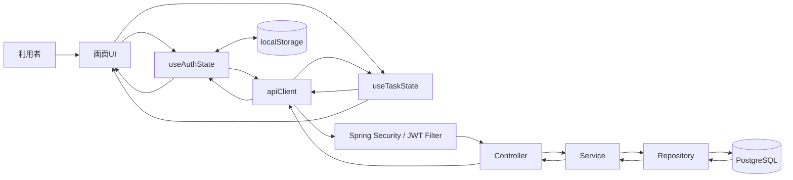

---

## 4. 認証・認可データフロー

## 4.1 ログインフロー

### 概要

ログイン画面入力値を `useAuthState` が受け取り、`authApi.login` 経由で `POST /api/auth/login` を呼び出す。  
バックエンドでは `AuthService` がユーザー検索とパスワード照合を行い、成功時に JWT を発行する。  
フロントは JWT と表示名を localStorage に保存し、保護画面へ遷移する。

### データフロー図

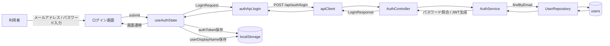

### 入出力データ

| 区分 | データ |
|---|---|
| 入力 | email, password |
| DB参照 | users |
| 出力 | token, user.id, user.name, user.email |
| localStorage保存 | authToken, userDisplayName |
| 画面反映 | ログイン状態、ヘッダー表示名、タスク画面遷移 |

### 補足

- ログイン失敗時は `401` を受け取り、画面にエラーメッセージを表示する
- `token` が空の場合はフロント側で異常扱いにする

---

## 4.2 新規登録フロー

### 概要

新規登録画面入力値を `useAuthState` が受け取り、`authApi.register` 経由で `POST /api/auth/register` を呼び出す。  
バックエンドではメールアドレス重複確認後、パスワードをハッシュ化して users に保存する。  
登録成功後、フロントはログイン画面へ戻し、成功メッセージとメールアドレスをセットする。

### データフロー図

```mermaid
flowchart LR
    U["利用者"]
    RP["新規登録画面"]
    AS["useAuthState"]
    RA["authApi.register"]
    AC["apiClient"]
    C["AuthController"]
    S["AuthService"]
    UR["UserRepository"]
    DB[("users")]

    U -->|"名前 / メール / パスワード入力"| RP
    RP -->|"submit"| AS
    AS -->|"RegisterRequest"| RA
    RA -->|"POST /api/auth/register"| AC
    AC --> C
    C --> S
    S -->|"existsByEmail"| UR
    UR --> DB
    DB --> UR
    UR --> S
    S -->|"重複なしなら保存"| UR
    UR --> DB
    DB --> UR
    UR --> S
    S -->|"RegisterResponse"| C
    C --> AC
    AC --> RA
    RA --> AS
    AS -->|"成功メッセージ設定 / ログイン画面遷移"| RP
```

### 入出力データ

| 区分 | データ |
|---|---|
| 入力 | name, email, password |
| DB参照 | users |
| DB更新 | users 追加 |
| 出力 | id, name, email, createdAt |
| 画面反映 | 成功メッセージ、ログイン画面遷移 |

### 補足

- メールアドレス重複時は `409 ERR-USR-001`
- パスワードはハッシュ化して保存される
- 登録成功時に `userDisplayName` は保存されるが、`authToken` は保存されない

---

## 4.3 保護API呼び出し時のJWT認証フロー

### 概要

保護API呼び出し時、`apiClient` の request interceptor が localStorage の `authToken` を Authorization ヘッダーに付与する。  
バックエンドでは `JwtAuthenticationFilter` がトークン検証を行い、妥当であれば SecurityContext に認証情報を設定して Controller に処理を渡す。

### データフロー図

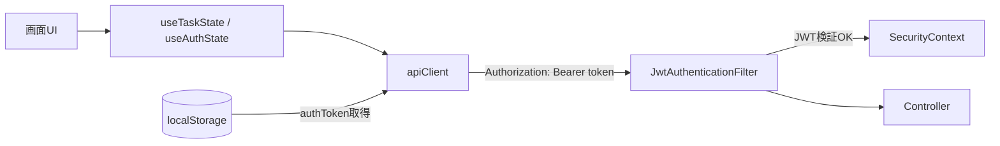

### 補足

- Bearer トークンなしの場合は未認証のまま後続に進む
- 期限切れ時は `ERR-AUTH-004`
- 不正トークン時は `ERR-AUTH-003`

---

## 4.4 401発生時の再ログイン誘導フロー

### 概要

保護APIで `401` を受けた場合、`apiClient` の response interceptor が `authToken` を削除し、`app:unauthorized` イベントを発火する。  
`useAuthState` はこのイベントを受け、必要に応じて現在パスを保存してログイン画面へ遷移させる。

### データフロー図

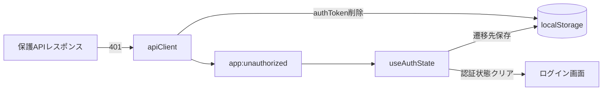

### 補足

- 認証API の `401` ではこのイベントは発火しない
- 保護パスにいた場合のみ `postLoginRedirectPath` を保存する
- 再ログイン成功後は保存済みパスへ戻る

---

## 5. タスク管理データフロー

## 5.1 アプリ起動時・ログイン後初期ロードフロー

### 概要

ログイン状態になると `useTaskState` の `useEffect` が発火し、以下を並行して実行する。

- `fetchTasks()` によるタスク一覧取得
- `fetchAssignableUsers()` による担当者候補一覧取得

### データフロー図

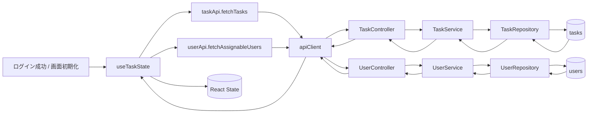

### 補足

- 一覧取得は現在フロントからクエリ条件を付けずに `GET /api/tasks` を呼ぶ
- ステータス、優先度の絞り込みは取得後にクライアント側で実施する
- 担当者候補は `GET /api/users` から名前順で取得する

---

## 5.2 タスク一覧取得フロー

### 概要

一覧画面表示や再読込時に `useTaskState.loadTasks()` が `taskApi.fetchTasks()` を呼び出す。  
バックエンドではログインユーザーが「作成者」または「担当者」であるタスクのみを取得し、一覧DTOへ変換して返却する。

### データフロー図

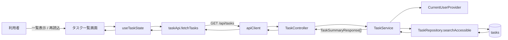

### 主な入出力

| 区分 | データ |
|---|---|
| 入力 | なし（本システムではクエリ未使用） |
| DB参照 | tasks |
| 出力 | id, title, status, priority, dueDate, assignedUser, updatedAt |
| 画面反映 | 一覧テーブル、取得件数、表示件数 |

### 補足

- バックエンドは `status`, `priority`, `assignedUserId`, `keyword` に対応している
- ただし本システムではそれらクエリを送っていない
- `filteredTasks` は React 側で `statusFilter` と `priorityFilter` により計算される

---

## 5.3 タスク詳細取得フロー

### 概要

`selectedTaskId` が変わると `useTaskState` の `useEffect` が `loadTaskDetail(taskId)` を呼び出す。  
バックエンドはタスク取得後、閲覧権限を判定し、詳細DTOへ変換して返す。

### データフロー図

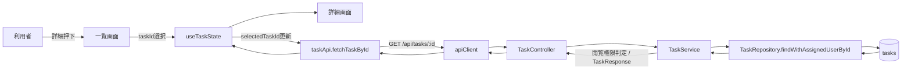

### 補足

- 閲覧可能条件:
  - 作成者本人
  - 担当者本人
- 不可の場合は 403
- タスクなしの場合は 404

---

## 5.4 タスク作成フロー

### 概要

作成画面で入力した値を `useTaskState.handleCreateTask()` が受け取り、ローカル検証後に `taskApi.createTask()` を呼び出す。  
バックエンドでは作成者にログインユーザーを設定し、必要に応じて担当者ユーザーを解決して tasks に保存する。  
成功後フロントは一覧再取得を行い、一覧画面へ遷移する。

### データフロー図

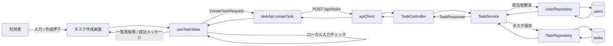

### 主な入出力

| 区分 | データ |
|---|---|
| 入力 | title, description, status, priority, dueDate, assignedUserId |
| DB参照 | users（assignedUser / currentUser） |
| DB更新 | tasks 追加 |
| 出力 | TaskResponse |
| 画面反映 | 一覧再取得、成功メッセージ、一覧画面遷移 |

### 補足

- フロントでは担当者候補一覧に存在する値のみ許可する
- バックエンドでは `createdBy` を current user で強制設定する
- `teamId` はフロント型に存在するが本システムでは未使用

---

## 5.5 タスク更新フロー

### 概要

編集画面表示時、まず詳細取得結果を元にフォームへ既存値をセットする。  
更新時はローカル検証後に `taskApi.updateTask()` を呼び出し、バックエンドで更新権限判定後に tasks を更新する。  
成功後フロントは一覧再取得し、詳細画面へ戻る。

### データフロー図

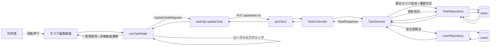

### 補足

- 更新可能条件:
  - 作成者本人
  - 担当者本人
- 成功時メッセージを設定して詳細画面へ戻る
- `resolveChangedFields()` により更新項目の差分を監査ログに出している

---

## 5.6 タスク削除フロー

### 概要

詳細画面で削除ボタン押下後、確認ダイアログで承認されると `taskApi.deleteTask()` を呼び出す。  
バックエンドは対象タスクを取得し、作成者本人のみ削除を許可する。  
成功後フロントは一覧再取得し、一覧画面へ戻る。

### データフロー図

```mermaid
flowchart LR
    U["利用者"]
    DP["タスク詳細画面"]
    TS["useTaskState"]
    TA["taskApi.deleteTask"]
    AC["apiClient"]
    TC["TaskController"]
    SV["TaskService"]
    TR["TaskRepository"]
    DB[("tasks")]

    U -->|"削除押下"| DP
    DP -->|"confirm OK"| TS
    TS --> TA
    TA -->|"DELETE /api/tasks/:id"| AC
    AC --> TC
    TC --> SV
    SV -->|"対象取得 / 削除権限判定"| TR
    TR --> DB
    DB --> TR
    TR --> SV
    SV -->|"delete"| TR
    TR --> DB
    SV --> TC
    TC -->|"204 No Content"| AC
    AC --> TA
    TA --> TS
    TS -->|"一覧再取得 / 一覧遷移"| DP
```

### 補足

- 削除可能条件:
  - 作成者本人のみ
- フロントでは `window.confirm()` により確認を行う
- 成功時は `selectedTask` をクリアする

---

## 5.7 担当者候補一覧取得フロー

### 概要

ログイン後、`useTaskState` が `fetchAssignableUsers()` を呼び出して `GET /api/users` から候補一覧を取得する。  
取得結果は作成・編集画面の担当者プルダウンに利用される。

### データフロー図

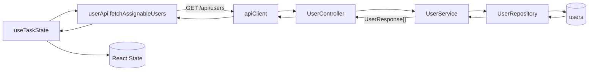

### 補足

- 並び順は `name ASC, id ASC`
- フロントでは先頭に `未選択` を追加する
- 編集画面で現在の担当者が候補にいない場合は、一時的に選択肢へ補完する

---

## 6. フロント内部状態フロー

## 6.1 ルーティング制御フロー

### 概要

本システムは `react-router` を使わず、`window.history.pushState` と `replaceState`、`popstate` を用いてルーティングしている。  
`useRouteState` が `window.location.pathname` を解析し、現在画面を解決する。

### データフロー図

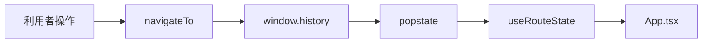

### 補足

- `/tasks/new` → create
- `/tasks/:id/edit` → edit
- `/tasks/:id` → detail
- その他 → list

---

## 6.2 タスク一覧フィルタフロー

### 概要

一覧取得後、表示絞り込みは API 再実行ではなく、React State 内の `tasks` から `filteredTasks` を `useMemo` で計算する。

### データフロー図

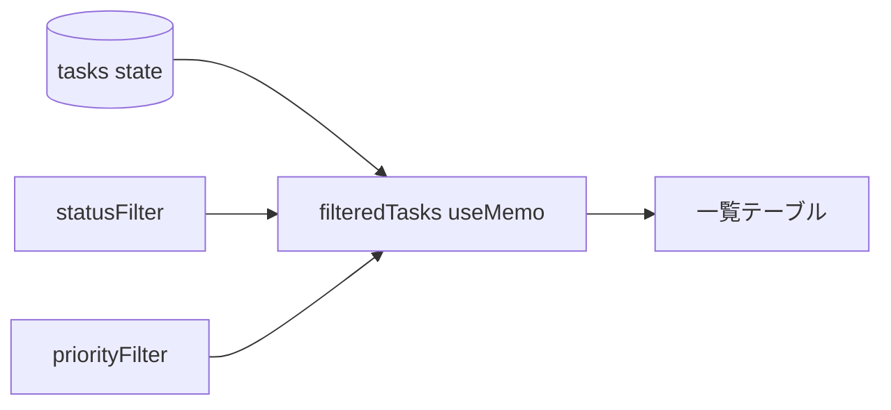

### 補足

- 現在はステータスと優先度のみクライアント絞り込み
- キーワード検索UIと担当者絞り込みUIは未実装

---

## 7. データストア入出力マトリクス

| 処理 | localStorage | users | tasks | React State |
|---|---|---|---|---|
| ログイン | 読取 / 更新 | 参照 |  | 更新 |
| 新規登録 | 更新（一部） | 参照 / 追加 |  | 更新 |
| 認証付きAPI呼出 | 読取 |  |  |  |
| 401発生 | 削除 / 更新 |  |  | 更新 |
| タスク一覧取得 |  |  | 参照 | 更新 |
| タスク詳細取得 |  |  | 参照 | 更新 |
| タスク作成 |  | 参照 | 追加 | 更新 |
| タスク更新 |  | 参照 | 参照 / 更新 | 更新 |
| タスク削除 |  |  | 参照 / 削除 | 更新 |
| 担当者候補取得 |  | 参照 |  | 更新 |

---

## 8. 特記事項

1. 一覧APIはバックエンドで条件検索に対応しているが、現行フロントはクエリパラメータを付けずに全件取得している
2. 一覧画面の絞り込みはクライアント側の `filteredTasks` で実施している
3. コメント機能の state `commentDraft` は存在するが、画面上では投稿処理や保存フローは未実装
4. `teamId` はフロントの型定義に存在するが、本システムのリクエストDTOには存在しない
5. 認証状態は `authToken` の有無で判定している
6. ログイン後の表示名は `user.name` を優先して localStorage に保存する
7. 認証エラー時は API クライアント主導でログイン画面へ戻す設計になっている

---

## 9. 今後拡張時の設計観点

### 9.1 タスク一覧検索のサーバーサイド化

現在はクライアントフィルタのみであるため、以下を実装する場合はデータフロー変更が必要。

- キーワード検索入力
- 担当者フィルタ
- サーバーサイドページング

### 9.2 コメント・添付ファイル追加時

以下の新規データストア・フロー追加が想定される。

- comments テーブル
- attachments テーブル
- ファイルアップロードストレージ
- タスク詳細画面での取得、投稿、ダウンロードフロー

### 9.3 チーム機能追加時

以下の権限制御変更が想定される。

- team / team_member データ
- タスク参照、更新、削除権限の見直し
- 担当者候補取得条件の変更

---

## 10. 備考

- 本書は `develop` ブランチの本システムのデータフロー図設計書である
- 設計意図ではなく、現在の仕様に沿ったフローを優先して記載している
- 機能追加や API 利用方法の変更があった場合は、本書も更新すること
