# シーケンス図設計書

## 改訂履歴

| 版数 | 改訂日 | 改訂内容 | 作成者 |
|---|---|---|---|
| 1.0 | 2026-04-13 | 初版作成 | 佐伯 |

## 目次

- 1 [文書概要](#1-文書概要)
- 2 [シーケンス図一覧](#2-シーケンス図一覧)
- 3 [共通登場要素](#3-共通登場要素)
- 4 [認証系シーケンス](#4-認証系シーケンス)
- 5 [タスク系シーケンス](#5-タスク系シーケンス)
- 6 [ユーザー候補取得シーケンス](#6-ユーザー候補取得シーケンス)
- 7 [認証エラー・例外系シーケンス](#7-認証エラー例外系シーケンス)
- 8 [補足事項](#8-補足事項)
- 9 [備考](#9-備考)

## 1. 文書概要

- システム名: task-manager-app
- 対象ブランチ: `develop`
- 対象ディレクトリ: `backend`, `frontend`
- 文書目的: 主要な画面操作およびAPI処理について、処理順序とコンポーネント間の呼び出し関係を整理する
- 表記形式: Mermaid `sequenceDiagram`

---

## 2. シーケンス図一覧

| No | シーケンス名 | 概要 |
|---|---|---|
| SEQ-01 | ログイン | メールアドレスとパスワードで認証し、JWTを保存する |
| SEQ-02 | 新規登録 | ユーザーを登録し、ログイン画面へ戻す |
| SEQ-03 | ログアウト | 認証情報とタスク状態をクリアし、ログイン画面へ戻す |
| SEQ-04 | ログイン後初期ロード | タスク一覧と担当者候補を取得する |
| SEQ-05 | タスク一覧取得 | 参照可能なタスク一覧を取得する |
| SEQ-06 | タスク詳細取得 | 選択したタスクの詳細を取得する |
| SEQ-07 | タスク作成 | 入力内容を検証し、新規タスクを登録する |
| SEQ-08 | タスク編集 | 既存値をフォームに反映し、タスクを更新する |
| SEQ-09 | タスク削除 | 確認後、作成者権限でタスクを削除する |
| SEQ-10 | 担当者候補取得 | タスクフォーム用のユーザー一覧を取得する |
| SEQ-11 | 401発生時の再ログイン誘導 | 保護APIで認証エラーとなった場合にログイン画面へ戻す |
| SEQ-12 | 入力エラー応答 | バリデーションエラーを画面へ表示する |

---

## 3. 共通登場要素

| 要素 | 役割 |
|---|---|
| 利用者 | 画面を操作するユーザー |
| 画面 | React の各画面コンポーネント |
| useAuthState | 認証状態、ログイン、新規登録、ログアウトを管理する |
| useTaskState | タスク一覧、詳細、作成、編集、削除、担当者候補を管理する |
| authApi | 認証API呼び出しを行うフロント側APIモジュール |
| taskApi | タスクAPI呼び出しを行うフロント側APIモジュール |
| userApi | ユーザー候補取得API呼び出しを行うフロント側APIモジュール |
| apiClient | axiosクライアント。JWT付与と401検知を行う |
| localStorage | 認証トークン、表示ユーザー名、ログイン後遷移先を保持する |
| RequestIdFilter | requestIdを採番し、アクセスログを出力する |
| JwtAuthenticationFilter | JWTを検証し、SecurityContextへ認証情報を設定する |
| Controller | APIリクエストを受け付ける |
| Service | 業務処理、権限判定、DTO変換を行う |
| Repository | DBアクセスを行う |
| DB | PostgreSQL。users、tasksを保持する |

---

## 4. 認証系シーケンス

## 4.1 SEQ-01 ログイン

### 概要

利用者がログイン画面でメールアドレスとパスワードを入力し、認証に成功した場合、JWTと表示ユーザー名を保存してタスク一覧画面へ遷移する。

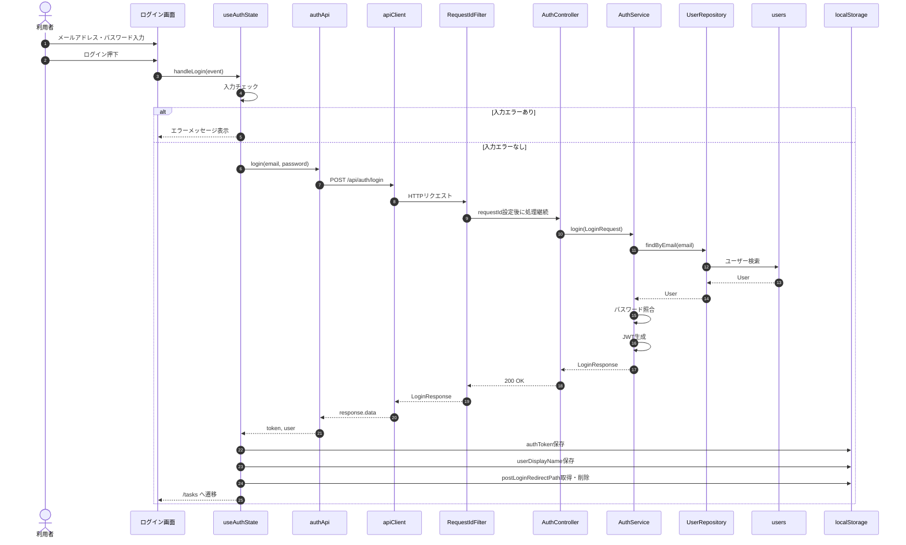

### 主な正常終了条件

- JWTが返却されている
- `authToken` が保存される
- `userDisplayName` が保存される
- `/tasks` または保存済み遷移先へ遷移する

### 主な異常系

| 条件 | 挙動 |
|---|---|
| メールアドレス未入力 | 画面に項目エラーを表示 |
| メールアドレス形式不正 | 画面に項目エラーを表示 |
| パスワード未入力 | 画面に項目エラーを表示 |
| 認証失敗 | 401エラーを受け取り、画面にエラーメッセージを表示 |
| token未返却 | 画面に「トークンの取得に失敗しました。」を表示 |

---

## 4.2 SEQ-02 新規登録

### 概要

利用者が新規登録画面でユーザー情報を入力し、登録に成功した場合、ログイン画面へ戻す。

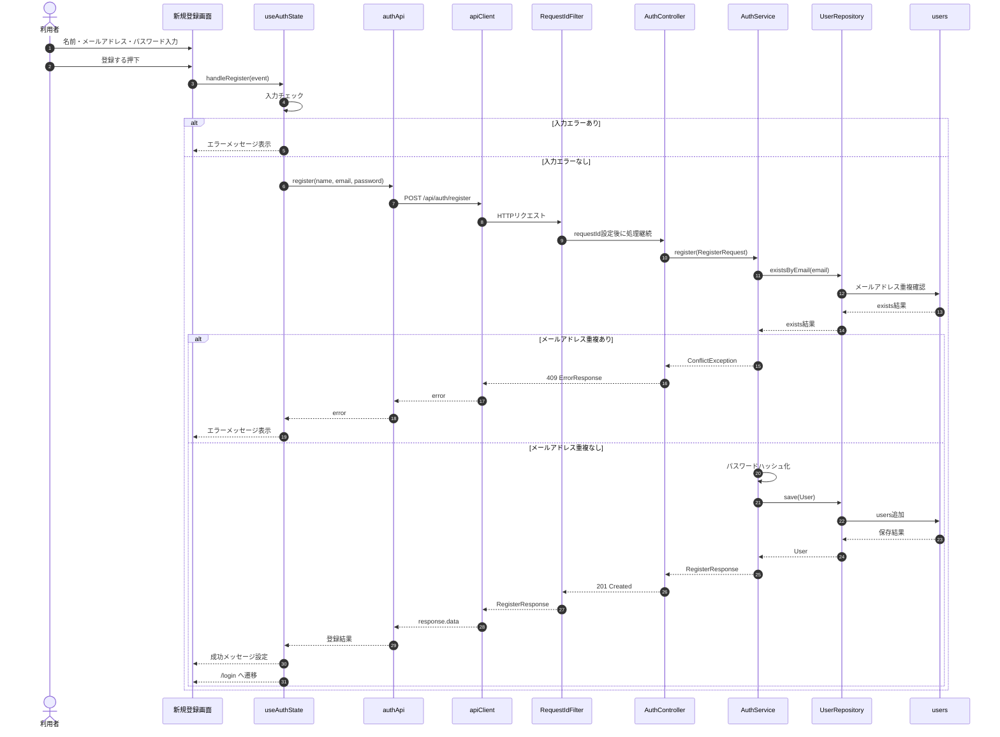

### 主な正常終了条件

- users に新規ユーザーが登録される
- パスワードはハッシュ化される
- ログイン画面へ遷移する
- 登録済みメールアドレスがログインフォームへ反映される

---

## 4.3 SEQ-03 ログアウト

### 概要

ログアウト押下時、認証情報とタスク関連状態をクリアし、ログイン画面へ遷移する。

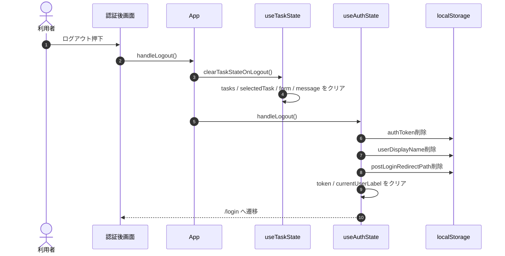

---

## 5. タスク系シーケンス

## 5.1 SEQ-04 ログイン後初期ロード

### 概要

ログイン状態になると、タスク一覧と担当者候補を取得する。

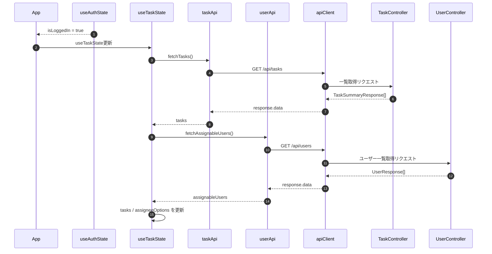

---

## 5.2 SEQ-05 タスク一覧取得

### 概要

タスク一覧画面表示時または再読込時、ログインユーザーが参照可能なタスク一覧を取得する。

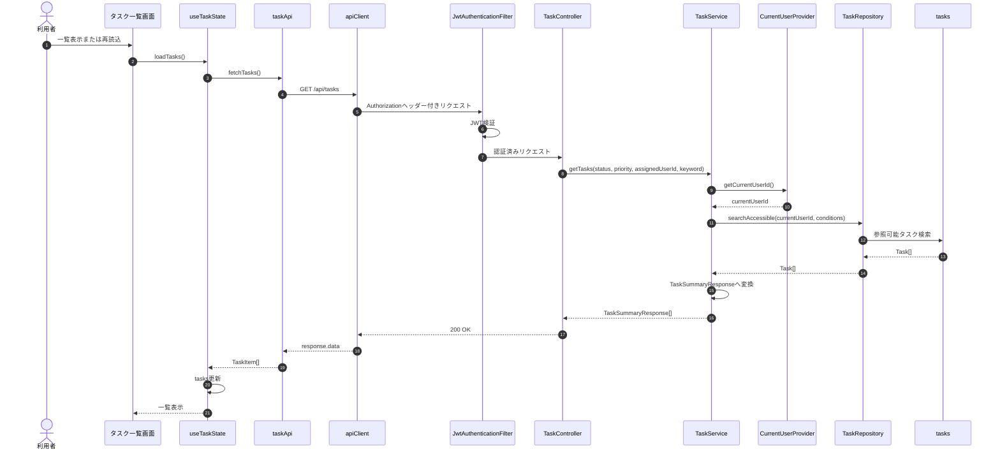

### 補足

- 参照可能条件は「作成者本人」または「担当者本人」
- 画面上のステータス・優先度絞り込みはフロント側で実施する

---

## 5.3 SEQ-06 タスク詳細取得

### 概要

一覧から詳細を押下すると、対象タスクIDをもとに詳細情報を取得する。

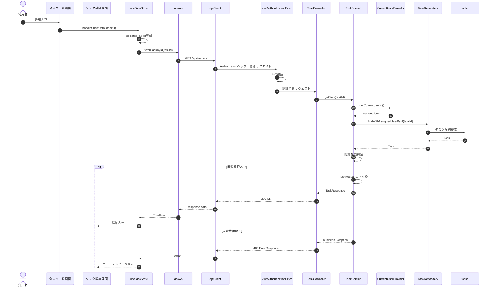

---

## 5.4 SEQ-07 タスク作成

### 概要

タスク作成画面で入力内容を検証し、正常な場合はタスクを登録する。

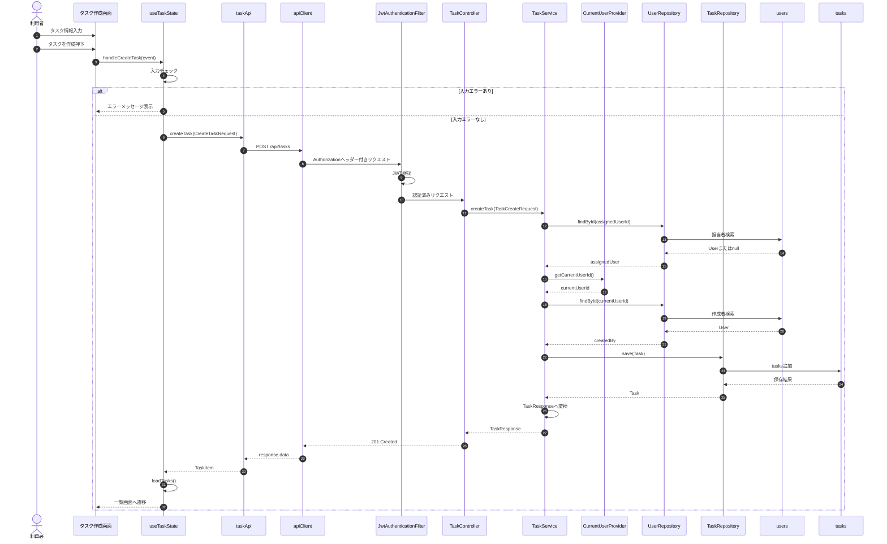

### 補足

- `createdBy` はログインユーザーから設定される
- `assignedUserId` が未指定の場合、担当者なしで登録される
- 成功後は一覧を再取得し、成功メッセージを表示する

---

## 5.5 SEQ-08 タスク編集

### 概要

タスク編集画面で既存値をフォームに反映し、更新押下時にタスクを更新する。

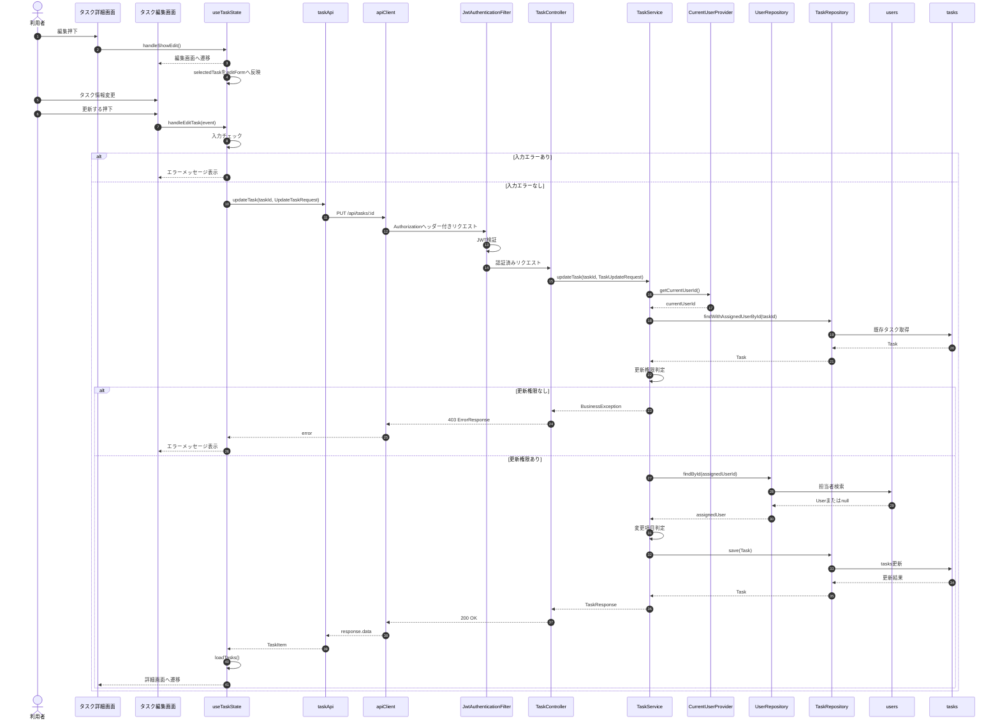

### 補足

- 更新可能条件は「作成者本人」または「担当者本人」
- 成功後は詳細画面へ戻る
- 更新後に一覧も再取得する

---

## 5.6 SEQ-09 タスク削除

### 概要

タスク詳細画面で削除を押下し、確認ダイアログで承認された場合にタスクを削除する。

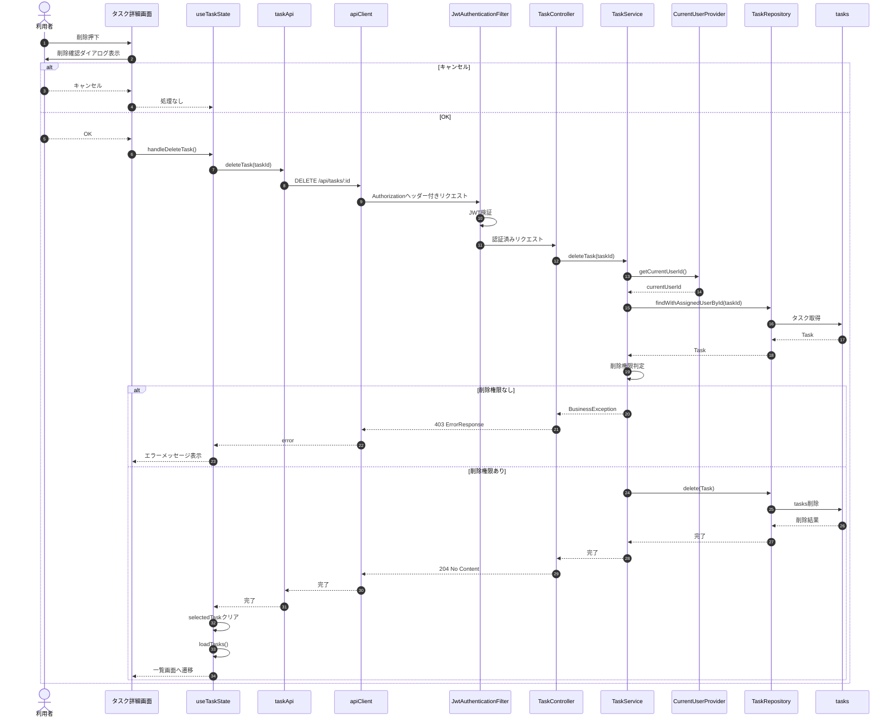

### 補足

- 削除可能条件は「作成者本人」のみ
- 成功後は一覧画面へ遷移する

---

## 6. ユーザー候補取得シーケンス

## 6.1 SEQ-10 担当者候補取得

### 概要

タスク作成・編集画面の担当者プルダウンで使用するユーザー一覧を取得する。

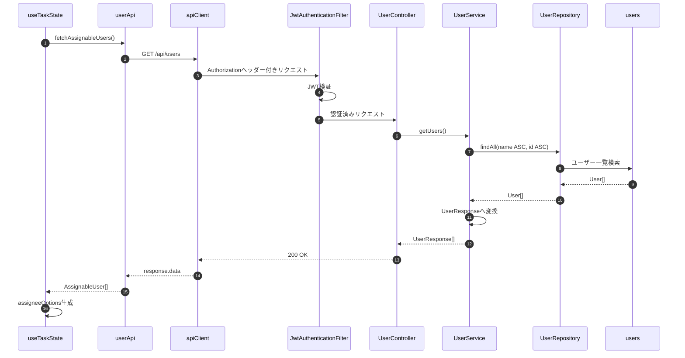

### 補足

- 先頭に `未選択` が追加される
- 編集対象の担当者が候補に含まれない場合は、選択肢に補完される

---

## 7. 認証エラー・例外系シーケンス

## 7.1 SEQ-11 401発生時の再ログイン誘導

### 概要

保護APIで 401 が返却された場合、フロント側で認証情報をクリアし、ログイン画面へ戻す。

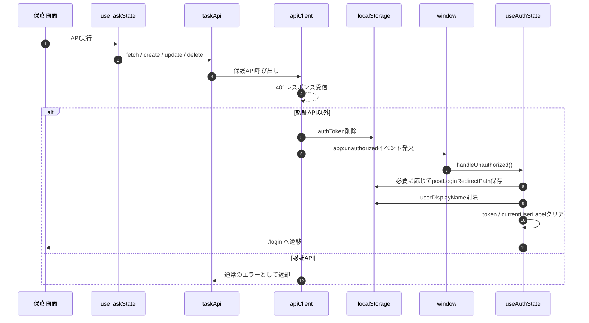

### 補足

- `/api/auth/` 配下の 401 では `app:unauthorized` を発火しない
- 保護パスにいた場合は、再ログイン後の戻り先としてパスを保存する

---

## 7.2 SEQ-12 入力エラー応答

### 概要

画面側の入力チェックまたはAPI側のバリデーションにより、入力エラーを画面へ表示する。

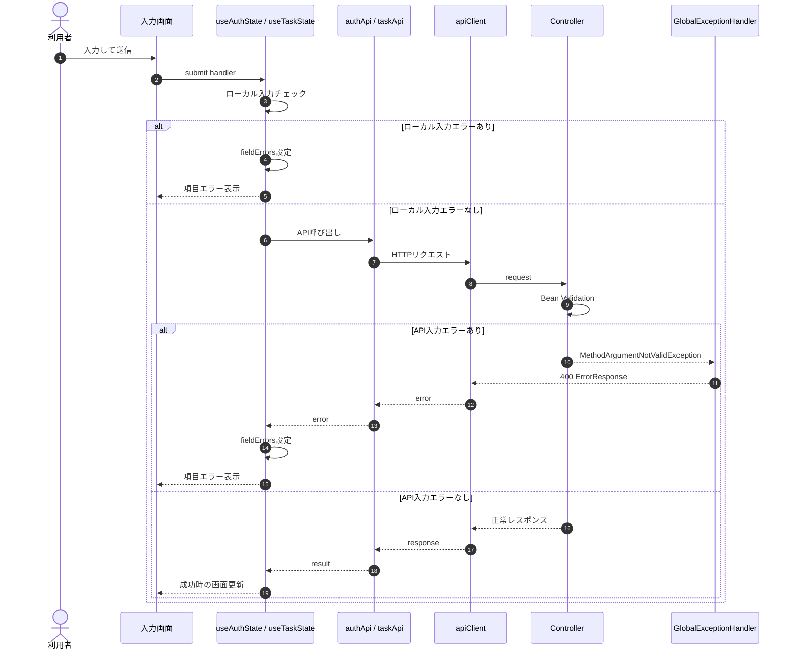

---

## 8. 補足事項

### 8.1 権限判定

| 操作 | 権限条件 |
|---|---|
| タスク一覧取得 | 作成者または担当者として参照可能なタスクのみ取得 |
| タスク詳細取得 | 作成者または担当者のみ参照可能 |
| タスク作成 | 認証済みユーザーであれば作成可能 |
| タスク更新 | 作成者または担当者のみ更新可能 |
| タスク削除 | 作成者のみ削除可能 |

### 8.2 フロント側の主な状態更新

| 処理 | 更新される状態 |
|---|---|
| ログイン成功 | token, currentUserLabel |
| ログアウト | token, currentUserLabel, tasks, selectedTask, form, message |
| タスク一覧取得 | tasks |
| タスク詳細取得 | selectedTask |
| タスク作成 | createForm, tasks, successMessage |
| タスク更新 | selectedTask, tasks, successMessage |
| タスク削除 | selectedTask, tasks, successMessage |
| 担当者候補取得 | assignableUsers, assigneeOptions |

### 8.3 localStorage 利用項目

| キー | 用途 |
|---|---|
| authToken | JWT |
| userDisplayName | ヘッダー表示名 |
| postLoginRedirectPath | 再ログイン後の戻り先 |

---

## 9. 備考

- 本書は `develop` ブランチ時点の内容を整理したシーケンス図設計書である
- 画面遷移は `window.history` ベースの独自ルーティングを前提とする
- コメント投稿、添付ファイル、チーム管理に関するシーケンスは未記載とする
- それらの機能追加時は、本書に別シーケンスとして追記する
