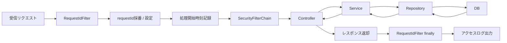
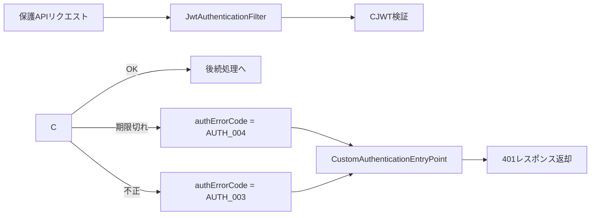
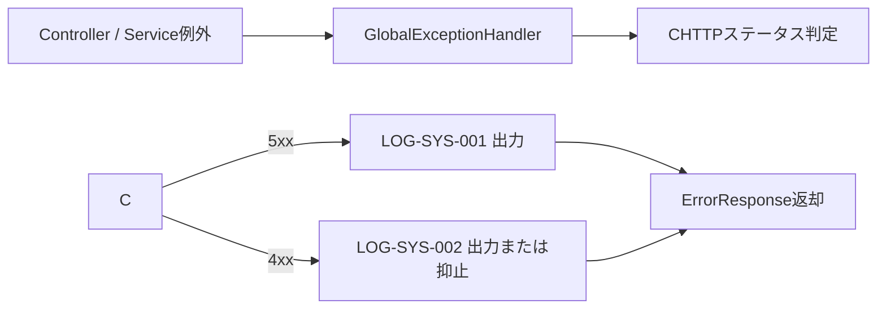

# ログ設計書

## 改訂履歴

| 版数 | 改訂日 | 改訂内容 | 作成者 |
|---|---|---|---|
| 1.0 | 2026-04-13 | 初版作成 | 佐伯 |

## 目次

- 1 [文書概要](#1-文書概要)
- 2 [ログ設計方針](#2-ログ設計方針)
- 3 [ログ出力構成](#3-ログ出力構成)
- 4 [共通出力項目](#4-共通出力項目)
- 5 [リクエストID設計](#5-リクエストid設計)
- 6 [ログ出力フロー](#6-ログ出力フロー)
- 7 [イベントID設計](#7-イベントid設計)
- 8 [ログ詳細設計](#8-ログ詳細設計)
- 9 [出力制御・機微情報方針](#9-出力制御機微情報方針)
- 10 [CloudWatch連携方針](#10-cloudwatch連携方針)
- 11 [サンプルログ](#11-サンプルログ)
- 12 [今後拡張時の観点](#12-今後拡張時の観点)
- 13 [備考](#13-備考)

## 1. 文書概要

- システム名: task-manager-app
- 対象ブランチ: `develop`
- 対象ディレクトリ: `backend`
- 文書目的: システムで出力するログの種類、出力形式、出力項目、運用方針を整理する

---

## 2. ログ設計方針

### 2.1 目的

本システムのログ設計の目的は以下の通り。

- 障害調査を迅速に行えること
- セキュリティイベントを追跡できること
- 業務上の重要操作を監査できること
- リクエスト単位で処理を追跡できること
- 機械可読な形式でログ基盤へ連携しやすいこと
- 運用時に「何のために、どのレベルで、どこへ、何を残すか」を説明できること

### 2.2 対象範囲

本書の対象は以下とする。

- バックエンドアプリケーションの構造化ログ
- 認証、認可、監査、例外、アクセスログ
- アプリケーション起動、終了、設定読込成功・失敗ログ
- Logback による出力設定
- CloudWatch Logs への集約を前提とした運用方針

### 2.3 基本方針

- 構造化 JSON を標準形式とする
- ログは `application`、`security`、`audit` の論理チャネルに分離する
- リクエスト単位の `requestId` を付与する
- 個人情報は必要最小限とし、メールアドレスはマスキングする
- パスワード、JWT、Authorization ヘッダ、リクエストボディ、レスポンスボディは出力しない
- 5xx は必ずエラーログとして出力する
- 4xx は用途に応じて出し分ける
- 参照系の正常終了は原則として個別イベントを出さず、共通のアクセス終了ログで追跡する
- 重要操作、認証イベント、監査上重要なイベントのみ個別イベントを出力する
- Spring やライブラリ標準ログは root logger で通常テキスト出力する

---

## 3. ログ出力構成

### 3.1 論理チャネル

| チャネル名 | 用途 | 想定内容 |
|---|---|---|
| application | アプリケーション運用ログ | 起動、終了、アクセス、設定読込、業務エラー、例外 |
| security | 認証・認可関連ログ | ログイン成功/失敗、JWT検証失敗、未認証アクセス、登録失敗 |
| audit | 監査ログ | タスク作成、更新、削除 |

### 3.2 出力先

| ロガー | 出力先 | 出力形式 | 備考 |
|---|---|---|---|
| application | 標準出力 | JSON文字列 | CloudWatch Logs 集約を想定 |
| security | 標準出力 | JSON文字列 | CloudWatch Logs 集約を想定 |
| audit | 標準出力 | JSON文字列 | CloudWatch Logs 集約を想定 |
| root | 標準出力 | 通常テキスト | Spring / ライブラリ標準ログ |

### 3.3 ログレベル・保持方針

| ログレベル | 用途 | 代表例 | 出力可否 | 保持方針 | 注意点 |
|---|---|---|---|---|---|
| DEBUG | 開発時の詳細追跡 | DTO確認、分岐確認、開発用疎通 | 本番は原則OFF | 短期 | 個人情報を出しすぎない |
| INFO | 正常系の主要イベント | 起動、アクセス終了、ログイン成功、タスク作成/更新/削除成功 | 本番ON | 標準保持 | 更新系・認証系・監査系の主要イベントに絞る |
| WARN | 即障害ではないが注意が必要 | ログイン失敗、未認証アクセス、権限不足、バリデーションエラー | 本番ON | 標準保持 | 大量発生時は閾値やサンプリングを検討 |
| ERROR | 障害調査に必要 | 設定読込失敗、例外発生、DB系障害 | 本番ON | 優先保持 | スタックトレースは 5xx 時のみ候補 |

### 3.4 出力形式

#### 構造化ログ

- 1ログ1JSON
- 改行区切り
- null 項目は出力しない

#### rootログ

- パターン形式
- 形式: `timestamp level [thread] logger - message`

### 3.5 Logger対応方針

| 用途 | logger名 |
|---|---|
| アプリ運用、アクセス、例外、バッチ監視 | `application` |
| 認証、認可、セキュリティ関連 | `security` |
| 監査対象または監査目的の業務イベント | `audit` |

---

## 4. 共通出力項目

### 4.1 共通JSON項目

| 項目名 | 型 | 説明 |
|---|---|---|
| timestamp | string | ログ出力日時 |
| level | string | ログレベル |
| serviceName | string | サービス名。固定値 `task-app` |
| environment | string | 実行環境。active profile から解決 |
| version | string | ビルドバージョン |
| eventId | string | イベント識別子 |
| message | string | ログメッセージ |

### 4.2 リクエスト関連項目

| 項目名 | 型 | 説明 |
|---|---|---|
| requestId | string | リクエスト単位の相関ID |
| userId | number | 認証済みユーザーID |
| path | string | リクエストURI |
| method | string | HTTPメソッド |
| status | number | HTTPステータス |
| durationMs | number | 処理時間ミリ秒 |
| ip | string | クライアントIP |

### 4.3 業務・監査関連項目

| 項目名 | 型 | 説明 |
|---|---|---|
| safeMessage | string | 利用者向けまたは安全な補足メッセージ |
| errorCode | string | アプリケーションエラーコード |
| details | array | バリデーションなどの詳細 |
| email | string | マスキング済みメールアドレス |
| loadedProfiles | string | 読み込み済みプロファイル |
| reason | string | 補足理由 |
| taskId | number | タスクID |
| changedFields | array | 更新されたフィールド一覧 |
| commentId | number | コメントID |
| attachmentId | number | 添付ID |
| fileName | string | ファイル名 |
| size | number | サイズ |
| teamId | number | チームID |
| memberUserId | number | 対象ユーザーID |
| newRole | string | 新ロール |
| jobName | string | バッチやジョブ名 |
| startedAt | string | 開始日時 |
| finishedAt | string | 終了日時 |
| targetCount | number | 対象件数 |
| processedCount | number | 処理件数 |
| successCount | number | 成功件数 |
| failureCount | number | 失敗件数 |

### 4.4 例外関連項目

| 項目名 | 型 | 説明 |
|---|---|---|
| exceptionClass | string | 例外クラス名 |
| stackTrace | string | スタックトレース |

---

## 5. リクエストID設計

- ヘッダ `X-Request-Id` があればそれを優先採用する
- 指定がなければサーバー側で UUID を採番する
- request attribute に `requestId` を格納する
- レスポンスヘッダ `X-Request-Id` にも同じ値を返す
- MDC にも設定し、同一スレッド内で参照可能にする
- リクエスト終了時に MDC をクリアする

---

## 6. ログ出力フロー

### 6.1 通常リクエスト処理



### 6.2 認証エラー処理



### 6.3 例外処理



---

## 7. イベントID設計

### 7.1 採番ルール

| 接頭辞 | 用途 |
|---|---|
| LOG-APP | アプリケーションライフサイクル、設定読込 |
| LOG-REQ | アクセスログ |
| LOG-AUTH | 認証・認可イベント |
| LOG-TASK | タスク監査イベント |
| LOG-SYS | 業務エラー、システム例外、フォーマット異常 |
| LOG-COMM | コメント系拡張イベント |
| LOG-FILE | 添付系拡張イベント |
| LOG-TEAM | チーム系拡張イベント |
| LOG-BATCH | バッチ系拡張イベント |

### 7.2 イベントID一覧

| eventId | チャネル | レベル | 概要 | 備考 |
|---|---|---|---|---|
| LOG-APP-001 | application | INFO | アプリケーション起動 |  |
| LOG-APP-002 | application | INFO | アプリケーション終了 | reason は任意 |
| LOG-APP-003 | application | INFO | 設定読込成功 | loadedProfiles を含む |
| LOG-APP-004 | application | ERROR | 設定読込失敗 | 起動失敗時 |
| LOG-REQ-001 | application | INFO | リクエスト終了 | 参照系成功も本ログで追跡 |
| LOG-AUTH-001 | security | INFO | ログイン成功 | email はマスク |
| LOG-AUTH-002 | security | WARN | ログイン失敗 | 失敗回数監視候補 |
| LOG-AUTH-003 | security | WARN | JWT検証失敗 | 期限切れ / 不正を含む |
| LOG-AUTH-004 | security | INFO | ユーザー登録成功 | email はマスク |
| LOG-AUTH-005 | security | WARN | ユーザー登録失敗 | 400 / 409 を含む |
| LOG-AUTH-006 | security | WARN | 未認証アクセス |  |
| LOG-TASK-001 | audit | INFO | タスク作成成功 |  |
| LOG-TASK-002 | audit | INFO | タスク更新成功 | changedFields を含む |
| LOG-TASK-003 | audit | INFO | タスク削除成功 |  |
| LOG-SYS-001 | application | ERROR | アプリ例外 | 5xx 時 |
| LOG-SYS-002 | application | WARN | 業務エラー応答 | 個別4xxイベントがない場合 |
| LOG-SYS-JSON-001 | application | ERROR | JSON整形失敗時のフォールバック | フォーマッタ異常時 |

---

## 8. ログ詳細設計

### 8.1 applicationログ

| eventId | レベル | 出力条件 | 主な項目 |
|---|---|---|---|
| LOG-APP-001 | INFO | アプリ起動時 | 共通項目 |
| LOG-APP-002 | INFO | アプリ終了時 | 共通項目, reason |
| LOG-APP-003 | INFO | 設定読込完了時 | 共通項目, loadedProfiles |
| LOG-APP-004 | ERROR | 起動失敗時 | 共通項目, exceptionClass, safeMessage |
| LOG-REQ-001 | INFO | リクエスト終了時 | requestId, userId, path, method, status, durationMs, ip |
| LOG-SYS-001 | ERROR | 5xx発生時 | requestId, path, method, status, durationMs, errorCode, safeMessage, exceptionClass, stackTrace |
| LOG-SYS-002 | WARN | 4xx業務エラー時 | requestId, path, method, status, durationMs, errorCode, safeMessage, details |

### 8.2 securityログ

| eventId | レベル | 出力条件 | 主な項目 |
|---|---|---|---|
| LOG-AUTH-001 | INFO | ログイン成功時 | requestId, status, userId, email |
| LOG-AUTH-002 | WARN | ログイン失敗時 | requestId, status, errorCode, email, ip |
| LOG-AUTH-003 | WARN | JWT期限切れ / 不正時 | requestId, path, method, status, errorCode, safeMessage, ip |
| LOG-AUTH-004 | INFO | ユーザー登録成功時 | requestId, status, userId, email |
| LOG-AUTH-005 | WARN | ユーザー登録失敗時 | requestId, status, errorCode, safeMessage, email, details |
| LOG-AUTH-006 | WARN | 未認証アクセス時 | requestId, path, method, status, errorCode, ip |

### 8.3 auditログ

| eventId | レベル | 出力条件 | 主な項目 |
|---|---|---|---|
| LOG-TASK-001 | INFO | タスク作成成功時 | requestId, status, userId, taskId |
| LOG-TASK-002 | INFO | タスク更新成功時 | requestId, status, userId, taskId, changedFields |
| LOG-TASK-003 | INFO | タスク削除成功時 | requestId, status, userId, taskId |

### 8.4 rootログ

| ログ種別 | レベル | 用途 |
|---|---|---|
| Spring Boot / ライブラリ標準ログ | INFO 以上 | フレームワーク標準の起動・内部ログ |
| アプリチャネル以外のログ | root設定に従う | 補助的な運用ログ |

### 8.5 Logger対応表

| eventId | イベント名 | logger名 | 備考 |
|---|---|---|---|
| LOG-APP-001 | アプリケーション起動 | application |  |
| LOG-APP-002 | アプリケーション終了 | application |  |
| LOG-APP-003 | 設定読込成功 | application |  |
| LOG-APP-004 | 設定読込失敗 | application |  |
| LOG-REQ-001 | リクエスト終了 | application |  |
| LOG-AUTH-001 | ログイン成功 | security |  |
| LOG-AUTH-002 | ログイン失敗 | security |  |
| LOG-AUTH-003 | JWT検証失敗 | security |  |
| LOG-AUTH-004 | ユーザー登録成功 | security |  |
| LOG-AUTH-005 | ユーザー登録失敗 | security |  |
| LOG-AUTH-006 | 未認証アクセス | security |  |
| LOG-TASK-001 | タスク作成成功 | audit | application へは重複出力しない |
| LOG-TASK-002 | タスク更新成功 | audit | application へは重複出力しない |
| LOG-TASK-003 | タスク削除成功 | audit | application へは重複出力しない |

---

## 9. 出力制御・機微情報方針

### 9.1 メールアドレスのマスキング

メールアドレスは `maskEmail()` により以下の形式で出力する。

| 元データ例 | 出力例 |
|---|---|
| `a@example.com` | `*@example.com` |
| `ab@example.com` | `a*@example.com` |
| `abcdef@example.com` | `ab***@example.com` |

### 9.2 出力禁止項目

| 対象情報 | 方針 | 理由 |
|---|---|---|
| パスワード | 出力禁止 | 機密情報のため |
| JWTトークン | 出力禁止 | 認証情報漏えい防止 |
| Authorizationヘッダ | 出力禁止 | Bearerトークンを含むため |
| リクエストボディ | 出力禁止 | 個人情報・認証情報混入防止 |
| レスポンスボディ | 出力禁止 | 個人情報・冗長出力防止 |
| SQL全文 | 本番では原則出力しない | 機密情報・負荷対策 |

### 9.3 スタックトレース出力制御

- 5xx ログ時のみ候補となる
- `app.logging.include-stacktrace = true` の場合のみ出力する
- デフォルトは `false`

### 9.4 アクセスログの抑止条件

正常系 2xx かつ以下のパスはアクセスログを抑止する。

- `/actuator/health`
- `/api/auth-test/` 配下

### 9.5 4xxログの抑止条件

- `RequestLogContext.suppressSystem4xxLog()` が立っている場合は `LOG-SYS-002` を抑止する
- 主な用途:
  - 認証系の失敗ログを security チャネルへ寄せる
  - ユーザー登録失敗を専用ログへ寄せる
  - 個別4xxイベントが出る場合の重複抑止

---

## 10. CloudWatch連携方針

| 項目 | 方針 | 理由 | 備考 |
|---|---|---|---|
| 出力先 | アプリは構造化JSONを標準出力へ出力し、CloudWatch Logs に集約する | AWS運用との整合、障害調査容易化 | 現行は stdout までを対象 |
| 論理分離 | 物理分離ではなく logger名で論理分離する | アプリ単体で完結しつつ拡張しやすい | application / security / audit |
| 検索単位 | requestId / userId / taskId で追跡可能とする | 問い合わせ・障害調査向け | CloudWatch Logs Insights 想定 |
| 保持 | 本番標準保持、DEBUG短期保持 | コストと調査性のバランス | 保持期間は運用設定 |
| メトリクス連携 | ログイン失敗や ERROR をメトリクス化可能 | 将来監視強化 | Metric Filter 想定 |
| 通知連携 | 重要エラーは将来通知可能 | 障害検知迅速化 | SNS等は将来拡張 |

---

## 11. サンプルログ

### 11.1 アプリケーションログ例

```json
{
  "timestamp": "2026-04-13T22:10:00+09:00",
  "level": "INFO",
  "serviceName": "task-app",
  "environment": "default",
  "version": "1.0.0",
  "eventId": "LOG-REQ-001",
  "requestId": "4e3a2c2e-b6b2-4d11-9e2f-1c6bfe1d1c10",
  "userId": 1,
  "path": "/api/tasks",
  "method": "GET",
  "status": 200,
  "durationMs": 18,
  "message": "リクエスト終了",
  "ip": "127.0.0.1"
}
```

### 11.2 セキュリティログ例

```json
{
  "timestamp": "2026-04-13T22:12:00+09:00",
  "level": "WARN",
  "serviceName": "task-app",
  "environment": "default",
  "version": "1.0.0",
  "eventId": "LOG-AUTH-003",
  "requestId": "1e5f1c98-2f45-4a32-88eb-0a7c0fdb12de",
  "path": "/api/tasks",
  "method": "GET",
  "status": 401,
  "message": "JWT検証失敗",
  "safeMessage": "トークンが不正です",
  "errorCode": "ERR-AUTH-003",
  "ip": "127.0.0.1"
}
```

### 11.3 監査ログ例

```json
{
  "timestamp": "2026-04-13T22:14:00+09:00",
  "level": "INFO",
  "serviceName": "task-app",
  "environment": "default",
  "version": "1.0.0",
  "eventId": "LOG-TASK-002",
  "requestId": "bfc17b72-9863-44cb-9aa3-5cba3d00d173",
  "userId": 1,
  "path": "/api/tasks/10",
  "method": "PUT",
  "status": 200,
  "message": "タスク更新成功",
  "taskId": 10,
  "changedFields": ["title", "priority", "assignedUserId"]
}
```

### 11.4 例外ログ例

```json
{
  "timestamp": "2026-04-13T22:16:00+09:00",
  "level": "ERROR",
  "serviceName": "task-app",
  "environment": "default",
  "version": "1.0.0",
  "eventId": "LOG-SYS-001",
  "requestId": "6ac317f1-6a35-4904-a77b-f98d76d83cf8",
  "path": "/api/tasks",
  "method": "POST",
  "status": 500,
  "durationMs": 24,
  "message": "アプリ例外",
  "safeMessage": "システムエラーが発生しました。しばらくしてから再度お試しください。",
  "errorCode": "ERR-SYS-999",
  "exceptionClass": "java.lang.RuntimeException"
}
```

---

## 12. 今後拡張時の観点

### 12.1 将来拡張イベントの扱い

既存設計書に含まれている以下のイベントは、現時点では将来拡張想定として扱う。

| eventId | 概要 | 想定logger名 |
|---|---|---|
| LOG-COMM-001 | コメント更新成功 | audit |
| LOG-COMM-002 | コメント削除成功 | audit |
| LOG-FILE-002 | 添付アップロード成功 | audit |
| LOG-FILE-003 | 添付ダウンロード | audit |
| LOG-FILE-004 | 添付削除成功 | audit |
| LOG-TEAM-003 | チーム作成成功 | audit |
| LOG-TEAM-004 | メンバー追加成功 | audit |
| LOG-TEAM-005 | ロール変更成功 | audit |
| LOG-TEAM-006 | メンバー削除成功 | audit |
| LOG-BATCH-001 | バッチ開始 | application |
| LOG-BATCH-002 | バッチ終了 | application |

### 12.2 コメント・添付・チーム・バッチへの拡張

- コメント機能追加時は `commentId` と `changedFields` を監査ログへ活用する
- 添付機能追加時は `attachmentId`, `fileName`, `size` を活用する
- 添付ダウンロードのように、参照系でも監査上重要なものは個別イベント対象とする
- チーム機能追加時は `teamId`, `memberUserId`, `newRole` を活用する
- 定期ジョブ追加時は `jobName`, `startedAt`, `finishedAt`, `processedCount`, `successCount`, `failureCount` を活用する

---

## 13. 備考

- 構造化ログの共通整形は `StructuredLogJsonFormatter` が担当する
- 論理チャネルへの振り分けは `LogChannel` と `StructuredLogService` が担当する
- リクエスト相関情報の管理は `RequestLogContext` が担当する
- requestId の採番とアクセスログ出力は `RequestIdFilter` が担当する
- 起動失敗時は `StartupFailureLoggingListener` により設定読込失敗ログを出力する
