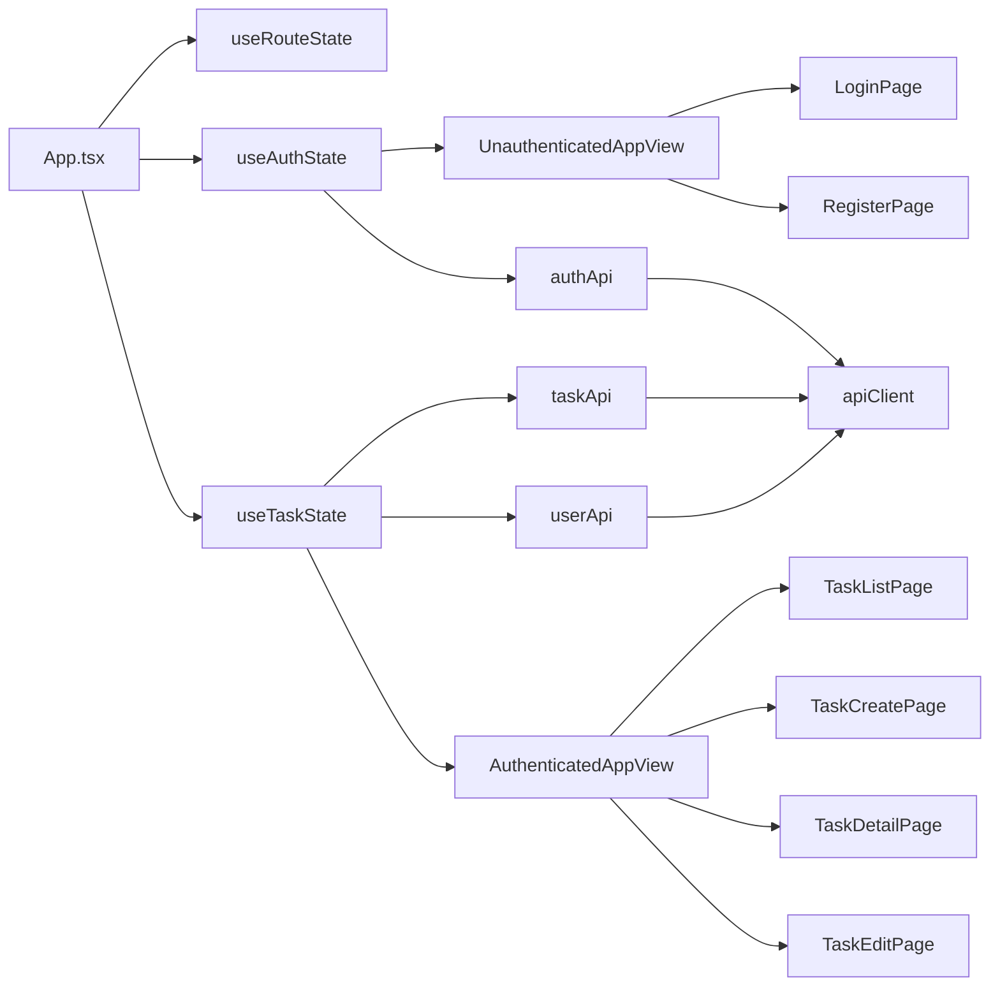

# フロントエンド設計書

## 改訂履歴

| 版数 | 改訂日 | 改訂内容 | 作成者 |
|---|---|---|---|
| 1.0 | 2026-04-13 | 初版作成 | 佐伯 |

## 目次

- 1 [文書概要](#1-文書概要)
- 2 [フロントエンド全体構成](#2-フロントエンド全体構成)
- 3 [採用技術・実行構成](#3-採用技術実行構成)
- 4 [ディレクトリ構成](#4-ディレクトリ構成)
- 5 [画面構成](#5-画面構成)
- 6 [画面遷移設計](#6-画面遷移設計)
- 7 [状態管理設計](#7-状態管理設計)
- 8 [API連携設計](#8-api連携設計)
- 9 [認証・認可制御](#9-認証認可制御)
- 10 [コンポーネント設計](#10-コンポーネント設計)
- 11 [フォーム設計](#11-フォーム設計)
- 12 [エラー・メッセージ制御](#12-エラーメッセージ制御)
- 13 [スタイル設計](#13-スタイル設計)
- 14 [テスト・ビルド設計](#14-テストビルド設計)
- 15 [今後拡張時の観点](#15-今後拡張時の観点)
- 16 [備考](#16-備考)

## 1. 文書概要

- システム名: task-manager-app
- 対象ブランチ: `develop`
- 対象ディレクトリ: `frontend`
- 文書目的: フロントエンドの構成、責務分担、状態管理、画面遷移、API連携方式を整理する

---

## 2. フロントエンド全体構成

本システムのフロントエンドは、**React + TypeScript + Vite** によるシングルページアプリケーションで構成する。  
認証前後で表示を切り替え、認証後はタスク一覧・作成・詳細・編集の各画面を表示する。

### 2.1 構成概要



### 2.2 設計方針

- ルーティングは `react-router` ではなく、独自の `window.history` ベース実装とする
- 認証状態は `useAuthState`、タスク状態は `useTaskState` に集約する
- API通信は `apiClient` を共通利用し、Authorization ヘッダー付与と 401 共通制御を行う
- 画面コンポーネントは表示責務に寄せ、状態更新や業務処理は hooks 側へ寄せる
- localStorage を使って JWT、表示名、ログイン後遷移先を保持する

---

## 3. 採用技術・実行構成

## 3.1 採用技術

| 分類 | 技術 | 用途 |
|---|---|---|
| UIライブラリ | React 19 | 画面描画 |
| 言語 | TypeScript 5 | 型安全な実装 |
| ビルドツール | Vite 8 | 開発サーバー、ビルド |
| HTTPクライアント | axios | API通信 |
| テスト | Playwright | E2Eテスト |
| Lint | ESLint | 静的解析 |

## 3.2 npm scripts

| スクリプト | 内容 |
|---|---|
| `npm run dev` | 開発サーバー起動 |
| `npm run build` | TypeScript ビルド + Vite ビルド |
| `npm run preview` | ビルド成果物プレビュー |
| `npm run lint` | ESLint 実行 |
| `npm run test:e2e` | Playwright E2E 実行 |

---

## 4. ディレクトリ構成

```text
frontend/
├─ src/
│  ├─ app_views/
│  ├─ components/
│  ├─ hooks/
│  ├─ lib/
│  ├─ pages/
│  ├─ utils/
│  ├─ App.tsx
│  ├─ App.css
│  ├─ app_navigation.ts
│  ├─ app_taskOptions.ts
│  └─ main.tsx
├─ package.json
└─ ...
```

### 4.1 役割一覧

| ディレクトリ / ファイル | 役割 |
|---|---|
| `src/App.tsx` | 全体の組み立て、認証前後の画面切替 |
| `src/app_views/` | 画面群の切替用ビュー |
| `src/pages/` | 画面単位のコンポーネント |
| `src/components/` | 共通レイアウト、共通フォーム部品 |
| `src/hooks/` | 状態管理、画面ロジック |
| `src/lib/` | API通信、ストレージ、エラー補助 |
| `src/app_navigation.ts` | ルート解析と画面遷移 |
| `src/app_taskOptions.ts` | ステータス・優先度選択肢定義 |
| `src/utils/` | 表示変換補助 |

---

## 5. 画面構成

| 画面ID | 画面名 | パス | 認証 |
|---|---|---|---|
| FE-01 | ログイン画面 | `/login` | 不要 |
| FE-02 | 新規登録画面 | `/signup` | 不要 |
| FE-03 | タスク一覧画面 | `/tasks` | 必要 |
| FE-04 | タスク作成画面 | `/tasks/new` | 必要 |
| FE-05 | タスク詳細画面 | `/tasks/:id` | 必要 |
| FE-06 | タスク編集画面 | `/tasks/:id/edit` | 必要 |

### 5.1 認証前表示

- `UnauthenticatedAppView`
  - `LoginPage`
  - `RegisterPage`

### 5.2 認証後表示

- `AuthenticatedAppView`
  - `TaskListPage`
  - `TaskCreatePage`
  - `TaskDetailPage`
  - `TaskEditPage`

---

## 6. 画面遷移設計

## 6.1 ルーティング方式

本システムは `react-router` を利用せず、`window.history.pushState / replaceState` と `popstate` を使って遷移を実現する。

### 6.1.1 ルート定義

| パス | 解決結果 |
|---|---|
| `/tasks/new` | create |
| `/tasks/:id/edit` | edit |
| `/tasks/:id` | detail |
| 上記以外 | list |

### 6.1.2 認証前ルート制御

| パス | 表示画面 |
|---|---|
| `/login` | ログイン |
| `/signup` | 新規登録 |
| 保護パス | `/login` にリダイレクト |

### 6.1.3 遷移ルール

- 未認証で保護パスへアクセスした場合はログイン画面へ遷移する
- ログイン成功時は保存済み遷移先があればそちらへ、なければ `/tasks` へ遷移する
- ログアウト時は `/login` へ遷移する
- `/login`, `/signup`, `/` にいる状態でログイン済みの場合は `/tasks` へ遷移する

---

## 7. 状態管理設計

## 7.1 全体方針

状態管理は外部ライブラリを用いず、React の `useState`, `useEffect`, `useMemo` によって行う。

### 7.1.1 状態分割

| hook | 管理対象 |
|---|---|
| `useRouteState` | 現在ルート、選択中タスクID、遷移関数 |
| `useAuthState` | 認証状態、認証フォーム、認証メッセージ |
| `useTaskState` | タスク一覧、詳細、フォーム、フィルタ、担当者候補 |

## 7.2 useRouteState

### 管理項目

| 項目 | 説明 |
|---|---|
| route | 現在ルート |
| selectedTaskId | 詳細 / 編集対象タスクID |
| go | 遷移関数 |
| activePath | サイドバーの選択状態用パス |

### 責務

- `window.location.pathname` を解析する
- `popstate` を監視して route を更新する
- `navigateTo()` を利用した遷移関数を提供する

## 7.3 useAuthState

### 管理項目

| 分類 | 主な状態 |
|---|---|
| 認証状態 | mode, token, isLoggedIn, currentUserLabel |
| ログインフォーム | email, password, fieldErrors |
| 登録フォーム | name, email, password, passwordConfirm, fieldErrors |
| メッセージ | errorMessage, successMessage |
| 実行状態 | isSubmitting |

### 責務

- ログイン / 新規登録フォーム管理
- ローカル入力チェック
- 認証API呼び出し
- JWT / 表示名 / 戻り先の localStorage 制御
- 認証前後のルート制御
- `UNAUTHORIZED_EVENT` 受信時の再ログイン誘導

## 7.4 useTaskState

### 管理項目

| 分類 | 主な状態 |
|---|---|
| 一覧 | tasks, filteredTasks, isLoadingTasks, taskErrorMessage |
| 詳細 | selectedTask, isLoadingDetail, detailErrorMessage |
| フィルタ | statusFilter, priorityFilter |
| 作成フォーム | createForm, createFieldErrors |
| 編集フォーム | editForm, editFieldErrors |
| 実行状態 | isSubmittingTask, isDeleting |
| 補助 | commentDraft, assignableUsers, assigneeOptionsError, isLoadingAssignableUsers |

### 責務

- タスク一覧取得
- タスク詳細取得
- タスク作成 / 更新 / 削除
- タスクフォームのローカルバリデーション
- フィルタ適用
- 担当者候補取得
- ログアウト時のタスク状態初期化

---

## 8. API連携設計

## 8.1 APIクライアント共通設計

`apiClient` を共通の axios インスタンスとして利用する。

### 8.1.1 baseURL 解決ルール

| 条件 | baseURL |
|---|---|
| `VITE_API_BASE_URL` 指定あり | 指定値 |
| ブラウザホストが localhost 以外 | `window.location.origin` |
| 上記以外 | `http://localhost:8080` |

### 8.1.2 request interceptor

- localStorage から `authToken` を取得する
- token がある場合は `Authorization: Bearer <token>` を付与する

### 8.1.3 response interceptor

- 認証API以外で 401 を受信した場合
  - `authToken` を削除
  - `app:unauthorized` イベントを発火
- それ以外は通常の Promise.reject とする

## 8.2 認証API

| 関数 | メソッド | パス | 用途 |
|---|---|---|---|
| `login()` | POST | `/api/auth/login` | ログイン |
| `register()` | POST | `/api/auth/register` | 新規登録 |

## 8.3 タスクAPI

| 関数 | メソッド | パス | 用途 |
|---|---|---|---|
| `fetchTasks()` | GET | `/api/tasks` | 一覧取得 |
| `fetchTaskById(id)` | GET | `/api/tasks/{id}` | 詳細取得 |
| `createTask()` | POST | `/api/tasks` | 新規作成 |
| `updateTask(id)` | PUT | `/api/tasks/{id}` | 更新 |
| `deleteTask(id)` | DELETE | `/api/tasks/{id}` | 削除 |

## 8.4 ユーザーAPI

| 関数 | メソッド | パス | 用途 |
|---|---|---|---|
| `fetchAssignableUsers()` | GET | `/api/users` | 担当者候補一覧取得 |

---

## 9. 認証・認可制御

## 9.1 localStorage 利用項目

| キー | 用途 |
|---|---|
| `authToken` | JWT保存 |
| `userDisplayName` | ヘッダー表示用ユーザー名 |
| `postLoginRedirectPath` | 再ログイン後の戻り先 |

## 9.2 保護パス判定

保護パスは `^/tasks(?:/.*)?$` に一致するパスとする。

## 9.3 401 制御

- 保護APIで 401 を受信した場合は認証切れとして扱う
- 現在の保護パスを `postLoginRedirectPath` に保存する
- `/login` へ遷移し、再ログインメッセージを表示する

## 9.4 表示名制御

ログイン成功時の表示名は次の優先順で決定する。

1. `result.user.name`
2. `result.user.email`
3. ログイン入力メールアドレス

---

## 10. コンポーネント設計

## 10.1 App.tsx

### 役割

- hooks を組み合わせて全体を構成する
- 未認証時は `UnauthenticatedAppView` を表示する
- 認証済み時は `AuthenticatedAppView` を表示する
- ログアウト時に auth / task 両方の状態をクリアする

## 10.2 app_views

### UnauthenticatedAppView

| 責務 | 内容 |
|---|---|
| 認証前切替 | mode に応じて LoginPage / RegisterPage を切り替える |
| props受け渡し | フォーム値、エラー、イベントを各画面へ渡す |

### AuthenticatedAppView

| 責務 | 内容 |
|---|---|
| 認証後切替 | route.page に応じて各タスク画面を切り替える |
| props受け渡し | 一覧、詳細、フォーム、共通レイアウト用データを渡す |

## 10.3 共通コンポーネント

### TaskShell

| 項目 | 内容 |
|---|---|
| 用途 | 認証後画面共通レイアウト |
| 主な表示 | ヘッダー、ユーザー表示、ログアウト、サイドバー、コンテンツヘッダー |
| ナビゲーション | `/tasks`, `/tasks/new` |

### TaskForm

| 項目 | 内容 |
|---|---|
| 用途 | タスク作成・編集共通フォーム |
| 入力項目 | title, description, status, priority, dueDate, assignedUserId |
| 表示項目 | fieldErrors, 読込中メッセージ, 担当者候補エラー |
| ボタン | submit, cancel |

---

## 11. フォーム設計

## 11.1 ログインフォーム

| 項目 | バリデーション |
|---|---|
| email | 必須、メール形式 |
| password | 必須 |

## 11.2 新規登録フォーム

| 項目 | バリデーション |
|---|---|
| name | 必須 |
| email | 必須、メール形式 |
| password | 8文字以上 |
| passwordConfirm | 必須、password と一致 |

## 11.3 タスクフォーム

| 項目 | バリデーション |
|---|---|
| title | 必須、100文字以内 |
| description | 任意 |
| status | 必須 |
| priority | 必須 |
| dueDate | 任意 |
| assignedUserId | 任意。ただし候補一覧に存在する値のみ許可 |

### 11.3.1 フォーム初期値

| 項目 | 初期値 |
|---|---|
| title | 空文字 |
| description | 空文字 |
| status | TODO |
| priority | MEDIUM |
| dueDate | 空文字 |
| assignedUserId | 空文字 |

---

## 12. エラー・メッセージ制御

## 12.1 共通方針

- 項目エラーは `fieldErrors` で保持する
- 画面全体メッセージは `errorMessage`, `successMessage` で保持する
- 入力変更時は該当項目の `fieldErrors` をクリアする

## 12.2 認証画面

| ケース | 表示方法 |
|---|---|
| ローカル入力エラー | 項目エラー + 全体メッセージ |
| API入力エラー | `details` を fieldErrors へ反映 |
| 認証失敗 | 全体メッセージ |
| 登録成功 | successMessage を表示してログイン画面へ |

## 12.3 タスク画面

| ケース | 表示方法 |
|---|---|
| 一覧取得失敗 | taskErrorMessage |
| 詳細取得失敗 | detailErrorMessage |
| 作成 / 更新入力エラー | fieldErrors + taskErrorMessage / detailErrorMessage |
| 削除失敗 | detailErrorMessage |
| 成功 | successMessage |

---

## 13. スタイル設計

## 13.1 基本方針

- スタイルは `App.css` に集約する
- CSS Modules や CSS-in-JS は利用しない
- 画面ごとのレイアウト差分は class 名の組み合わせで表現する

## 13.2 主なスタイル対象

| 分類 | 主なクラス用途 |
|---|---|
| 全体レイアウト | `workspace-shell`, `content-area`, `sidebar` |
| ヘッダー | `app-header`, `user-chip` |
| ボタン | `primary-button`, `secondary-button` |
| フォーム | `form-grid`, `input-error`, `field-error` |
| メッセージ | `success-box`, `error-box`, `empty-message` |
| 一覧 / 詳細 | テーブル、詳細表示、サマリー領域 |

---

## 14. テスト・ビルド設計

## 14.1 ビルド

- TypeScript コンパイル後に Vite build を実行する
- 本番ビルド成果物は Vite 標準構成に従う

## 14.2 E2Eテスト

- Playwright を利用する
- 実行モード:
  - 通常実行
  - headed 実行
  - UI 実行

## 14.3 静的解析

- ESLint を利用する
- React Hooks ルールを適用する

---

## 15. 今後拡張時の観点

| 観点 | 想定内容 |
|---|---|
| ルーティング拡張 | 画面数増加時は react-router 導入を検討 |
| 状態管理拡張 | 機能増加時は Zustand / Redux Toolkit 等の導入を検討 |
| 検索機能 | 現在は一覧全件取得 + クライアント絞り込み。将来的にサーバーサイド検索へ移行可能 |
| コメント機能 | `commentDraft` は既に state が存在するため、UI・APIを接続して拡張可能 |
| 添付ファイル機能 | TaskDetail / TaskForm 周辺にアップロードUI追加が必要 |
| チーム機能 | ルート、状態、API、認可制御の見直しが必要 |
| UI分割 | 画面ごとの container / presentational 分離をさらに進められる |

---

## 16. 備考

- 認証前後の切替は `App.tsx` を起点に行う
- ルーティングは `window.history` ベースの独自実装である
- コメント投稿、添付ファイル、チーム管理のUIは現時点では未実装
- それらの機能追加時は、本書に対象画面・状態・APIの設計を追記する
