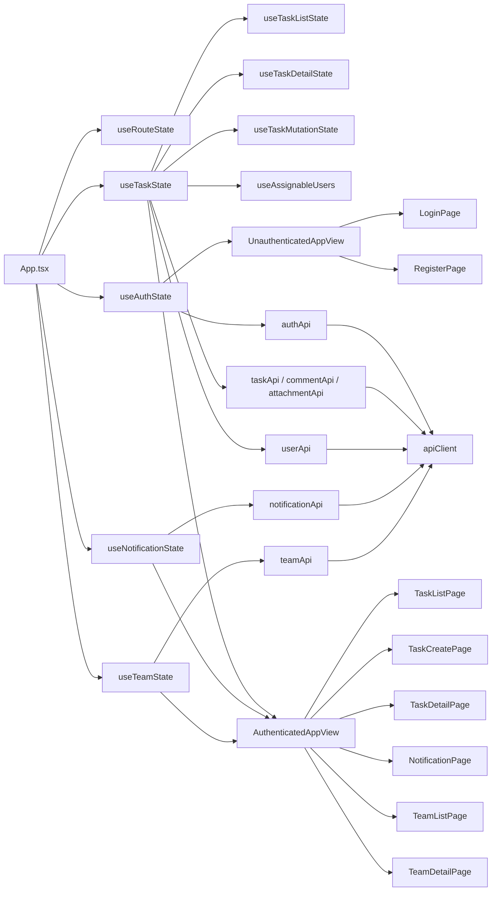

# フロントエンド設計書

## 改訂履歴

| 版数 | 改訂日 | 改訂内容 | 作成者 |
|---|---|---|---|
| 1.0 | 2026-04-13 | 初版作成 | 佐伯 |
| 1.1 | 2026-04-15 | タスク詳細画面内編集、通知ポーリング、添付S3保存、削除済みタスク非表示制御を反映 | 佐伯 |
| 1.2 | 2026-04-28 | 実コードに合わせてチーム管理画面、チーム文脈付きタスク操作、ルーティング、状態管理、API連携、フォーム・エラー制御を反映 | 佐伯 |


<details>
<summary>1. 文書概要</summary>

- システム名: task-manager-app
- 対象ブランチ: `develop`
- 対象ディレクトリ: `frontend`
- 文書目的: フロントエンドの構成、責務分担、状態管理、画面遷移、API連携方式を整理する

---

</details>
<details>
<summary>2. フロントエンド全体構成</summary>

本システムのフロントエンドは、**React + TypeScript + Vite** によるシングルページアプリケーションで構成する。  
認証前後で表示を切り替え、認証後はチーム一覧・チーム詳細・タスク一覧・タスク作成・タスク詳細・通知一覧の各画面を表示する。

### 2.1 構成概要



### 2.2 設計方針

- ルーティングは `react-router` ではなく、独自の `window.history` ベース実装とする
- 認証状態は `useAuthState`、タスク状態は `useTaskState`、チーム状態は `useTeamState`、通知状態は `useNotificationState` を起点に管理する
- API通信は `apiClient` を共通利用し、Authorization ヘッダー付与と 401 共通制御を行う
- 画面コンポーネントは表示責務に寄せ、状態更新や業務処理は hooks 側へ寄せる
- localStorage を使って JWT、表示名、ログイン後遷移先を保持する
- タスク作成はチーム文脈が確定している場合のみ実行可能とする
- タスク一覧は `/tasks` の全所属チーム横断表示と、`/tasks?teamId=...` のチーム文脈表示に対応する
- タスク詳細・編集では `teamId` と `from` をクエリパラメータで維持し、戻り先を制御する
- タスク更新は詳細画面内編集、および `/tasks/:id/edit` のURLで扱う
- 更新系APIは `version` を保持して送信し、タスクとコメントの競合エラーコードを個別メッセージへ変換する
- 送信系APIは実行中フラグで同一操作の二重送信を防止する
- 未読通知件数は認証後共通レイアウトでポーリング管理する
- 添付ファイルはバックエンド経由でAPI連携し、保存先はS3とする
- 削除済みタスクは通常の一覧・詳細表示対象から除外する

---

</details>
<details>
<summary>3. 採用技術・実行構成</summary>

## 3.1 採用技術

| 分類 | 技術 | 用途 |
|---|---|---|
| UIライブラリ | React 19 | 画面描画 |
| 言語 | TypeScript 5 | 型安全な実装 |
| ビルドツール | Vite 8 | 開発サーバー、ビルド |
| HTTPクライアント | axios | API通信 |
| テスト | Playwright | E2Eテスト |
| Lint | ESLint | 静的解析 |

## 3.2 npm scripts

| スクリプト | 内容 |
|---|---|
| `npm run dev` | 開発サーバー起動 |
| `npm run build` | TypeScript ビルド + Vite ビルド |
| `npm run preview` | ビルド成果物プレビュー |
| `npm run lint` | ESLint 実行 |
| `npm run test:e2e` | Playwright E2E 実行 |
| `npm run test:e2e:headed` | Playwright headed 実行 |
| `npm run test:e2e:ui` | Playwright UI 実行 |

---

</details>
<details>
<summary>4. ディレクトリ構成</summary>

```text
frontend/
├─ src/
│  ├─ app_views/
│  ├─ components/
│  │  └─ team/
│  ├─ hooks/
│  ├─ lib/
│  ├─ pages/
│  ├─ types/
│  ├─ utils/
│  ├─ App.tsx
│  ├─ App.css
│  ├─ app_navigation.ts
│  ├─ app_taskOptions.ts
│  └─ main.tsx
├─ package.json
└─ ...
```

### 4.1 役割一覧

| ディレクトリ / ファイル | 役割 |
|---|---|
| `src/App.tsx` | 全体の組み立て、認証前後の画面切替、auth / task / team / notification 状態の集約 |
| `src/app_views/` | 認証前後の画面群切替用ビュー |
| `src/pages/` | 画面単位のコンポーネント |
| `src/components/` | 共通レイアウト、共通フォーム部品 |
| `src/components/team/` | チーム作成、メンバー追加、ロール変更、メンバー削除のモーダル・ダイアログ |
| `src/hooks/` | 状態管理、画面ロジック |
| `src/lib/` | API通信、ストレージ、エラー補助 |
| `src/types/` | チームなど画面横断で利用する型定義 |
| `src/app_navigation.ts` | ルート解析と画面遷移 |
| `src/app_taskOptions.ts` | ステータス・優先度選択肢定義 |
| `src/utils/` | 表示変換補助 |

---

</details>
<details>
<summary>5. 画面構成</summary>

| 画面ID | 画面名 | パス | 認証 |
|---|---|---|---|
| FE-01 | ログイン画面 | `/login` | 不要 |
| FE-02 | 新規登録画面 | `/signup` | 不要 |
| FE-03 | タスク一覧画面 | `/tasks` | 必要 |
| FE-04 | タスク作成画面 | `/tasks/new?teamId=:teamId` | 必要 |
| FE-05 | タスク詳細画面 | `/tasks/:id` | 必要 |
| FE-06 | 通知一覧画面 | `/notifications` | 必要 |
| FE-07 | チーム一覧画面 | `/teams` | 必要 |
| FE-08 | チーム詳細画面 | `/teams/:teamId` | 必要 |
| FE-09 | タスク編集画面 | `/tasks/:id/edit` | 必要 |

### 5.1 認証前表示

- `UnauthenticatedAppView`
  - `LoginPage`
  - `RegisterPage`

### 5.2 認証後表示

- `AuthenticatedAppView`
  - `TaskListPage`
  - `TaskCreatePage`
  - `TaskDetailPage`
  - `NotificationPage`
  - `TeamListPage`
  - `TeamDetailPage`

### 5.3 チーム管理画面

| 画面 | 主な表示・操作 |
|---|---|
| `TeamListPage` | 所属チーム一覧、チーム作成モーダル、詳細画面への導線 |
| `TeamDetailPage` | チーム基本情報、メンバー一覧、メンバー追加、ロール変更、メンバー削除、チームタスク一覧への導線 |

---

</details>
<details>
<summary>6. 画面遷移設計</summary>

## 6.1 ルーティング方式

本システムは `react-router` を利用せず、`window.history.pushState / replaceState` と `popstate` を使って遷移を実現する。

### 6.1.1 ルート定義

| パス | 解決結果 |
|---|---|
| `/tasks` | list |
| `/tasks?teamId=:teamId` | list + teamId |
| `/tasks/new?teamId=:teamId` | create + teamId |
| `/tasks/:id` | detail + taskId + mode=view |
| `/tasks/:id?teamId=:teamId` | detail + taskId + mode=view + teamId |
| `/tasks/:id/edit` | detail + taskId + mode=edit |
| `/tasks/:id/edit?teamId=:teamId` | detail + taskId + mode=edit + teamId |
| `/teams` | teams |
| `/teams/:teamId` | teamDetail |
| `/notifications` | notifications |
| 上記以外 | list |

### 6.1.2 認証前ルート制御

| パス | 表示画面 |
|---|---|
| `/login` | ログイン |
| `/signup` | 新規登録 |
| 保護パス | `/login` にリダイレクト |

### 6.1.3 遷移ルール

- 未認証で保護パスへアクセスした場合はログイン画面へ遷移する
- ログイン成功時は保存済み遷移先があればそちらへ、なければ `/tasks` へ遷移する
- ログアウト時は `/login` へ遷移する
- `/login`, `/signup`, `/` にいる状態でログイン済みの場合は `/tasks` へ遷移する
- サイドバーの「チーム」は `/teams` へ遷移する
- サイドバーの「タスク一覧」は `/tasks` へ遷移する
- サイドバーの「通知」は `/notifications` へ遷移する
- チーム詳細画面の「このチームのタスクを見る」は `/tasks?teamId=:teamId` へ遷移する
- チーム文脈のタスク一覧からタスク作成する場合は `/tasks/new?teamId=:teamId` へ遷移する
- `teamId` なしでタスク作成画面へアクセスした場合は `/teams` へ戻し、チーム選択を促す
- 存在しない、または所属していない `teamId` でタスク作成画面へアクセスした場合は `/teams` へ戻し、エラーメッセージを表示する
- タスク詳細から編集開始する場合は `/tasks/:id/edit` へ遷移する
- タスク詳細・編集では、必要に応じて `teamId` と `from` をクエリパラメータで維持する
- `from=notifications` の場合、タスク詳細からの戻り先は通知一覧を優先する

---

</details>
<details>
<summary>7. 状態管理設計</summary>

## 7.1 全体方針

状態管理は外部ライブラリを用いず、React の `useState`, `useEffect`, `useMemo`, `useCallback` によって行う。

### 7.1.1 状態分割

| hook | 管理対象 |
|---|---|
| `useRouteState` | 現在ルート、選択中タスクID、選択中チームID、チーム文脈、戻り元、遷移関数 |
| `useAuthState` | 認証状態、認証フォーム、認証メッセージ |
| `useTaskState` | タスク画面向け hook の集約、チーム文脈付き画面遷移 action |
| `useTaskListState` | タスク一覧、ステータス / 優先度 / チームフィルタ、一覧再読込 |
| `useTaskDetailState` | タスク詳細、詳細エラー、編集モード、commentDraft |
| `useTaskMutationState` | タスク作成、更新、削除、フォーム状態、チーム文脈付き作成 |
| `useAssignableUsers` | 担当者候補一覧、候補変換、取得エラー |
| `useNotificationState` | 通知一覧、未読件数、既読化、ポーリング状態 |
| `useTeamState` | チーム一覧、チーム詳細、メンバー一覧、メンバー管理モーダル状態 |

## 7.2 useRouteState

### 管理項目

| 項目 | 説明 |
|---|---|
| route | 現在ルート |
| selectedTaskId | 詳細 / 編集対象タスクID |
| selectedTeamId | 詳細表示対象チームID |
| taskTeamId | タスク一覧 / 作成 / 詳細で利用するチームID |
| routeFrom | タスク詳細の戻り元 |
| taskMode | タスク詳細の表示モード。`view` / `edit` |
| go | 遷移関数 |
| activePath | サイドバーの選択状態用パス |

### 責務

- `window.location.pathname` と `window.location.search` を解析する
- `teamId` と `from` のクエリパラメータを取り出す
- `popstate` を監視して route を更新する
- `navigateTo()` を利用した遷移関数を提供する
- チーム系画面ではサイドバーの activePath を `/teams` とする

## 7.3 useAuthState

### 管理項目

| 分類 | 主な状態 |
|---|---|
| 認証状態 | mode, token, isLoggedIn, currentUserLabel, currentUserId |
| ログインフォーム | email, password, fieldErrors |
| 登録フォーム | name, email, password, passwordConfirm, fieldErrors |
| メッセージ | errorMessage, successMessage |
| 実行状態 | isSubmitting |

### 責務

- ログイン / 新規登録フォーム管理
- ローカル入力チェック
- 認証API呼び出し
- JWT / 表示名 / ログインユーザーID / 戻り先の localStorage 制御
- 認証前後のルート制御
- `UNAUTHORIZED_EVENT` 受信時の再ログイン誘導

## 7.4 useTaskState

### 管理項目

| 分類 | 主な状態 |
|---|---|
| 集約 | list, detail, mutation, assignableUsers |
| context | teamId, from, taskListPath |
| action | handleShowList, handleShowCreate, handleShowDetail, handleStartEdit, handleCancelEdit, clearTaskStateOnLogout |

### 責務

- `useTaskListState`, `useTaskDetailState`, `useTaskMutationState`, `useAssignableUsers` を束ねる
- URL上の `teamId` をタスク一覧取得、担当者候補取得、タスク作成へ渡す
- チーム文脈に応じたタスク一覧パスを生成する
- タスク詳細パス生成時に `teamId` と `from` を維持する
- タスク作成画面へ遷移する際、`teamId` がない場合は `/teams` へ遷移する
- タスク編集開始時は `/tasks/:id/edit` へ遷移する
- ログアウト時のタスク関連 state 初期化をまとめる

## 7.5 useTaskListState

### 管理項目

| 分類 | 主な状態 |
|---|---|
| 一覧 | tasks, filteredTasks, isLoadingTasks, taskErrorMessage |
| フィルタ | statusFilter, priorityFilter, teamFilter |
| 文脈 | teamId |

### 責務

- タスク一覧取得
- `teamId` 指定時はチーム文脈付き一覧を取得する
- ステータス / 優先度 / チームのクライアント側フィルタを適用する
- チーム文脈付き一覧では `teamFilter` を `ALL` に戻す
- 一覧再読込
- 削除済みタスクを一覧表示対象から除外する

## 7.6 useTaskDetailState

### 管理項目

| 分類 | 主な状態 |
|---|---|
| 詳細 | selectedTask, isLoadingDetail, detailErrorMessage |
| 編集 | isEditing, detailForm, detailFieldErrors |
| 補助 | commentDraft, activeActivityTab |

### 責務

- タスク詳細取得
- 詳細表示用 state 管理
- 表示モード / 編集モードの切替
- コメント入力 draft の保持
- 削除済みタスク取得時の未存在扱い制御

## 7.7 useTaskMutationState

### 管理項目

| 分類 | 主な状態 |
|---|---|
| 作成フォーム | createForm, createFieldErrors, createErrorMessage |
| 詳細編集フォーム | editForm, editFieldErrors |
| 実行状態 | isSubmittingTask, isDeleting |
| 文脈 | taskTeamId, taskListPath, taskDetailPath |

### 責務

- タスク作成 / 更新 / 削除
- タスクフォームのローカルバリデーション
- 作成フォーム state の管理
- タスク作成時に `teamId` を必須としてAPIへ送信する
- `teamId` がない場合は `タスクを作成するチームを選択してください` を表示する
- タスク詳細画面内編集の更新処理
- タスク更新時の `version` 引き継ぎと `409 ERR-TASK-007` のメッセージ制御
- 更新成功時は詳細表示へ戻し、一覧と未読通知件数を再取得する
- 削除成功時は `taskListPath` へ戻る

## 7.8 useAssignableUsers

### 管理項目

| 分類 | 主な状態 |
|---|---|
| 候補 | assigneeOptions, isLoadingAssignableUsers, assigneeOptionsError |
| 文脈 | teamId |

### 責務

- 担当者候補取得
- チーム文脈がある場合は対象チームの所属メンバーを担当者候補として扱う
- タスク詳細上では選択タスクの `teamId` を担当者候補取得に利用する
- 担当者候補を選択肢形式へ変換する

## 7.9 useNotificationState

### 管理項目

| 分類 | 主な状態 |
|---|---|
| 一覧 | notifications, isLoadingNotifications, notificationErrorMessage |
| 未読件数 | unreadCount, isFetchingUnreadCount, lastFetchedAt |
| 既読操作 | isMarkingRead, isMarkingAllRead |
| ポーリング | pollingIntervalMs, inactivePollingIntervalMs |

### 責務

- 通知一覧取得
- 未読通知件数取得
- 個別既読化 / 一括既読化
- 通知レコードクリック時の既読化、関連タスク参照可否確認、遷移可否判定
- 認証後共通レイアウトでの未読通知件数ポーリング
- 未読通知バッジ表示用 state 管理

## 7.10 useTeamState

### 管理項目

| 分類 | 主な状態 |
|---|---|
| チーム一覧 | teams, isLoadingTeams, hasLoadedTeams, teamErrorMessage |
| チーム詳細 | selectedTeam, members, isLoadingTeamDetail, isLoadingMembers, teamDetailErrorMessage, memberListErrorMessage |
| チーム作成 | isCreateModalOpen, createForm, createFieldErrors, createErrorMessage, isCreatingTeam |
| メンバー追加 | isAddMemberModalOpen, availableUsers, selectedUserId, selectedAddRole, addMemberFieldErrors, addMemberErrorMessage, availableUsersErrorMessage, isLoadingAvailableUsers, isAddingMember |
| ロール変更 | changeRoleTarget, selectedChangeRole, changeRoleFieldErrors, changeRoleErrorMessage, isChangingRole |
| メンバー削除 | removeMemberTarget, removeMemberErrorMessage, isRemovingMember |

### 責務

- 所属チーム一覧取得
- 選択中チームの詳細取得
- チーム所属メンバー一覧取得
- チーム追加候補ユーザー一覧取得
- チーム作成フォームのローカルバリデーション
- メンバー追加フォームのローカルバリデーション
- チーム作成後、作成したチーム詳細へ遷移し、成功メッセージを表示する
- メンバー追加後、チーム詳細・メンバー一覧・追加候補を再取得する
- ロール変更後、チーム詳細・メンバー一覧を再取得する
- メンバー削除後、チーム詳細・メンバー一覧を再取得する
- 自分自身をチームから削除した場合は `/teams` へ遷移し、`チームから外れました` を表示する
- ログアウト時にチーム関連 state を初期化する

---

</details>
<details>
<summary>8. API連携設計</summary>

## 8.1 APIクライアント共通設計

`apiClient` を共通の axios インスタンスとして利用する。

### 8.1.1 baseURL 解決ルール

| 条件 | baseURL |
|---|---|
| `VITE_API_BASE_URL` 指定あり | 指定値 |
| ブラウザホストが localhost 以外 | `window.location.origin` |
| 上記以外 | `http://localhost:8080` |

### 8.1.2 request interceptor

- localStorage から `authToken` を取得する
- token がある場合は `Authorization: Bearer <token>` を付与する

### 8.1.3 response interceptor

- 認証API以外で 401 を受信した場合
  - `authToken` を削除
  - `app:unauthorized` イベントを発火
- それ以外は通常の Promise.reject とする

## 8.2 認証API

| 関数 | メソッド | パス | 用途 |
|---|---|---|---|
| `login()` | POST | `/api/auth/login` | ログイン |
| `register()` | POST | `/api/auth/register` | 新規登録 |

## 8.3 タスクAPI

| 関数 | メソッド | パス | 用途 |
|---|---|---|---|
| `fetchTasks(options)` | GET | `/api/tasks` | 一覧取得 |
| `fetchTaskById(id)` | GET | `/api/tasks/{id}` | 詳細取得 |
| `createTask()` | POST | `/api/tasks` | 新規作成 |
| `updateTask(id)` | PUT | `/api/tasks/{id}` | 更新 |
| `deleteTask(id)` | DELETE | `/api/tasks/{id}` | 削除 |

### 補足

- `fetchTasks(options)` は `teamId` を任意パラメータとして受け取り、指定がある場合のみ `GET /api/tasks?teamId=...` を実行する。
- `createTask()` のリクエストには `teamId` を必須で含める。
- `updateTask(id)` のリクエストには、編集中タスクの `version` を含める。
- `409 ERR-TASK-007` を受けた場合はタスク詳細を再取得し、競合メッセージを表示したうえで再編集を促す。
- APIレスポンスの `assignedUser` / `createdBy` がネスト形式・フラット形式のどちらでも画面側で扱いやすいように `normalizeTask()` で補正する。

## 8.4 ユーザーAPI

| 関数 | メソッド | パス | 用途 |
|---|---|---|---|
| `fetchAssignableUsers()` | GET | `/api/users` | 担当者候補一覧取得 |

## 8.5 コメントAPI

| 関数 | メソッド | パス | 用途 |
|---|---|---|---|
| `fetchComments(taskId)` | GET | `/api/tasks/{taskId}/comments` | コメント一覧取得 |
| `createComment(taskId)` | POST | `/api/tasks/{taskId}/comments` | コメント投稿 |
| `updateComment(commentId)` | PUT | `/api/comments/{commentId}` | コメント更新 |
| `deleteComment(commentId)` | DELETE | `/api/comments/{commentId}` | コメント削除 |

### 補足

- `updateComment(commentId)` のリクエストには、対象コメントの `version` を含める。
- `409 ERR-COMMENT-006` を受けた場合はコメント一覧を再取得し、競合メッセージを表示したうえで再編集を促す。

## 8.6 添付ファイルAPI

| 関数 | メソッド | パス | 用途 |
|---|---|---|---|
| `fetchAttachments(taskId)` | GET | `/api/tasks/{taskId}/attachments` | 添付一覧取得 |
| `uploadAttachment(taskId)` | POST | `/api/tasks/{taskId}/attachments` | 添付アップロード |
| `downloadAttachment(attachmentId)` | GET | `/api/attachments/{attachmentId}/download` | 添付ダウンロード |
| `deleteAttachment(attachmentId)` | DELETE | `/api/attachments/{attachmentId}` | 添付削除 |

### 補足

- 添付ファイルの保存先はS3とする。
- フロントエンドは常にバックエンドAPI経由でアップロード / ダウンロードを行う。

## 8.7 通知API

| 関数 | メソッド | パス | 用途 |
|---|---|---|---|
| `fetchNotifications()` | GET | `/api/notifications` | 通知一覧取得 |
| `fetchUnreadNotificationCount()` | GET | `/api/notifications/unread-count` | 未読通知件数取得 |
| `markNotificationRead(notificationId)` | PATCH | `/api/notifications/{notificationId}/read` | 個別既読化 |
| `markAllNotificationsRead()` | PATCH | `/api/notifications/read-all` | 一括既読化 |

### 補足

- `markNotificationRead(notificationId)` と `markAllNotificationsRead()` は冪等APIとして扱う。
- `isMarkingRead` / `isMarkingAllRead` が `true` の間は、同一既読操作の再実行を不可とする。

## 8.8 チームAPI

| 関数 | メソッド | パス | 用途 |
|---|---|---|---|
| `createTeam()` | POST | `/api/teams` | チーム作成 |
| `fetchTeams()` | GET | `/api/teams` | 所属チーム一覧取得 |
| `fetchTeamDetail(teamId)` | GET | `/api/teams/{teamId}` | チーム詳細取得 |
| `fetchTeamMembers(teamId)` | GET | `/api/teams/{teamId}/members` | チーム所属メンバー一覧取得 |
| `fetchAvailableUsers(teamId)` | GET | `/api/teams/{teamId}/available-users` | チーム追加候補ユーザー一覧取得 |
| `addTeamMember(teamId)` | POST | `/api/teams/{teamId}/members` | チームメンバー追加 |
| `updateTeamMemberRole(teamId, memberId)` | PATCH | `/api/teams/{teamId}/members/{memberId}` | チームメンバーのロール変更 |
| `removeTeamMember(teamId, memberId)` | DELETE | `/api/teams/{teamId}/members/{memberId}` | チームメンバー削除 |

### 補足

- チームAPIは `teamApi.ts` に集約する。
- APIレスポンスは `unwrapApiData()` を通して、raw DTO / envelope のどちらでも扱えるようにする。
- `fetchTeams()`、`fetchTeamMembers()`、`fetchAvailableUsers()` は配列でないレスポンスを受けた場合、空配列として扱う。
- チームメンバー追加・ロール変更では `OWNER` を選択肢として扱わず、`ADMIN` / `MEMBER` のみ画面から指定する。
- チームから自分自身が削除された場合は、チーム詳細に留まらず `/teams` へ遷移する。

## 8.9 送信系APIの二重送信防止

- `POST` / `PUT` / `PATCH` / `DELETE` 実行中は、同一操作に対応するボタンを `disabled` にする。
- 対象はタスク保存 / 削除、コメント投稿 / 更新 / 削除、添付アップロード / 削除、通知既読化 / 一括既読化、チーム作成、メンバー追加、ロール変更、メンバー削除とする。
- タスク作成、コメント投稿、添付アップロード、チーム作成、メンバー追加は `Idempotency-Key` を使わないため、画面側の `disabled` 制御で重複作成を抑止する。
- 未読通知件数ポーリングは既存方針どおり、前回リクエスト中は次回ポーリングを開始しない。

---

</details>
<details>
<summary>9. 認証・認可制御</summary>

## 9.1 localStorage 利用項目

| キー | 用途 |
|---|---|
| `authToken` | JWT保存 |
| `userDisplayName` | ヘッダー表示用ユーザー名 |
| `userId` | ログインユーザーID |
| `postLoginRedirectPath` | 再ログイン後の戻り先 |

## 9.2 保護パス判定

保護パスは以下に一致するパスとする。

- `^/tasks(?:/.*)?$`
- `^/teams(?:/.*)?$`
- `/notifications`

## 9.3 401 制御

- 保護APIで 401 を受信した場合は認証切れとして扱う
- 現在の保護パスを `postLoginRedirectPath` に保存する
- `/login` へ遷移し、再ログインメッセージを表示する

## 9.4 表示名制御

ログイン成功時の表示名は次の優先順で決定する。

1. `result.user.name`
2. `result.user.email`
3. ログイン入力メールアドレス

## 9.5 チーム内ロールによる表示制御

| ロール | 表示・操作 |
|---|---|
| OWNER | メンバー追加、ロール変更、メンバー削除が可能。ただし OWNER は削除・変更対象外 |
| ADMIN | メンバー追加、メンバー削除が可能。ロール変更は不可。自分自身のチーム離脱は可能 |
| MEMBER | メンバー一覧の参照のみ。メンバー管理操作は表示しない |

---

</details>
<details>
<summary>10. コンポーネント設計</summary>

## 10.1 App.tsx

### 役割

- hooks を組み合わせて全体を構成する
- 未認証時は `UnauthenticatedAppView` を表示する
- 認証済み時は `AuthenticatedAppView` を表示する
- ログアウト時に auth / task / team / notification の状態をクリアする

## 10.2 app_views

### UnauthenticatedAppView

| 責務 | 内容 |
|---|---|
| 認証前切替 | mode に応じて LoginPage / RegisterPage を切り替える |
| props受け渡し | フォーム値、エラー、イベントを各画面へ渡す |

### AuthenticatedAppView

| 責務 | 内容 |
|---|---|
| 認証後切替 | route.page に応じてタスク画面、チーム画面、通知一覧画面を切り替える |
| チーム文脈制御 | タスク作成時に `teamId` の有無と所属チーム一覧ロード状態を確認し、不正な場合は `/teams` へ戻す |
| props受け渡し | 一覧、詳細、フォーム、通知、チーム、共通レイアウト用データを渡す |

## 10.3 共通コンポーネント

### TaskShell

| 項目 | 内容 |
|---|---|
| 用途 | 認証後画面共通レイアウト |
| 主な表示 | ヘッダー、ユーザー表示、ログアウト、サイドバー、未読通知バッジ、コンテンツヘッダー |
| ナビゲーション | `/teams`, `/tasks`, `/notifications` |

### TaskForm

| 項目 | 内容 |
|---|---|
| 用途 | タスク作成フォーム、およびタスク詳細画面内編集フォーム |
| 入力項目 | title, description, status, priority, dueDate, assignedUserId |
| 表示項目 | fieldErrors, 読込中メッセージ, 担当者候補エラー |
| ボタン | submit, cancel |

## 10.4 チーム関連コンポーネント

### TeamListPage

| 項目 | 内容 |
|---|---|
| 用途 | 所属チーム一覧とチーム作成導線を表示する |
| 主な表示 | チーム名、説明、自分のロール、メンバー数、更新日時 |
| 主な操作 | チーム作成、再読込、チーム詳細表示 |

### TeamDetailPage

| 項目 | 内容 |
|---|---|
| 用途 | チーム詳細、メンバー一覧、メンバー管理導線を表示する |
| 主な表示 | チーム名、説明、自分のロール、メンバー数、作成日時、更新日時、メンバー一覧 |
| 主な操作 | チーム一覧へ戻る、メンバー追加、ロール変更、メンバー削除、このチームのタスクを見る |

### チームモーダル・ダイアログ

| コンポーネント | 用途 |
|---|---|
| `CreateTeamModal` | チーム名・説明を入力してチームを作成する |
| `AddMemberModal` | 追加候補ユーザーとロールを選択してメンバーを追加する |
| `ChangeRoleModal` | 対象メンバーのロールを `ADMIN` / `MEMBER` に変更する |
| `RemoveMemberDialog` | 対象メンバー削除または自分自身のチーム離脱を確認する |

---

</details>
<details>
<summary>11. フォーム設計</summary>

## 11.1 ログインフォーム

| 項目 | バリデーション |
|---|---|
| email | 必須、メール形式 |
| password | 必須 |

## 11.2 新規登録フォーム

| 項目 | バリデーション |
|---|---|
| name | 必須 |
| email | 必須、メール形式 |
| password | 8文字以上 |
| passwordConfirm | 必須、password と一致 |

## 11.3 タスクフォーム

| 項目 | バリデーション |
|---|---|
| title | 必須、100文字以内 |
| description | 任意 |
| status | 必須 |
| priority | 必須 |
| dueDate | 任意 |
| assignedUserId | 任意。ただし候補一覧に存在する値のみ許可 |
| teamId | 作成時必須。URLクエリの `teamId` を利用する |

### 11.3.1 フォーム初期値

| 項目 | 初期値 |
|---|---|
| title | 空文字 |
| description | 空文字 |
| status | TODO |
| priority | MEDIUM |
| dueDate | 空文字 |
| assignedUserId | 空文字 |

## 11.4 チーム作成フォーム

| 項目 | バリデーション |
|---|---|
| name | 必須、100文字以内 |
| description | 任意、1000文字以内 |

### 11.4.1 フォーム初期値

| 項目 | 初期値 |
|---|---|
| name | 空文字 |
| description | 空文字 |

## 11.5 メンバー追加フォーム

| 項目 | バリデーション |
|---|---|
| userId | 必須。追加候補ユーザー一覧から選択 |
| role | 必須。`ADMIN` / `MEMBER` のいずれか |

### 11.5.1 フォーム初期値

| 項目 | 初期値 |
|---|---|
| userId | 空文字 |
| role | MEMBER |

## 11.6 ロール変更フォーム

| 項目 | バリデーション |
|---|---|
| role | 必須。`ADMIN` / `MEMBER` のいずれか |

---

</details>
<details>
<summary>12. エラー・メッセージ制御</summary>

## 12.1 共通方針

- 項目エラーは `fieldErrors` で保持する
- 画面全体メッセージは `errorMessage`, `successMessage` で保持する
- 入力変更時は該当項目の `fieldErrors` をクリアする

## 12.2 認証画面

| ケース | 表示方法 |
|---|---|
| ローカル入力エラー | 項目エラー + 全体メッセージ |
| API入力エラー | `details` を fieldErrors へ反映 |
| 認証失敗 | 全体メッセージ |
| 登録成功 | successMessage を表示してログイン画面へ |

## 12.3 タスク画面

| ケース | 表示方法 |
|---|---|
| 一覧取得失敗 | taskErrorMessage |
| 詳細取得失敗 | detailErrorMessage |
| 削除済みタスク取得 | detailErrorMessage または empty-message |
| 作成 / 更新入力エラー | fieldErrors + taskErrorMessage / detailErrorMessage |
| teamIdなしでタスク作成画面へアクセス | `/teams` へ戻し、`タスクを作成するチームを選択してください` を表示 |
| 不正なteamIdでタスク作成画面へアクセス | `/teams` へ戻し、`指定されたチームでタスクを作成できません` を表示 |
| 更新競合 | `ERR-TASK-007` / `ERR-COMMENT-006` を専用メッセージへ変換し、最新データ再取得後に再編集を促す |
| 削除失敗 | detailErrorMessage |
| 通知遷移失敗 | notificationErrorMessage |
| 成功 | successMessage |

## 12.4 競合時メッセージ

- タスク更新で `ERR-TASK-007` を受けた場合は、`他のユーザーによりタスクが更新されました。最新状態を再読み込みしました。内容を確認して再編集してください。` を表示する。
- コメント更新で `ERR-COMMENT-006` を受けた場合は、`他のユーザーによりコメントが更新されました。最新状態を再読み込みしてください。` を表示する。
- タスク更新競合時はタスク詳細を再取得し、編集中フォームは最新値で再初期化する。
- コメント更新競合時はコメント一覧を再取得し、対象コメントの再編集を促す。

## 12.5 チーム画面

| ケース | 表示方法 |
|---|---|
| 所属チーム一覧取得失敗 | teamErrorMessage |
| 所属チーム0件 | 空状態パネルとチーム作成ボタンを表示 |
| チーム詳細取得失敗 | teamDetailErrorMessage |
| `ERR-TEAM-003` | `このチームにアクセスする権限がありません` を表示 |
| `ERR-TEAM-004` | `対象のチームが存在しません` を表示 |
| メンバー一覧取得失敗 | memberListErrorMessage と再読み込み導線を表示 |
| 追加候補ユーザー取得失敗 | availableUsersErrorMessage と再読み込み導線を表示 |
| チーム作成入力エラー | createFieldErrors + createErrorMessage |
| メンバー追加入力エラー | addMemberFieldErrors + addMemberErrorMessage |
| ロール変更入力エラー | changeRoleFieldErrors + changeRoleErrorMessage |
| メンバー削除失敗 | removeMemberErrorMessage |
| 自分自身のチーム離脱成功 | `/teams` へ遷移し、`チームから外れました` を表示 |

---

</details>
<details>
<summary>13. スタイル設計</summary>

## 13.1 基本方針

- スタイルは `App.css` に集約する
- CSS Modules や CSS-in-JS は利用しない
- 画面ごとのレイアウト差分は class 名の組み合わせで表現する

## 13.2 主なスタイル対象

| 分類 | 主なクラス用途 |
|---|---|
| 全体レイアウト | `workspace-shell`, `content-area`, `sidebar` |
| ヘッダー | `app-header`, `user-chip` |
| サイドバー | `sidebar-link`, `nav-icon`, `nav-badge` |
| ボタン | `primary-button`, `secondary-button`, `table-action-button` |
| フォーム | `form-grid`, `input-error`, `field-error` |
| メッセージ | `success-box`, `error-box`, `empty-message` |
| 一覧 / 詳細 | テーブル、詳細表示、サマリー領域 |
| チーム一覧 / 詳細 | `team-card-grid`, `team-card`, `team-detail-page`, `team-detail-overview-panel`, `role-badge`, `member-action-row` |
| モーダル / ダイアログ | チーム作成、メンバー追加、ロール変更、メンバー削除確認 |

---

</details>
<details>
<summary>14. テスト・ビルド設計</summary>

## 14.1 ビルド

- TypeScript コンパイル後に Vite build を実行する
- 本番ビルド成果物は Vite 標準構成に従う

## 14.2 E2Eテスト

- Playwright を利用する
- 実行モード:
  - 通常実行
  - headed 実行
  - UI 実行

## 14.3 静的解析

- ESLint を利用する
- React Hooks ルールを適用する

---

</details>
<details>
<summary>15. 今後拡張時の観点</summary>

| 観点 | 想定内容 |
|---|---|
| ルーティング拡張 | 画面数増加時は react-router 導入を検討 |
| 状態管理拡張 | 機能増加時は Zustand / Redux Toolkit 等の導入を検討 |
| 検索機能 | 現在は一覧全件取得 + クライアント絞り込み。将来的にサーバーサイド検索へ移行可能 |
| コメント機能 | `commentDraft` は `useTaskDetailState` にあるが、本実装時は `useTaskCommentsState` などへ分離する余地を残す |
| 添付ファイル機能 | 現在はS3保存 + バックエンド経由連携を前提とする。将来的に署名付きURL方式への切替を検討する |
| チーム機能拡張 | チーム編集、チーム削除、招待機能、OWNER移譲、メンバー検索、管理履歴表示を検討 |
| チーム別タスク機能 | チーム単位の詳細検索、ページング、カンバン表示、ダッシュボードを検討 |
| UI分割 | `AuthenticatedAppView` がさらに肥大化した場合は list / create / detail / team / notification ごとの container 分割を検討する |

---

</details>
<details>
<summary>16. 備考</summary>

- 認証前後の切替は `App.tsx` を起点に行う
- ルーティングは `window.history` ベースの独自実装である
- コメント投稿、添付ファイル、通知一覧を含む次フェーズ設計方針を反映している
- タスク編集は `/tasks/:id/edit` のURLを利用しつつ、表示上はタスク詳細画面内の編集モードとして扱う
- チーム管理画面は `/teams` と `/teams/:teamId` で扱う
- タスク作成はチーム文脈付きの `/tasks/new?teamId=:teamId` から行う
- サイドバーは「チーム」「タスク一覧」「通知」を表示する
- チーム管理機能の認可結果はバックエンドAPIの結果を正とし、フロントエンドではロールに応じた操作ボタンの表示制御とエラーメッセージ表示を行う

</details>
