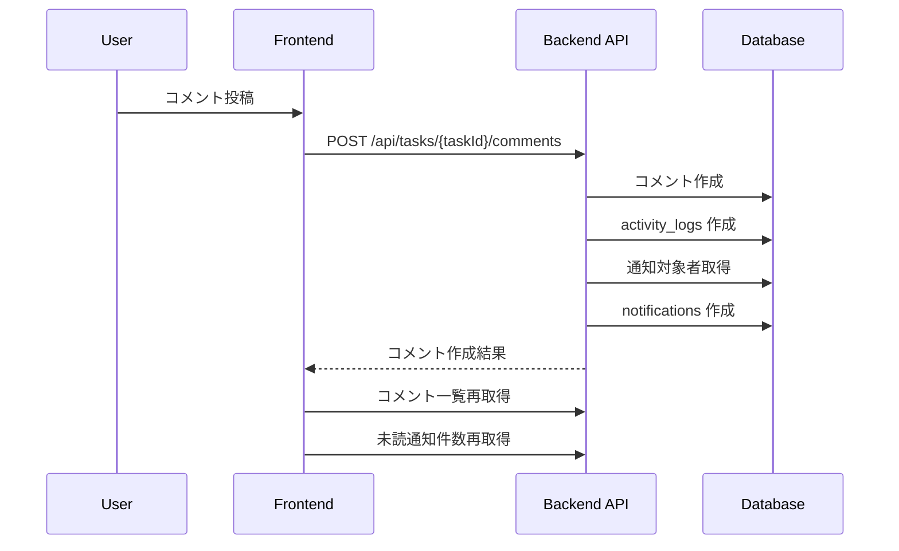
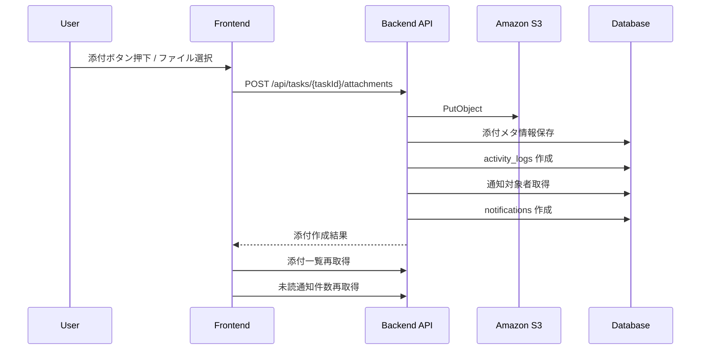
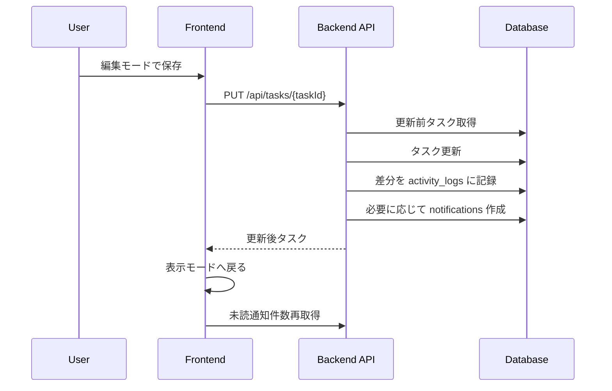
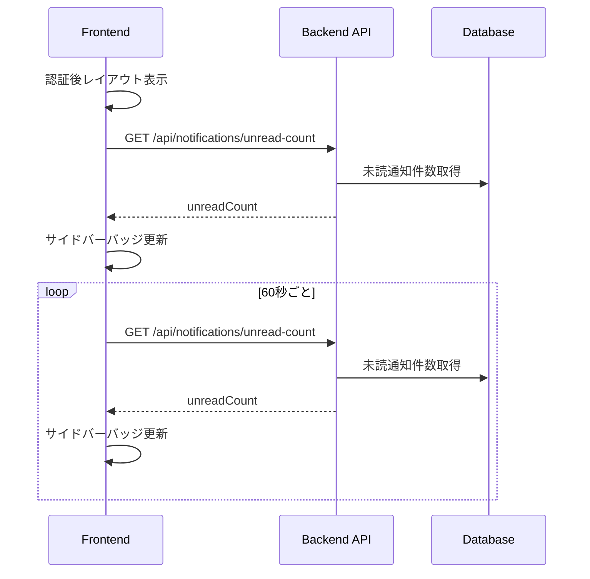

# アクティビティログ・通知生成ルール設計書

## 改訂履歴

| 版数 | 改訂日 | 改訂内容 | 作成者 |
|---|---|---|---|
| 1.0 | 2026-04-14 | 初版作成 | 佐伯 |

---

<details>
<summary>1. 文書概要</summary>

## 1.1 目的

本書は、タスク管理アプリにおけるアクティビティログ記録、通知生成、未読通知バッジ更新のルールを定義する。

対象は以下とする。

- タスク詳細画面の履歴タブに表示する履歴
- 通知一覧画面に表示する通知
- サイドバーの未読通知バッジ
- コメント、添付ファイル、タスク更新操作に伴う履歴・通知連携
- 未読通知件数を定期取得するポーリング制御

## 1.2 前提

- 独立したアクティビティログ画面は設けない。
- アクティビティログはタスク詳細画面内の履歴タブで表示する。
- 通知は `notifications` テーブルで本文を保持せず、`activity_logs` を参照して表示内容を組み立てる。
- 通知一覧画面では通知レコード全体をクリック可能にし、関連タスク詳細画面へ遷移する。
- 通知に気づかせる仕組みとして、サイドバーの未読通知バッジを表示する。
- 未読通知件数は `GET /api/notifications/unread-count` で取得する。
- リアルタイム通知ではなく、一定間隔ポーリングで未読件数を更新する。

## 1.3 対象外

以下は本フェーズでは対象外とする。

- WebSocket / SSE によるリアルタイム通知
- Redis Pub/Sub による通知配信
- メール通知
- Slack / 外部チャット通知
- 通知削除機能
- 全体横断のアクティビティログ一覧画面
- ブラウザプッシュ通知

---
</details>

<details>
<summary>2. 基本方針</summary>

## 2.1 アクティビティログの役割

`activity_logs` は、システム上で発生したタスク関連操作の事実を記録する。

| 用途 | 内容 |
|---|---|
| 履歴表示 | タスク詳細画面の履歴タブに表示する |
| 通知生成元 | 通知一覧に表示する通知内容の元データとして利用する |
| 監査補助 | 誰がいつ何をしたかを確認できるようにする |

## 2.2 通知の役割

`notifications` は、どのユーザーにどのアクティビティを通知するか、および既読状態を管理する。

通知本文、通知種別、関連タスク情報は `activity_logs` から取得・組み立てる。

| テーブル | 役割 |
|---|---|
| `activity_logs` | 何が起きたか |
| `notifications` | 誰に通知するか / 読んだか |

## 2.3 通知に気づかせる方式

本フェーズでは、通知に気づかせる方式として **未読通知バッジ + 定期ポーリング** を採用する。

| 項目 | 方針 |
|---|---|
| 表示場所 | 認証後レイアウトのサイドバー `通知` |
| 表示内容 | 未読通知件数 |
| 更新方式 | `GET /api/notifications/unread-count` のポーリング |
| 初期ポーリング間隔 | 60秒 |
| リアルタイム通知 | 本フェーズ対象外 |

## 2.4 生成方式

アクティビティログと通知は、対象操作の正常完了時に同一トランザクション内で同期生成する。

| 項目 | 方針 |
|---|---|
| 生成方式 | 同期生成 |
| トランザクション | 業務データ更新、アクティビティログ作成、通知作成を同一トランザクションで実行 |
| 非同期化 | 本フェーズでは対象外 |
| 失敗時 | いずれかに失敗した場合は業務操作全体をロールバックする |

---
</details>

<details>
<summary>3. アクティビティログ設計</summary>

## 3.1 対象イベント一覧

| No | event_type | 対象操作 | target_type | target_id | task_id | 通知生成 |
|---:|---|---|---|---|---|---|
| 1 | TASK_CREATED | タスク作成 | TASK | 作成タスクID | 作成タスクID | 原則なし |
| 2 | TASK_UPDATED | タスク更新 | TASK | 更新タスクID | 更新タスクID | 条件付き |
| 3 | TASK_DELETED | タスク削除 | TASK | 削除タスクID | 削除タスクID | 原則なし |
| 4 | COMMENT_CREATED | コメント投稿 | COMMENT | コメントID | 対象タスクID | あり |
| 5 | COMMENT_UPDATED | コメント更新 | COMMENT | コメントID | 対象タスクID | 原則なし |
| 6 | COMMENT_DELETED | コメント削除 | COMMENT | コメントID | 対象タスクID | 原則なし |
| 7 | ATTACHMENT_UPLOADED | 添付ファイル追加 | ATTACHMENT | 添付ID | 対象タスクID | あり |
| 8 | ATTACHMENT_DELETED | 添付ファイル削除 | ATTACHMENT | 添付ID | 対象タスクID | 原則なし |

## 3.2 activity_logs カラム利用方針

| カラム | 設定内容 |
|---|---|
| id | 自動採番 |
| event_type | イベント種別 |
| actor_user_id | 操作実行ユーザーID |
| target_type | 操作対象種別 |
| target_id | 操作対象ID |
| task_id | 関連タスクID |
| summary | 履歴・通知表示用の概要文 |
| detail_json | 更新差分や補足情報 |
| created_at | 作成日時 |

## 3.3 target_type 定義

| target_type | 内容 |
|---|---|
| TASK | タスク |
| COMMENT | コメント |
| ATTACHMENT | 添付ファイル |

## 3.4 summary 生成ルール

| event_type | summary 例 |
|---|---|
| TASK_CREATED | `{actorName}さんがタスクを作成しました。` |
| TASK_UPDATED | `{actorName}さんがタスクを更新しました。` |
| TASK_DELETED | `{actorName}さんがタスクを削除しました。` |
| COMMENT_CREATED | `{actorName}さんがコメントを投稿しました。` |
| COMMENT_UPDATED | `{actorName}さんがコメントを更新しました。` |
| COMMENT_DELETED | `{actorName}さんがコメントを削除しました。` |
| ATTACHMENT_UPLOADED | `{actorName}さんがファイルを添付しました。` |
| ATTACHMENT_DELETED | `{actorName}さんが添付ファイルを削除しました。` |

## 3.5 detail_json 設計

`detail_json` は、履歴表示や将来の拡張に必要な補足情報をJSON形式で保持する。

### TASK_UPDATED

```json
{
  "changes": [
    {
      "field": "status",
      "oldValue": "TODO",
      "newValue": "DOING"
    },
    {
      "field": "assignedUserId",
      "oldValue": 2,
      "newValue": 3
    }
  ]
}
```

### COMMENT_CREATED / COMMENT_UPDATED / COMMENT_DELETED

```json
{
  "commentId": 10
}
```

- `COMMENT_DELETED` では、削除済みコメント本文は `detail_json` に保持しない。
- 履歴タブでは `summary` による削除イベントのみ表示し、削除済み本文は表示しない。

### ATTACHMENT_UPLOADED / ATTACHMENT_DELETED

```json
{
  "attachmentId": 15,
  "fileName": "設計書.md"
}
```

## 3.6 タスク更新時の差分記録対象

タスク詳細画面の編集モードで更新可能な項目を差分記録対象とする。

| 項目 | field名 |
|---|---|
| タイトル | title |
| 説明 | description |
| ステータス | status |
| 優先度 | priority |
| 期限 | dueDate |
| 担当者 | assignedUserId |

## 3.7 記録タイミング

| 操作 | 記録タイミング |
|---|---|
| タスク作成 | タスク作成成功後 |
| タスク更新 | タスク更新成功後 |
| タスク削除 | タスク論理削除または削除成功後 |
| コメント投稿 | コメント作成成功後 |
| コメント更新 | コメント更新成功後 |
| コメント削除 | コメント論理削除成功後 |
| 添付追加 | 添付メタ情報保存成功後 |
| 添付削除 | 添付論理削除成功後 |

---
</details>

<details>
<summary>4. 通知生成設計</summary>

## 4.1 通知生成対象イベント

| event_type | 通知生成 | 理由 |
|---|---|---|
| TASK_CREATED | なし | 作成直後は通知対象が明確でないため |
| TASK_UPDATED | 条件付き | 担当者変更時など、ユーザーに気づかせる必要があるため |
| TASK_DELETED | なし | 本フェーズでは削除通知を扱わない |
| COMMENT_CREATED | あり | タスク関係者がコメント追加に気づく必要があるため |
| COMMENT_UPDATED | なし | 更新通知は通知過多になりやすいため |
| COMMENT_DELETED | なし | 削除通知は本フェーズでは扱わない |
| ATTACHMENT_UPLOADED | あり | タスク関係者がファイル追加に気づく必要があるため |
| ATTACHMENT_DELETED | なし | 削除通知は本フェーズでは扱わない |

## 4.2 通知受信者決定ルール

## 4.2.1 基本方針

通知対象者は、対象タスクに関係するユーザーとする。

通知候補者:

- タスク作成者
- タスク担当者
- コメント投稿者
- 添付登録者
- 操作実行者以外の関係者

ただし、操作実行者本人には通知しない。

## 4.2.2 イベント別通知対象

| event_type | 通知対象 |
|---|---|
| COMMENT_CREATED | タスク作成者、タスク担当者 |
| ATTACHMENT_UPLOADED | タスク作成者、タスク担当者 |
| TASK_UPDATED | 担当者が変更された場合の新担当者 |

## 4.2.3 操作者本人除外

操作実行者本人には通知を作成しない。

例:

- タスク担当者本人がコメント投稿した場合、その担当者本人には通知しない。
- タスク作成者本人が添付追加した場合、その作成者本人には通知しない。

## 4.2.4 重複排除

通知対象候補に同一ユーザーが複数回含まれる場合、通知は1件のみ作成する。

例:

- タスク作成者と担当者が同じユーザーの場合、通知は1件のみ。
- コメント投稿者がタスク作成者でもある場合、本人除外により通知しない。

## 4.3 notifications 作成ルール

通知生成対象イベントで `activity_logs` を作成した後、通知対象ユーザーごとに `notifications` を作成する。

| カラム | 設定値 |
|---|---|
| recipient_user_id | 通知受信者ID |
| activity_log_id | 作成した `activity_logs.id` |
| is_read | false |
| read_at | null |
| created_at | 現在日時 |

- 通知対象候補は `recipient_user_id` 単位で事前に重複除去する。
- `notifications` は `(recipient_user_id, activity_log_id)` を一意制約とし、同一アクティビティログに対する重複通知を防止する。

## 4.4 通知メッセージ表示ルール

通知一覧画面のメッセージは、`activity_logs.summary` を利用する。

| 表示項目 | 取得元 |
|---|---|
| 通知ID | notifications.id |
| 既読状態 | notifications.is_read |
| 既読日時 | notifications.read_at |
| 通知日時 | notifications.created_at |
| イベント種別 | activity_logs.event_type |
| メッセージ | activity_logs.summary |
| 関連タスクID | activity_logs.task_id |
| 対象種別 | activity_logs.target_type |
| 対象ID | activity_logs.target_id |

## 4.5 通知レコードクリック時の遷移

通知一覧画面で通知レコードをクリックした場合、`activity_logs.task_id` をもとにタスク詳細画面へ遷移する。

```text
/tasks/{taskId}
```

画面上は `詳細へ移動` ボタンを表示せず、通知レコード全体をクリック可能領域とする。

クリック時の処理順序は以下とする。

1. 通知が未読の場合は、先に既読化APIを実行する
2. 既読化成功後、`GET /api/tasks/{taskId}` で関連タスクの参照可否を確認する
3. 参照可否確認が `200 OK` の場合のみ `/tasks/{taskId}` へ遷移する
4. `404 ERR-TASK-004` の場合は通知一覧画面に留まり、`関連タスクは削除済みか、参照できなくなりました。` を表示する
5. `403 ERR-AUTH-005` の場合は通知一覧画面に留まり、`関連タスクを参照する権限がありません。` を表示する
6. 既読化成功後に 404 / 403 となった場合でも、通知の既読状態は維持する

## 4.6 未読通知バッジ

サイドバーの `通知` に未読通知件数を表示する。

| 項目 | 内容 |
|---|---|
| 対象 | ログインユーザー宛の未読通知 |
| API | `GET /api/notifications/unread-count` |
| 表示条件 | 未読件数が1件以上 |
| 非表示条件 | 未読件数が0件 |
| 表示場所 | 認証後共通レイアウトのサイドバー |
| 表示例 | `通知 2` |

---
</details>

<details>
<summary>5. 通知ポーリング設計</summary>

## 5.1 目的

通知ポーリングは、画面を手動更新しなくてもユーザーが未読通知の発生に気づけるようにするために行う。

本フェーズではWebSocket等のリアルタイム配信は導入せず、未読通知件数APIを一定間隔で取得してサイドバーの未読通知バッジを更新する。

## 5.2 利用API

| 項目 | 内容 |
|---|---|
| API | `GET /api/notifications/unread-count` |
| 認証 | 必要 |
| 用途 | サイドバー未読通知バッジの更新 |
| レスポンス | `{ "unreadCount": 2 }` |

## 5.3 実行タイミング

| タイミング | 実行有無 | 理由 |
|---|---|---|
| ログイン直後 | 実行する | 初期表示時に未読通知を反映するため |
| 認証後レイアウト初期表示時 | 実行する | 直接URLアクセス時にも反映するため |
| 画面遷移時 | 実行する | 画面遷移のタイミングで最新状態へ近づけるため |
| 一定間隔 | 実行する | ユーザー操作なしでも通知に気づけるようにするため |
| 通知既読化後 | 実行する | バッジ件数を即時更新するため |
| 通知一括既読後 | 実行する | バッジ件数を即時更新するため |
| ログアウト時 | 実行しない | 認証情報が存在しないため |
| 未認証画面表示時 | 実行しない | 通知は認証後機能のため |

## 5.4 ポーリング間隔

初期実装では **60秒間隔** とする。

| 間隔 | 採用有無 | 理由 |
|---|---|---|
| 15秒 | 不採用 | 個人開発アプリとしては通信頻度が高い |
| 30秒 | 将来候補 | 即時性は高いが初期実装ではやや過剰 |
| 60秒 | 採用 | 通信量と気づきやすさのバランスが良い |
| 5分 | 不採用 | 通知に気づくまでが遅い |

## 5.5 実行条件

| 条件 | 挙動 |
|---|---|
| ログイン済み | ポーリング実行 |
| 未ログイン | ポーリング停止 |
| アクセストークンなし | ポーリング停止 |
| 認証後レイアウト表示中 | ポーリング実行 |
| ログイン画面 / 新規登録画面 | ポーリング停止 |
| 通知一覧画面表示中 | ポーリング実行 |
| タスク詳細画面表示中 | ポーリング実行 |

## 5.6 多重実行防止

前回の未読件数取得リクエストが完了していない場合、次のポーリングは開始しない。

| 状態 | 挙動 |
|---|---|
| リクエスト未実行 | 実行する |
| リクエスト中 | 次回ポーリングをスキップする |
| リクエスト成功 | 次回ポーリング可能 |
| リクエスト失敗 | 次回ポーリング可能 |

実装上は `isFetchingUnreadCount` のようなフラグで制御する。

## 5.7 タブ非アクティブ時の制御

ブラウザタブが非アクティブの場合、ポーリング頻度を下げる。

| 状態 | 挙動 |
|---|---|
| タブがアクティブ | 60秒間隔で実行 |
| タブが非アクティブ | 180秒間隔に延長 |
| タブが再アクティブ化 | 即時に1回取得し、その後60秒間隔へ戻す |

補足:

- 初期実装で複雑になる場合、タブ状態による間隔変更は後続対応としてもよい。
- ただし、設計上は拡張方針として明記しておく。

## 5.8 エラー時の挙動

| HTTP | 挙動 |
|---:|---|
| 401 | 認証切れとしてログアウト処理またはログイン画面へ遷移 |
| 403 | バッジは前回値を維持し、画面全体エラーにはせず、次回ポーリングで再試行 |
| 404 | API定義不整合として扱うが、バッジは前回値を維持し、画面全体エラーにはしない |
| 5xx | バッジは前回値を維持し、次回ポーリングで再試行 |
| ネットワークエラー | バッジは前回値を維持し、次回ポーリングで再試行 |

未読通知件数取得は補助情報の更新であるため、401を除く取得失敗ではHTTPステータス別の個別UI制御を行わず、前回の未読件数を維持する。これにより、一時的な権限判定失敗や通信失敗でバッジ表示が消えることを避ける。

## 5.9 エラー表示方針

未読通知件数取得に失敗しても、画面全体のエラーメッセージは表示しない。

理由:

- 未読件数バッジは補助情報であり、主操作を妨げるべきではないため
- 一時的な通信失敗で画面全体にエラーを出すとUXが悪いため

ログ出力方針:

| レベル | 内容 |
|---|---|
| warn | 未読件数取得失敗 |
| error | 認証エラー以外の継続的な取得失敗 |
| debug | ポーリングスキップ、多重実行防止 |

## 5.10 バッジ更新ルール

| unreadCount | 表示 |
|---:|---|
| 0 | バッジ非表示 |
| 1〜99 | 件数をそのまま表示 |
| 100以上 | `99+` と表示 |

## 5.11 通知一覧画面との連携

| 操作 | 未読件数更新 |
|---|---|
| 通知一覧画面表示 | 通知一覧取得後に未読件数も取得する |
| 個別既読化 | 既読化成功後、未読件数を再取得する |
| 一括既読化 | 一括既読化成功後、未読件数を再取得する |
| 通知レコードクリック | 未読なら既読化後に関連タスク参照可否を確認し、参照可能時のみタスク詳細へ遷移する |
| 未読のみ表示切替 | 通知一覧は再取得するが、未読件数は必要に応じて再取得する |

## 5.12 ポーリング停止タイミング

| タイミング | 挙動 |
|---|---|
| ログアウト | ポーリング停止、未読件数をクリア |
| 認証エラー | ポーリング停止、ログイン画面へ遷移 |
| コンポーネントアンマウント | タイマー解除 |
| ブラウザ終了 | 自然停止 |

## 5.13 フロントエンド実装方針

認証後共通レイアウトで未読通知件数を管理する。

想定配置:

```text
TaskShell
  ├─ useUnreadNotificationPolling
  ├─ Sidebar
  │   └─ 通知 + 未読件数バッジ
  └─ PageContent
```

想定フック:

```text
useUnreadNotificationPolling({
  enabled: isAuthenticated,
  intervalMs: 60000,
  inactiveIntervalMs: 180000
})
```

保持する状態:

| 状態 | 内容 |
|---|---|
| unreadCount | 未読通知件数 |
| isFetching | 取得中フラグ |
| lastFetchedAt | 最終取得日時 |
| lastError | 直近エラー |

## 5.14 バックエンド実装方針

`GET /api/notifications/unread-count` は、ログインユーザーIDをもとに未読通知件数を返却する。

集計条件:

```sql
recipient_user_id = :loginUserId
AND is_read = false
```

推奨インデックス:

```text
notifications(recipient_user_id, is_read, created_at DESC)
```

---
</details>

<details>
<summary>6. 処理フロー</summary>

## 6.1 コメント投稿時



## 6.2 添付ファイル追加時



## 6.3 タスク更新時



- 更新前タスク取得時に `version` を比較し、不一致の場合は `409 ERR-TASK-007` を返却して処理を終了する。

## 6.4 未読通知件数ポーリング



---
</details>

<details>
<summary>7. 認可方針</summary>

## 7.1 アクティビティログ参照

| 操作 | 認可条件 |
|---|---|
| タスク別履歴取得 | 対象タスクを参照できること |

## 7.2 通知参照

| 操作 | 認可条件 |
|---|---|
| 通知一覧取得 | 自分宛通知のみ |
| 未読件数取得 | 自分宛通知のみ |
| 通知既読化 | 自分宛通知のみ |
| 一括既読化 | 自分宛の未読通知のみ |

- 個別既読化 / 一括既読化は冪等とし、同じ既読操作を再実行してもエラーにしない。

## 7.3 アクティビティログ作成

アクティビティログは、対象操作の認可チェックに成功し、業務操作が正常完了した場合に作成する。

`version` 不一致による `409 ERR-TASK-007` または `409 ERR-COMMENT-006` で更新が失敗した場合は、アクティビティログも通知も作成しない。

---
</details>

<details>
<summary>8. エラー方針</summary>

## 8.1 アクティビティログ作成失敗

アクティビティログ作成に失敗した場合、業務操作全体をロールバックする。

| 例 | 挙動 |
|---|---|
| コメント作成後にログ作成失敗 | コメント作成もロールバック |
| 添付メタ情報保存後にログ作成失敗 | 添付メタ情報保存もロールバック |
| タスク更新後にログ作成失敗 | タスク更新もロールバック |

## 8.2 通知作成失敗

通知作成に失敗した場合、業務操作全体をロールバックする。

理由:

- 本フェーズでは同期生成を前提とするため
- 通知不整合を避けるため
- 実装・検証を単純化するため

## 8.3 通知対象者が存在しない場合

通知対象者が存在しない場合、通知は作成しない。  
ただし、アクティビティログは作成する。

## 8.4 ポーリング失敗

未読件数取得に失敗した場合、業務操作や画面操作は継続可能とする。  
前回の未読件数を維持し、次回ポーリングで再試行する。

## 8.5 更新競合

タスク更新およびコメント更新で、リクエストの `version` がサーバー最新値と不一致の場合は競合とみなし、タスク更新では `409 ERR-TASK-007`、コメント更新では `409 ERR-COMMENT-006` を返却する。

| 項目 | 挙動 |
|---|---|
| 対象データ更新 | 実行しない |
| activity_logs 作成 | 実行しない |
| notifications 作成 | 実行しない |
| フロント表示 | 競合メッセージ表示 + 最新データ再取得 |

---
</details>

<details>
<summary>9. テスト観点</summary>

## 9.1 アクティビティログ記録

| 観点 | 確認内容 |
|---|---|
| コメント投稿 | COMMENT_CREATED が記録されること |
| 添付追加 | ATTACHMENT_UPLOADED が記録されること |
| タスク更新 | TASK_UPDATED が記録されること |
| 更新競合時非記録 | `409 ERR-TASK-007` / `409 ERR-COMMENT-006` 時に `TASK_UPDATED` / `COMMENT_UPDATED` が記録されないこと |
| 操作者 | actor_user_id がログインユーザーになること |
| 関連タスク | task_id が対象タスクIDになること |
| 更新差分 | TASK_UPDATED の detail_json に変更項目が記録されること |

## 9.2 通知生成

| 観点 | 確認内容 |
|---|---|
| コメント投稿 | タスク作成者・担当者に通知が作成されること |
| 添付追加 | タスク作成者・担当者に通知が作成されること |
| 担当者変更 | 新担当者に通知が作成されること |
| 本人除外 | 操作者本人には通知されないこと |
| 重複排除 | 同一ユーザーに重複通知が作成されないこと |
| DB一意制約 | 同一 `recipient_user_id` + `activity_log_id` の通知が重複作成されないこと |
| 既読化 | is_read が true になり、read_at が設定されること |
| 一括既読冪等性 | 未読通知が0件でも一括既読化が正常終了すること |
| 未読件数 | 未読通知件数が正しく返ること |

## 9.3 通知ポーリング

| 観点 | 確認内容 |
|---|---|
| 初期取得 | 認証後レイアウト表示時に未読件数を取得すること |
| 定期取得 | 60秒間隔で未読件数を再取得すること |
| バッジ表示 | 未読件数が1件以上の場合にバッジ表示されること |
| バッジ非表示 | 未読件数が0件の場合にバッジ非表示となること |
| 個別既読化後 | 既読化後に未読件数が再取得されること |
| 一括既読化後 | 一括既読化後に未読件数が再取得されること |
| 多重実行防止 | 前回リクエスト中は次のポーリングを開始しないこと |
| 401エラー | 認証切れとしてログイン画面へ遷移すること |
| 403エラー | 画面全体エラーにせず、未読件数は前回値を維持し、次回ポーリングで再試行すること |
| 5xxエラー | 画面全体エラーにせず、次回ポーリングで再試行すること |
| ログアウト | ポーリングが停止し、未読件数がクリアされること |

## 9.4 認可

| 観点 | 確認内容 |
|---|---|
| 他人通知参照 | 他人宛通知を参照できないこと |
| 他人通知既読化 | 他人宛通知を既読化できないこと |
| 履歴参照 | 参照不可タスクの履歴を取得できないこと |

---
</details>

<details>
<summary>10. 今後の検討事項</summary>

| 項目 | 内容 |
|---|---|
| リアルタイム通知 | WebSocket / SSE / Redis PubSub の導入 |
| メール通知 | 重要通知のみメール送信 |
| 通知設定 | ユーザーごとの通知ON/OFF |
| 通知保持期間 | 古い通知の削除またはアーカイブ |
| 非同期化 | 通知生成をキュー処理化 |
| 監査ログ強化 | 管理者向けの横断ログ検索 |
| ブラウザ通知 | Web Push API の導入 |
</details>
